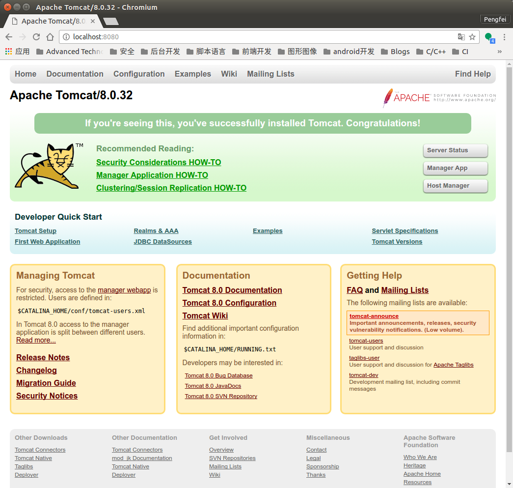
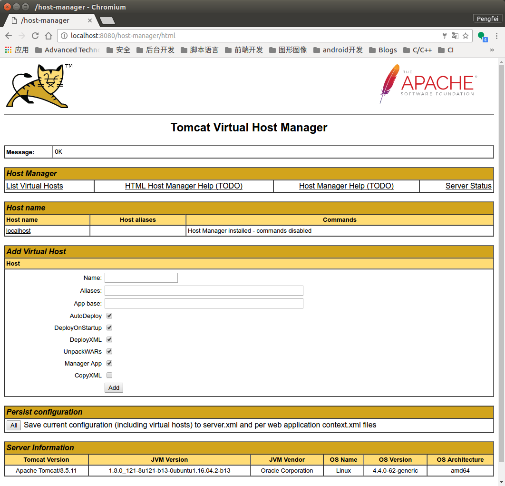

# 介绍
Apache Tomcat 是一个 Web 服务器及 Servlet 容器，它可被用于提供 Java 应用服务。Tomcat 是 Java Servlet 和 JSP (JavaServer Pages) 技术的一个开源实现，由 Apache 软件基金会发布。这份指南描述在 Ubuntu 16.04 主机上，发行版 Tomcat 8 的基本安装和一些配置。
<!--more-->
# 预备条件

在开始后面的操作之前，在你的主机上应该有一个具有 sudo 权限的非 root 用户。

# 第一步：安装Java

要安装 Tomcat，需要先在服务器上安装 Java，以使 Java Web 应用代码可以执行。我们可以通过 apt-get 来安装 OpenJDK，以满足这一点。

首先，更新 apt-get 的包索引：
```
$ sudo apt-get update
```

然后用 apt-get 安装 JDK 包：
```
$ sudo apt-get install default-jdk
```
现在Java已经安装好了。我们创建一个 **tomcat** 用户，用于运行 Tomcat 服务。

# 第二步：创建 **tomcat** 用户

出于安全考虑，Tomcat 应该以非特权用户 (比如，非 root ) 运行。我们将创建一个新的用户和组来运行 Tomcat 服务。

首先，创建一个新的 tomcat 组：
```
$ sudo groupadd tomcat
```

接下来，创建一个新的 **tomcat** 用户。我们让这个用户成为 tomcat 组的成员，并让它的用户根目录为 /opt/tomcat ( 我们将在这个目录下安装Tomcat )，以 /bin/false 为用户 shell (这样就没人能用这个帐号登录了)：
```
$ sudo useradd -s /bin/false -g tomcat -d /opt/tomcat tomcat
```
现在我们的 **tomcat** 用户就设置好了，让我们下载并安装Tomcat。

# 第三步：安装Tomcat
安装 Tomcat 8 的最好方式是下载最新版的二进制发行包，然后手动配置它。

可以在 [Tomcat 8下载页面](http://tomcat.apache.org/download-80.cgi) 找到Tomcat 8的最新版。当前 Tomcat 8 的最新版是 **8.5.11**，但应该使用一个较新的稳定版。在 **Binary Distributions** 下，然后是 **Core** 下的列表，可以找到它的 **"tar.gz"** 的链接。然而直接使用最新的版本，有一个不好的地方就是，与许多 IDE 的配合还不够好， IntelliJ 2016.3 可能识别不出来太新的版本，比如 8.5.x 的版本就无法识别。因而我们从这个 [位置](http://archive.apache.org/dist/tomcat/tomcat-8/) 找以版本点进去，进入 `/bin`，然后找到 `.tar.gz` 包，并复制链接。

接下来，切换到你的服务器的 /tmp 目录下。这是下载临时文件的好地方，比如 Tomcat tarball，在我们解压 Tomcat 之后它就没用了：
```
$ cd /tmp
```
使用 **curl** 下载前面从 Tomcat 网站复制的链接：
```
$ curl -O http://archive.apache.org/dist/tomcat/tomcat-8/v8.0.32/bin/apache-tomcat-8.0.32.tar.gz
```
这里我们选择安装 `Tomcat 8.0.32` 这一版。

我们把 Tomcat 安装到 /opt/tomcat 文件夹下。创建文件夹，然后用如下这些命令将归档提取到它下面：
```
$ sudo mkdir /opt/tomcat
$ sudo tar xzvf apache-tomcat-8*tar.gz -C /opt/tomcat --strip-components=1
```
接下来为我们的安装设置适当的用户权限。

# 第四步：更新权限
我们创建的 **tomcat** 用户需要有访问 Tomcat 安装的权限。现在我们将设置它。

切换到我们解压 Tomcat 安装的目录下：
```
$ cd /opt/tomcat
```
将整个安装目录的组所有权给 **tomcat** 组：
```
$ sudo chgrp -R tomcat /opt/tomcat
```

接下来，给 **tomcat** 组开放对 **conf** 目录及其所有内容的读权限，以及对目录本身的 **执行** 权限：
```
$ sudo chmod -R g+r conf
$ sudo chmod g+x conf
```

然后使 **tomcat** 用户成为 **webapps** ， **work** ， **temp** ，和 **logs** 目录的所有者：
```
$ sudo chown -R tomcat webapps/ work/ temp/ logs/
```
现在适当的权限已经设置好了。我们可sudo update-java-alternatives -l以创建一个 systemd 服务文件来管理 Tomcat 进程。

上面的第二、三和四步，其实不用手动的一个个执行命令那么麻烦，写个 shell 脚本来执行更方便，如下面这样：
```
#!/bin/bash

## Step Two.

groupId=`id -g "tomcat"`

if [ $groupId -ne 0 ]; then
  echo "Group exists"
else
  groupadd tomcat
fi 

userId=`id -u "tomcat"`

if [ $userId -ne 0 ]; then
  echo "User exists"
else
  useradd -s /bin/false -g tomcat -d /opt/tomcat tomcat
fi

## Step Three.

cd /tmp

url=http://archive.apache.org/dist/tomcat/tomcat-8/v8.0.32/bin/apache-tomcat-8.0.32.tar.gz
filename=`basename $url`

# echo "filename "
# echo $filename

if [ ! -f $filename ]; then 
  curl -O $url
else
  echo "$filename File exists"
fi

if [ $? -ne 0 ]; then
  echo "Download failed!!!"
  exit 1
fi

if [ -d "/opt/tomcat" ]; then
  mv /opt/tomcat /opt/tomcat_bak
fi

mkdir /opt/tomcat

if [ $? -ne 0 ]; then
  echo "mkdir /opt/tomcat failed!!!"
  exit 1
fi

tar xzf apache-tomcat-8*tar.gz -C /opt/tomcat --strip-components=1

if [ $? -ne 0 ]; then
  echo "mkdir /opt/tomcat failed!!!"
  exit 1
fi

## Step Four.

cd /opt/tomcat

chown -R tomcat:tomcat .

chgrp -R tomcat /opt/tomcat

chmod -R g+r conf

sudo chmod g+x conf

chown -R tomcat webapps/ work/ temp/ logs/

```
只需要配置 Apache Tomcat 的下载地址，其它的一切，脚本都会帮忙搞定。相关的代码已经放在了我的 [GitHub repo](https://github.com/hanpfei/wolfcs-tools/blob/master/TomcatInstaller.sh) 里了，有兴趣的朋友可以拿下来用。

# 第五步：创建一个systemd服务文件
我们想要能够以一个服务来运行 Tomcat，因而我们将建立 systemd 服务文件。

Tomcat 需要知道Java安装在哪里。这个路径通常称为 **"JAVA_HOME"**。查看那个位置最简单的方法是通过执行这个命令：
```
$ sudo update-java-alternatives -l
```

输出为：
```
$ sudo update-java-alternatives -l
java-1.8.0-openjdk-amd64       1081       /usr/lib/jvm/java-1.8.0-openjdk-amd64
java-7-oracle                  1082       /usr/lib/jvm/java-7-oracle
```
正确的 **JAVA_HOME** 变量可以通过将上面输出的最后一列后面接上 **/jre** 来构造。对于上面给出的例子，这个服务器正确的 **JAVA_HOME** 将是：
```
# JAVA_HOME
/usr/lib/jvm/java-1.8.0-openjdk-amd64/jre
```
你的 **JAVA_HOME** 可能不一样。

根据这些信息，我们可以创建systemd 服务文件。输入如下内容在 **/etc/systemd/system** 目录下打开一个称为 **tomcat.service** 的文件：
```
$ sudo nano /etc/systemd/system/tomcat.service
```

将下面的内容粘贴到服务文件中。如果需要的话，就将 **JAVA_HOME** 的值修改为你的系统的对应值。你也可能想要修改 **CATALINA_OPTS** 下指定的内存分配设置：
```
/etc/systemd/system/tomcat.service
[Unit]
Description=Apache Tomcat Web Application Container
After=network.target

[Service]
Type=forking

Environment=JAVA_HOME=/usr/lib/jvm/java-1.8.0-openjdk-amd64/jre
Environment=CATALINA_PID=/opt/tomcat/temp/tomcat.pid
Environment=CATALINA_HOME=/opt/tomcat
Environment=CATALINA_BASE=/opt/tomcat
Environment='CATALINA_OPTS=-Xms512M -Xmx1024M -server -XX:+UseParallelGC'
Environment='JAVA_OPTS=-Djava.awt.headless=true -Djava.security.egd=file:/dev/./urandom'

ExecStart=/opt/tomcat/bin/startup.sh
ExecStop=/opt/tomcat/bin/shutdown.sh

User=tomcat
Group=tomcat
UMask=0007
RestartSec=10
Restart=always

[Install]
WantedBy=multi-user.target
```
结束之后，保存并关闭文件。

接下来，重新加载 **systemd** 守护进程以使它知道我们的服务文件：
```
$ sudo systemctl daemon-reload
```
键入如下内容来启动Tomcat服务：
```
$ sudo systemctl start tomcat
```
输入如下命令来再次检查它在启动时没有错误发生：
```
$ sudo systemctl status tomcat
● tomcat.service - Apache Tomcat Web Application Container
   Loaded: loaded (/etc/systemd/system/tomcat.service; disabled; vendor preset: enabled)
   Active: active (running) since 五 2017-02-24 17:02:20 CST; 52s ago
  Process: 12835 ExecStart=/opt/tomcat/bin/startup.sh (code=exited, status=0/SUCCESS)
 Main PID: 12843 (java)
   CGroup: /system.slice/tomcat.service
           └─12843 /usr/lib/jvm/java-1.8.0-openjdk-amd64/jre/bin/java -Djava.util.logging.config.file=/opt/tomcat/conf/logging.properties -Djava.util.logging.manager=org.ap

2月 24 17:02:20 ThundeRobot systemd[1]: Starting Apache Tomcat Web Application Container...
2月 24 17:02:20 ThundeRobot startup.sh[12835]: Using CATALINA_BASE:   /opt/tomcat
2月 24 17:02:20 ThundeRobot startup.sh[12835]: Using CATALINA_HOME:   /opt/tomcat
2月 24 17:02:20 ThundeRobot startup.sh[12835]: Using CATALINA_TMPDIR: /opt/tomcat/temp
2月 24 17:02:20 ThundeRobot startup.sh[12835]: Using JRE_HOME:        /usr/lib/jvm/java-1.8.0-openjdk-amd64/jre
2月 24 17:02:20 ThundeRobot startup.sh[12835]: Using CLASSPATH:       /opt/tomcat/bin/bootstrap.jar:/opt/tomcat/bin/tomcat-juli.jar
2月 24 17:02:20 ThundeRobot startup.sh[12835]: Using CATALINA_PID:    /opt/tomcat/temp/tomcat.pid
2月 24 17:02:20 ThundeRobot systemd[1]: Started Apache Tomcat Web Application Container.
lines 1-16/16 (END)...skipping...
● tomcat.service - Apache Tomcat Web Application Container
   Loaded: loaded (/etc/systemd/system/tomcat.service; disabled; vendor preset: enabled)
   Active: active (running) since 五 2017-02-24 17:02:20 CST; 52s ago
  Process: 12835 ExecStart=/opt/tomcat/bin/startup.sh (code=exited, status=0/SUCCESS)
 Main PID: 12843 (java)
   CGroup: /system.slice/tomcat.service
           └─12843 /usr/lib/jvm/java-1.8.0-openjdk-amd64/jre/bin/java -Djava.util.logging.config.file=/opt/tomcat/conf/logging.properties -Djava.util.logging.manager=org.ap

2月 24 17:02:20 ThundeRobot systemd[1]: Starting Apache Tomcat Web Application Container...
2月 24 17:02:20 ThundeRobot startup.sh[12835]: Using CATALINA_BASE:   /opt/tomcat
2月 24 17:02:20 ThundeRobot startup.sh[12835]: Using CATALINA_HOME:   /opt/tomcat
2月 24 17:02:20 ThundeRobot startup.sh[12835]: Using CATALINA_TMPDIR: /opt/tomcat/temp
2月 24 17:02:20 ThundeRobot startup.sh[12835]: Using JRE_HOME:        /usr/lib/jvm/java-1.8.0-openjdk-amd64/jre
2月 24 17:02:20 ThundeRobot startup.sh[12835]: Using CLASSPATH:       /opt/tomcat/bin/bootstrap.jar:/opt/tomcat/bin/tomcat-juli.jar
2月 24 17:02:20 ThundeRobot startup.sh[12835]: Using CATALINA_PID:    /opt/tomcat/temp/tomcat.pid
2月 24 17:02:20 ThundeRobot systemd[1]: Started Apache Tomcat Web Application Container.
```
Tomcat 状态良好。

Tomcat 使用 8080 端口，通过运行 netstat 命令来检查服务器打开的端口：
```
$ sudo netstat -plntu
激活Internet连接 (仅服务器)
Proto Recv-Q Send-Q Local Address           Foreign Address         State       PID/Program name
tcp6       0      0 127.0.0.1:8005          :::*                    LISTEN      12843/java      
tcp6       0      0 :::8009                 :::*                    LISTEN      12843/java      
tcp6       0      0 :::8080                 :::*                    LISTEN      12843/java      
tcp6       0      0 :::80                   :::*                    LISTEN      1049/nginx -g daemo

```

## 第六步：调整防火墙并测试 Tomcat 服务器
现在Tomcat服务已经启动，我们可以测试以确保默认的页面可访问了。

在测试之前，我们需要调整防火墙，以使得我们的请求可以到达服务。

Tomcat 使用 8080 端口来接收传统的请求。输入如下命令以使得流量可以到达那个端口：
```
$ sudo ufw allow 8080
```
修改防火墙之后，你可以在浏览器的地址栏中输入域名或IP地址，然后是 **:8080** 来访问默认的启动页面：
```
# Open in web browser
http://server_domain_or_IP:8080
```
你将看到默认的 Tomcat 启动页面，还有一些其它的信息。然而，如果你点击 **manager webapp** 链接，例如，你将被拒绝访问。我们将在后面配置那个权限。

如果你能够成功地访问Tomcat，现在是启用服务文件以使Tomcat在开机时自动运行的好时机：
```
$ sudo systemctl enable tomcat
```

## 第七步：配置Tomcat Web管理界面
为了使用 Tomcat 的管理器 Web app，我们必须为我们的 Tomcat 服务器添加一个登录。我们将通过编辑 **tomcat-users.xml** 文件来做到这一点：
```
$ sudo nano /opt/tomcat/conf/tomcat-users.xml
```
你想要添加一个可以访问 **manager-gui** 和 **admin-gui** ( Tomcat 自带的 Web apps ) 的用户。你可以在 **tomcat-users** 标签之间定义一个用户，类似于下面的例子。确保将 username 和 password 修改为安全的：
`tomcat-users.xml — Admin User`
```
<tomcat-users . . .>
  <role rolename="admin"/>
  <role rolename="manager-script"/>
  <role rolename="manager-gui"/>
  <role rolename="manager-jmx"/>
  <role rolename="manager-status"/>
  <role rolename="admin-gui"/>
  <role rolename="admin-script"/>

  <user username="admin" password="admin" roles="manager-gui,manager-script,manager-jmx,manager-status,admin-gui,admin-script"/>
</tomcat-users>
```
结束之后保存并关闭文件。

默认情况下，较新的 Tomcat 版本限制只有来自服务器自身的连接才能访问 **Manager** 和 **Host Manager** apps。由于我们要在一个远端的机器上安装配置，你可能想要移除或改变这样的限制。要改变这些关于 IP地址的限制，则打开适当的 **context.xml** 文件。

对于 **Manager** app，输入：
```
$ sudo nano /opt/tomcat/webapps/manager/META-INF/context.xml
```

对于 **Host Manager** app，输入：
```
$ sudo nano /opt/tomcat/webapps/host-manager/META-INF/context.xml
```

在文件内，注释掉IP地址限制以允许来自于任何地址的连接。还有一种办法，如果你只想允许来自你自己的IP地址的连接访问，可以把你的公网IP地址添加到列表里：
`context.xml files for Tomcat webapps`
```
<Context antiResourceLocking="false" privileged="true" >
  <!--<Valve className="org.apache.catalina.valves.RemoteAddrValve"
         allow="127\.\d+\.\d+\.\d+|::1|0:0:0:0:0:0:0:1" />-->
</Context>
```
结束之后保存并关闭文件。

为了使我们的改动生效，重启Tomcat服务：
```
$ sudo systemctl restart tomcat
```

## 第八步：访问Web界面
现在我们已经创建了一个用户，我们可以在 Web 浏览器中再次访问 Web 管理界面了。再一次，你可以通过在浏览器中输入你的服务器的域名或IP地址，后跟8080端口来访问正确的界面：
```
# Open in web browser
http://server_domain_or_IP:8080
```

你看到的界面应该和你之前测试时看到的一样：


然后我们看一下 **Manager App** ，可通过链接 http://localhost:8080/manager/html 访问。你将需要键入给 **tomcat-users.xml** 文件添加的账户和密码。然后你将看到类似下面的页面：


Web应用管理用于管理你的 Java 应用。你可以在这里启动，停止，重新加载，部署，取消部署。你也可以运行关于你的 apps 的诊断 (如，查找内存泄漏)。最后，在这个页面的底部可以找到关于你的服务器的信息。

现在让我们看一下 **Host Manager**，可通过 http://localhost:8080/host-manager/html 访问：


这样 Tomcat 就安装好了。

# 参考文档

[How To Install Apache Tomcat 8 on Ubuntu 16.04](https://www.digitalocean.com/community/tutorials/how-to-install-apache-tomcat-8-on-ubuntu-16-04)

[Tomcat 7 访问 Manager 和 Host Manager](http://blog.csdn.net/babyfacer/article/details/6839972)

[How to Install and Configure Apache Tomcat 8.5 on Ubuntu 16.04]()