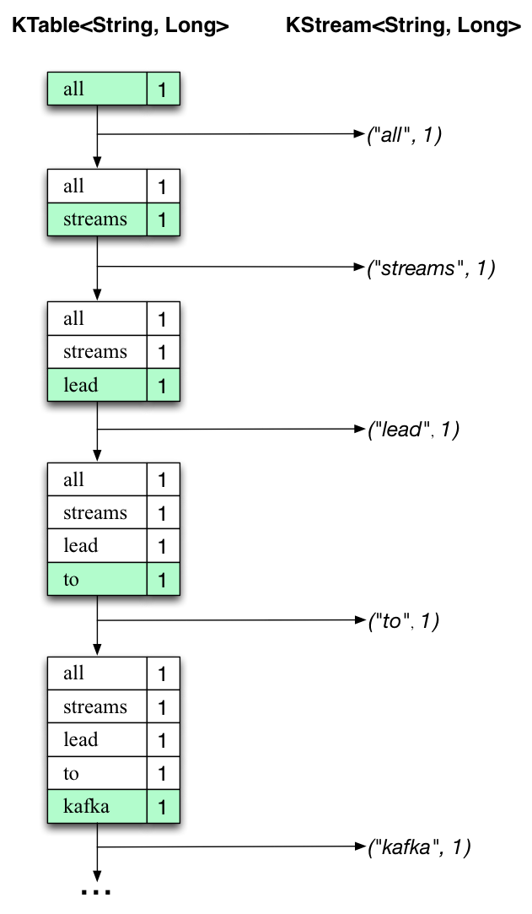
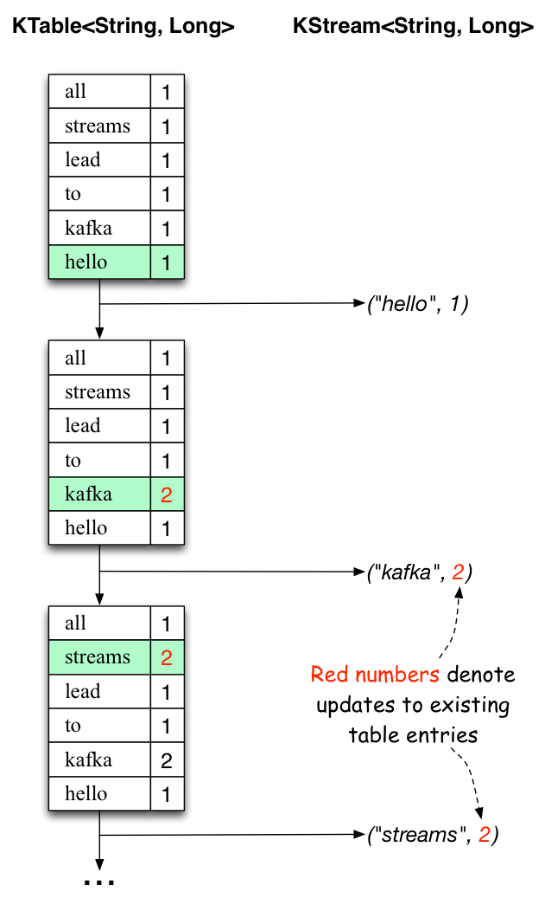

这份指南假设你是新手，且还没有 Kafka 和 ZooKeeper 数据。由于 Kafka 针对基于 Unix 的平台和 Windows 平台的终端脚本是不同的，因而，在 Windows 平台下，请使用 `bin\windows` 下的来代替 `bin/` 下的，并将脚本的扩展名修改为 `.bat`。
 <!--more-->
# 第 1 步：下载代码。

[下载](https://www.apache.org/dyn/closer.cgi?path=/kafka/0.10.2.0/kafka_2.11-0.10.2.0.tgz) 0.10.20.0 发布版并 un-tar 它。
```
$ tar -xzf kafka_2.11-0.10.2.0.tgz
$ cd kafka_2.11-0.10.2.0
```

# 第 2 步，启动服务器
Kafka 使用 ZooKeeper，因而如果你还没有启动它的话，你需要先启动一个 ZooKeeper 服务器。你可以使用包装了 kafka 的脚本来得到一个快速而干净的单节点 ZooKeeper 实例。
```
$ bin/zookeeper-server-start.sh config/zookeeper.properties
[2017-03-10 11:33:43,848] INFO Reading configuration from: config/zookeeper.properties (org.apache.zookeeper.server.quorum.QuorumPeerConfig)
[2017-03-10 11:33:43,889] INFO autopurge.snapRetainCount set to 3 (org.apache.zookeeper.server.DatadirCleanupManager)
[2017-03-10 11:33:43,889] INFO autopurge.purgeInterval set to 0 (org.apache.zookeeper.server.DatadirCleanupManager)
[2017-03-10 11:33:43,889] INFO Purge task is not scheduled. (org.apache.zookeeper.server.DatadirCleanupManager)
[2017-03-10 11:33:43,889] WARN Either no config or no quorum defined in config, running  in standalone mode (org.apache.zookeeper.server.quorum.QuorumPeerMain)
[2017-03-10 11:33:43,920] INFO Reading configuration from: config/zookeeper.properties (org.apache.zookeeper.server.quorum.QuorumPeerConfig)
[2017-03-10 11:33:43,920] INFO Starting server (org.apache.zookeeper.server.ZooKeeperServerMain)
[2017-03-10 11:33:43,943] INFO Server environment:zookeeper.version=3.4.9-1757313, built on 08/23/2016 06:50 GMT (org.apache.zookeeper.server.ZooKeeperServer)
. . . . . .
```

启动 ZooKeeper 时，为脚本传入的参数是配置文件的路径。该配置文件的主要内容如下：
```
# the directory where the snapshot is stored.
dataDir=/tmp/zookeeper-0.10.2.0
# the port at which the clients will connect
clientPort=2181
# disable the per-ip limit on the number of connections since this is a non-production config
maxClientCnxns=0
```

`dataDir` 选项用于配置 ZooKeeper 数据的保存路径。 `clientPort` 用于配置 ZooKeeper 监听的端口，默认为 2181。而 `maxClientCnxns` 则用以配置客户端与 ZooKeeper 之间的最大连接数。通常情况下，在一台机器上，我们只需运行一个 ZooKeeper 实例，因而 `dataDir` 和 `clientPort` 选项采用默认值即可。然而，如果我们需要在同一台主机上运行多个 ZooKeeper 实例，比如为了方便开发测试，我们需要为 Kafka 0.8.2 运行一个 ZooKeeper 实例，同时又需要为 Kafka 0.9.0 运行一个 ZooKeeper 实例，则需要注意配置这两个选项，以使它们监听的端口和保存数据文件的路径不会发生冲突。

现在可以启动 Kafka 服务器了：
```
$ bin/kafka-server-start.sh config/server.properties
[2017-03-10 11:35:21,291] INFO KafkaConfig values: 
	advertised.host.name = null
	advertised.listeners = null
	advertised.port = null
	authorizer.class.name = 
	auto.create.topics.enable = true
	auto.leader.rebalance.enable = true
. . . . . .
```
启动 Kafka 的脚本，执行时传入的参数同样是配置文件的路径。Kafka 的配置文件的内容比较多：
```
# The id of the broker. This must be set to a unique integer for each broker.
broker.id=0

# Switch to enable topic deletion or not, default value is false
#delete.topic.enable=true

############################# Socket Server Settings #############################

# The address the socket server listens on. It will get the value returned from 
# java.net.InetAddress.getCanonicalHostName() if not configured.
#   FORMAT:
#     listeners = listener_name://host_name:port
#   EXAMPLE:
#     listeners = PLAINTEXT://your.host.name:9092
listeners=PLAINTEXT://:9095

# Hostname and port the broker will advertise to producers and consumers. If not set, 
# it uses the value for "listeners" if configured.  Otherwise, it will use the value
# returned from java.net.InetAddress.getCanonicalHostName().
#advertised.listeners=PLAINTEXT://your.host.name:9092

# Maps listener names to security protocols, the default is for them to be the same. See the config documentation for more details
#listener.security.protocol.map=PLAINTEXT:PLAINTEXT,SSL:SSL,SASL_PLAINTEXT:SASL_PLAINTEXT,SASL_SSL:SASL_SSL

# The number of threads handling network requests
num.network.threads=3

# The number of threads doing disk I/O
num.io.threads=8
. . . . . .
############################# Log Basics #############################

# A comma seperated list of directories under which to store log files
log.dirs=/tmp/kafka-logs-0.10.2.0
. . . . . .
############################# Zookeeper #############################

# Zookeeper connection string (see zookeeper docs for details).
# This is a comma separated host:port pairs, each corresponding to a zk
# server. e.g. "127.0.0.1:3000,127.0.0.1:3001,127.0.0.1:3002".
# You can also append an optional chroot string to the urls to specify the
# root directory for all kafka znodes.
zookeeper.connect=localhost:2185

# Timeout in ms for connecting to zookeeper
zookeeper.connection.timeout.ms=6000
```
我们可以配置 Kafka 实例的 Broker ID（`broker.id`），监听的端口号（`listeners=PLAINTEXT://:9095`），日志文件的保存路径（`log.dirs`），以及 ZooKeeper 监听的端口号（`zookeeper.connect`）等等。在建立 Kafka 集群时，需要注意不同 Kafka 实例间 `broker.id` 的值不能重复。在单主机上运行多个 Kafka 实例时，需要注意 `log.dirs` 和 `listeners=PLAINTEXT://:9095` 两个选项的值不能相同，以避免发生冲突。而在对 ZooKeeper 的运行做了配置时，比如修改了 ZooKeeper 监听的端口号，则需要有针对性地配置 `zookeeper.connect`。

# 第 3 步：创建一个 topic
让我们创建一个名为 "test" 且只有一个分区和一个副本的 topic：
```
$ bin/kafka-topics.sh --create --zookeeper localhost:2181 --replication-factor 1 --partitions 1 --topic test
```

`--zookeeper` 参数用以指定 ZooKeeper 的地址。ZooKeeper 默认监听 2181，若做了修改，则这里同样要有针对性的做修改。

现在如果我们运行 `list topic` 命令的话，就可以看到那个 topic 了：
```
$ bin/kafka-topics.sh --list --zookeeper localhost:2181
test
```

同样注意 ZooKeeper 的地址。

此外，除了手动创建 topic 外，你还可以配置你的 brokers 在发布的目标 topic 不存在时自动创建 topics。

# 第 4 步：发送一些消息
Kafka 中带有一个命令行客户端，它可以从文件或标准输入获取输入，并把它作为消息发送给 Kafka 集群。默认情况下，每行都将作为一条分开的消息。

运行生产者，向终端输入一些消息并发送给服务器。
```
$ bin/kafka-console-producer.sh --broker-list localhost:9092 --topic test
This is a message
This is another message
```

` --broker-list` 用于指定 Kafka brokers 的地址。若修改了 Kafka 运行的配置，以非默认端口 `9092` 运行的话，则要做相应的修改。下面遇到的` --broker-list` 类似。

# 第 5 步：启动消费者
Kafka 还有一个命令行消费者，它将把消息显示在标准输出中。
```
$ bin/kafka-console-consumer.sh --bootstrap-server localhost:9092 --topic test --from-beginning
This is a message
This is another message
```

`--bootstrap-server` 用于指定 Kafka brokers 的地址。若修改了 Kafka 运行的配置，以非默认端口 `9092` 运行的话，则要做相应的修改。`--from-beginning` 表示，我们想要接收 Kafka 中保存的所有消息。我们还可以通过 `--offset` 参数表明我们只想接收从某个消息开始之后的消息，如：
```
$ bin/kafka-console-consumer.sh --bootstrap-server localhost:9095 --topic test --partition 0 --offset 1
```

在指定了 `--offset` 参数的同时，也要指定 `--partition` 参数。

如果你是在不同终端中运行上述命令的，则你应该可以在生产者的终端键入消息，并在消费者终端中看到它们。

所有的命令行工具都具有其它的选项；不传入参数运行它们的话，将显示关于它们更详细的用法信息。

# 第 6 步：搭建多broker 集群
目前为止我们已经运行了单个 broker，但这不好玩。对于 Kafka 而言，单个 broker 只是大小为 1 的集群，因而启动更多 broker 实例也无需太多改动。但只是为了对它有更多的认识，我们扩展我们的集群为三个节点（依然在我们的本地机器上）。

首先我们要为每个 broker 创建一个配置文件（在 Windows 上使用 `copy` 命令替代）：
```
$ cp config/server.properties config/server-1.properties
$ cp config/server.properties config/server-2.properties
```

现在让我们编辑这些新文件并设置如下属性：
```
config/server-1.properties:
    broker.id=1
    listeners=PLAINTEXT://:9093
    log.dirs=/tmp/kafka-logs-0.10.2.0-1

config/server-2.properties:
    broker.id=2
    listeners=PLAINTEXT://:9094
    log.dirs=/tmp/kafka-logs-0.10.2.0-2
```

`broker.id` 属性是集群中每个节点唯一的且永久的名字。我们不得不覆写端口和日志目录只是因为我们在相同的主机上运行所有的这些 Kafka 实例，且我们要使 brokers 不试图在相同的端口上注册或相互之间覆写其它 broker 的数据。

我们已经有了 ZooKeeper，且我们的单节点已经启动，因而我们只需启动两个新节点：
```
$ bin/kafka-server-start.sh config/server-1.properties &
. . . . . .
$ bin/kafka-server-start.sh config/server-2.properties &
. . . . . .
```

现在让我们创建一个副本因子为三的 topic：
```
$ bin/kafka-topics.sh --create --zookeeper localhost:2185 --replication-factor 3 --partitions 1 --topic my-replicated-topic
Created topic "my-replicated-topic".
[2017-03-10 12:18:00,737] INFO [ReplicaFetcherManager on broker 2] Removed fetcher for partitions my-replicated-topic-0 (kafka.server.ReplicaFetcherManager)
. . . . . .
```

好了，现在我们有了一个集群，但我们要如何知道哪个 broker 在做什么呢？运行 "describe topics" 命令来查看：
```
$ bin/kafka-topics.sh --describe --zookeeper localhost:2181 --topic my-replicated-topic
Topic:my-replicated-topic	PartitionCount:1	ReplicationFactor:3	Configs:
	Topic: my-replicated-topic	Partition: 0	Leader: 2	Replicas: 2,0,1	Isr: 2,0,1
```

下面是对输出的解释。第一行给出了所有分区的总结，每个额外的行给出了关于一个分区的信息。由于我们的这个 topic 只有一个分区，因而只有一行。

* "leader" 是负责对给定的分区进行所有的读和写的节点。每个节点将是分区的随机选择部分的 leader。
* "replicas" 是复制此分区的日志的节点的列表，无论它们是否为 leader，或者即使它们当前处于活动状态。
* "isr" 是 "in-sync" 副本的集合。这是副本列表的当前处于活跃状态且被 leader 抓住了的子集。

注意，在我的例子中节点 2 是 topic 仅有的分区 leader。

我们可以在我们最初创建的 topic 之上运行相同的命令来查看它在哪儿：
```
$ bin/kafka-topics.sh --describe --zookeeper localhost:2181 --topic test
Topic:test	PartitionCount:1	ReplicationFactor:1	Configs:
	Topic: test	Partition: 0	Leader: 0	Replicas: 0	Isr: 0
```

没什么值得惊讶的地方 —— 最初的 topic 没有副本，且在服务器 0 上，创建时我们的集群中仅有的服务器。

让我们给我们的新 topic 发布一些消息：
```
$ bin/kafka-console-producer.sh --broker-list localhost:9092 --topic my-replicated-topic
. . . . . .
my test message 1
my test message 2
^C
```

现在让我们消费这些消息：
```
$ bin/kafka-console-consumer.sh --bootstrap-server localhost:9092 --from-beginning --topic my-replicated-topic
. . . . . .
my test message 1
my test message 2
^C
```

现在让我们测试一下容错。Broker 2 扮演 leader 的角色，让我们杀掉它：
```
$ ps aux | grep server-2.properties
hanpfei+  1808  0.0  0.0  24608  1040 pts/27   S+   13:45   0:00 grep --color=auto server-2.properties
hanpfei+ 30471  0.7  3.0 6764728 498624 pts/27 Sl   12:16   0:38 /usr/lib/jvm/java-1.8.0-openjdk-amd64/bin/java . . .
$ kill -9 30471
```

在 Windows 上使用：
```
$ wmic process get processid,caption,commandline | find "java.exe" | find "server-2.properties"
java.exe    java  -Xmx1G -Xms1G -server -XX:+UseG1GC ... build\libs\kafka_2.10-0.10.2.0.jar"  kafka.Kafka config\server-2.properties    644
$ taskkill /pid 644 /f
```

Leadership 已经切换为了副 brokers 中的一个，且节点 2 不再在 in-sync 副本集了：
```
$ bin/kafka-topics.sh --describe --zookeeper localhost:2181 --topic my-replicated-topic
Topic:my-replicated-topic	PartitionCount:1	ReplicationFactor:3	Configs:
	Topic: my-replicated-topic	Partition: 0	Leader: 0	Replicas: 2,0,1	Isr: 0,1
```

但消息依然可以用于消费，即使最初接管写操作的 leader 不在了：
```
$ bin/kafka-console-consumer.sh --bootstrap-server localhost:9092 --from-beginning --topic my-replicated-topic
...
my test message 1
my test message 2
^C
```

Kafka broker 实例是如何被组织为容错好，可伸缩性好的 brokers 集群的呢？由上面创建 Kafka 集群的过程，不难猜测，是由 ZooKeeper 帮忙将 Kafka 实例节点组织为集群的。

# 第 7 步：使用 Kafka 连接来导入/导出数据
初学 Kafka，从终端读取数据并把它写回终端是比较方便的，但你可能想要使用其它来源的数据，或从 Kafka 导出数据到其它系统。对于许多系统而言，无需编写定制的集成代码，你可以使用 Kafka Connect 导入或导出数据。

Kafka Connect 是 Kafka 中包含的工具，它可用于从 Kafka 导出数据或向 Kafka 导入数据。它是一个运行 *connectors* 的可扩展的工具，其实现了与外部系统交互的定制逻辑。在这份入门文档中，我们将看到如何以将文件中的数据导入到 Kafka topic 并将 Kafka topic 的数据导出到文件的简单的 connectors 运行 Kafka Connect

首先我们从创建一些种子数据用以测试开始：
```
$ echo -e "foo\nbar" > test.txt
```

接下来，我们将启动两个 connectors，以 *standalone*  模式运行，这意味着它们运行于单独的本地的专门的进程中。我们提供三个配置文件作为参数。第一个总是 Kafka Connect 进程的配置，包含诸如要连接的 Kafka broker 和数据的序列化格式等通用的配置。其余的配置文件每个都描述一个要创建的 connector。这些文件包含一个唯一的 connector 名字，要初始化的 connector 类，及 connector 需要的其它配置。
```
$ bin/connect-standalone.sh config/connect-standalone.properties config/connect-file-source.properties config/connect-file-sink.properties
```

这些示例配置文件，包含在 Kafka 中，使用你之前启动的默认的本地集群配置并创建两个 connectors：第一个是从输入文件中读取行的源 connector，并为 Kafka topic 每行生产一条消息，第二个是从 Kafka topic 读取消息并为每个消息生产一个输出行的输出 connector。

`config/connect-standalone.properties` 配置文件的主要内容如下：
```
# These are defaults. This file just demonstrates how to override some settings.
bootstrap.servers=localhost:9095

# The converters specify the format of data in Kafka and how to translate it into Connect data. Every Connect user will
# need to configure these based on the format they want their data in when loaded from or stored into Kafka
key.converter=org.apache.kafka.connect.json.JsonConverter
value.converter=org.apache.kafka.connect.json.JsonConverter
# Converter-specific settings can be passed in by prefixing the Converter's setting with the converter we want to apply
# it to
key.converter.schemas.enable=true
value.converter.schemas.enable=true

# The internal converter used for offsets and config data is configurable and must be specified, but most users will
# always want to use the built-in default. Offset and config data is never visible outside of Kafka Connect in this format.
internal.key.converter=org.apache.kafka.connect.json.JsonConverter
internal.value.converter=org.apache.kafka.connect.json.JsonConverter
internal.key.converter.schemas.enable=false
internal.value.converter.schemas.enable=false

offset.storage.file.filename=/tmp/connect.offsets
# Flush much faster than normal, which is useful for testing/debugging
offset.flush.interval.ms=10000
```

同样注意，在修改了 Kafka broker默认的监听端口时，要相应地修改这里的 `bootstrap.servers` 选项的值。

而 `config/connect-file-source.properties` 的主要内容如下：
```
name=local-file-source
connector.class=FileStreamSource
tasks.max=1
file=test.txt
topic=connect-test
```

可以通过这个文件配置 connector 的类，输入文件的路径，和 kafka topic。`config/connect-file-sink.properties` 的内容类似：
```
name=local-file-sink
connector.class=FileStreamSink
tasks.max=1
file=test.sink.txt
topics=connect-test
```

可以在这里配置 输出文件的路径等。

在启动期间你将看到大量的日志消息，包括一些表明 connectors 正在被初始化的。一旦 Kafka Connect 进程启动了，源 connector 应该开始从 `test.txt` 读取行并将它们生产到 `connect-test` topic，而输出 connector 应该开始从 `connect-test` topic 读取消息并将它们写入文件 `test.sink.txt`。我们可以通过检查输出文件的内容验证数据已经通过整个管道被传送了。
```
$ cat test.sink.txt
foo
bar
```

注意，数据被存储在了 Kafka topic `connect-test`，因而我们也可以运行终端消费者查看 topic 中的数据（或使用定制的消费者代码处理它）：
```
$ bin/kafka-console-consumer.sh --bootstrap-server localhost:9092 --topic connect-test --from-beginning
{"schema":{"type":"string","optional":false},"payload":"foo"}
{"schema":{"type":"string","optional":false},"payload":"bar"}
```

Connectors 持续处理数据，因而我们可以给文件添加数据，并看到它通过了管道：
```
$ echo "Another line" >> test.txt
```

你应该在终端消费者输出和输出文件中看到了相应的行。

# 第 8 步：使用 Kafka Streams 处理数据
Kafka Streams 是一个 Kafka 客户端库，用于实时流处理和分析存储在 Kafka brokers 中的数据。这份入门文档示例将演示如何以这个库运行一个流应用程序。这里是 `[WordCountDemo](https://github.com/apache/kafka/blob/%7BdotVersion%7D/streams/examples/src/main/java/org/apache/kafka/streams/examples/wordcount/WordCountDemo.java)` 示例代码的要旨（转换为了使用 Java 8 lambda 表达式以方便阅读）：
```
// Serializers/deserializers (serde) for String and Long types
final Serde<String> stringSerde = Serdes.String();
final Serde<Long> longSerde = Serdes.Long();

// Construct a `KStream` from the input topic ""streams-file-input", where message values
// represent lines of text (for the sake of this example, we ignore whatever may be stored
// in the message keys).
KStream<String, String> textLines = builder.stream(stringSerde, stringSerde, "streams-file-input");

KTable<String, Long> wordCounts = textLines
    // Split each text line, by whitespace, into words.
    .flatMapValues(value -> Arrays.asList(value.toLowerCase().split("\\W+")))

    // Group the text words as message keys
    .groupBy((key, value) -> value)

    // Count the occurrences of each word (message key).
    .count("Counts")

// Store the running counts as a changelog stream to the output topic.
wordCounts.to(stringSerde, longSerde, "streams-wordcount-output");
```

它实现了 WordCount 算法，其从输入文本计算单词出现直方图。然而，不像其它你之前可能已经见过的操作有界数据的 WordCount 例子，这个 WordCount 示例应用的行为有一点点不同，因为它被设计来操作数据的 **无限的，无界的流**。类似于有界的变体，它是一个跟踪并更新单词个数的有状态算法。然而，由于它必须假设数据为潜在无界的，它将在持续处理更多数据时周期性地输出它的当前状态和结果，因为它无法知道它何时处理完“所有”输入数据。

第一步，我们将为 Kafka topic 准备输入数据，其将会在后面被 Kafka Streams 应用处理掉。
```
$ echo -e "all streams lead to kafka\nhello kafka streams\njoin kafka summit" > file-input.txt
```

或在 Windows 上：
```
$ echo all streams lead to kafka> file-input.txt
$ echo hello kafka streams>> file-input.txt
$ echo|set /p=join kafka summit>> file-input.txt
```

接下来，我们使用终端生产者将这些输入数据发送到名为 **streams-file-input** 的输入 topic 。终端生产者一行接一行地从 STDIN 读取数据，并将每一行作为一条分开的以 null 为 key 且 value 被编码为字符串的 Kafka 消息发送给 topic（实践上，流数据将可能持续地流入应用程序启动并运行的 Kafka）：
```
$ bin/kafka-topics.sh --create \
            --zookeeper localhost:2181 \
            --replication-factor 1 \
            --partitions 1 \
            --topic streams-file-input
```

```
$ bin/kafka-console-producer.sh --broker-list localhost:9092 --topic streams-file-input < file-input.txt
```

我们可以运行 WordCount 示例应用来处理输入数据：
```
$ bin/kafka-run-class.sh org.apache.kafka.streams.examples.wordcount.WordCountDemo
```

示例应用将从输入 topic **streams-file-input** 读取，对每个读取的消息执行 WordCount 算法的计算，并将它的当前结果持续写入到输出 topic **streams-wordcount-output**。因此，除了作为结果的日志项被写回到 Kafka，将没有任何 STDOUT 输出。示例应用将运行几秒钟，然后不像典型的流处理应用程序，自动地终止。

我们现在可以通过读取它的输出 topic 来深入 WordCount 示例应用程序的输出：
```
$ bin/kafka-console-consumer.sh --bootstrap-server localhost:9092 \
            --topic streams-wordcount-output \
            --from-beginning \
            --formatter kafka.tools.DefaultMessageFormatter \
            --property print.key=true \
            --property print.value=true \
            --property key.deserializer=org.apache.kafka.common.serialization.StringDeserializer \
            --property value.deserializer=org.apache.kafka.common.serialization.LongDeserializer
```

下面的输出数据被打印到终端：
```
all     1
lead    1
to      1
hello   1
streams 2
join    1
kafka   3
summit  1
```

这里，第一列是 `java.lang.String` 格式的 Kafka 消息 key，第二列是 `java.lang.Long` 格式的消息值。注意，输出实际上是一个持续更新的流，其中每个数据记录（比如，上面最初的输出中的每行）是单个单词更新后的个数，比如 "kafka" 这样的 aka 记录 key。对于相同 key 的多个记录，每个后面的记录是前一个的更新。

下面的两个图说明了幕后发生的事情。第一列展示了计数 `count` 的单次出现的 `KTable<String, Long>` 的当前状态的发展。第二列展示了改变记录导致 KTable 的状态更新，且被发送到输出 Kafka topic **streams-wordcount-output**。




首先，文本行 “all streams lead to kafka” 被处理。`KTable` 被创建，每个新单词导致一个新表项（由绿色背景高亮），然后一个对应的修改记录被发送给下游的 `KStream`。

当第二个文本行 “hello kafka streams” 被处理时，我们首次观察到，`KTable` 中已有的项被更新（这里：是单次 “kafka” 和 “streams”）。再次，修改记录被发送给输出 topic。

以此类推（我们跳过对第三行的处理的描述）。这解释了为什么输出 topic 具有我们上面展示的内容，因为它包含完整的修改记录。

超越这个具体示例的范围，Kafka Streams 在这里做的是利用表和 changelog 流之间的对偶性（这里：table = KTable，changelog 流 = 下游的 KStream）：你可以发布每个表的修改到一个流，且如果你从头至尾消费了整个 changelog 流，则你可以重建表的内容。

现在你可以向 **streams-file-input** topic 写更多输入消息，并观察到额外的消息被添加到了 **streams-wordcount-output** topic，反映了更新的单词计数（比如，使用终端生产者和终端消费者，像上面描述的那样）。

你可以通过 Ctrl-C 来停止终端消费者。

### [打赏](https://www.wolfcstech.com/about/donate.html)

[原文](https://kafka.apache.org/quickstart)

# 参考资料
[Apache kafka 工作原理介绍](https://www.ibm.com/developerworks/cn/opensource/os-cn-kafka/)