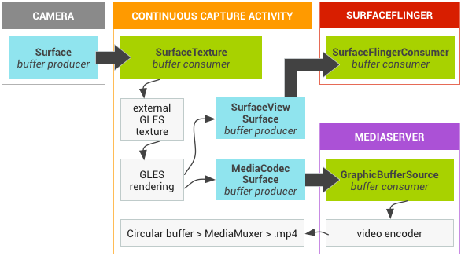

SurfaceTexture 类是在 Android 3.0 中引入的。就像 SurfaceView 是 Surface 和 View 的结合一样，SurfaceTexture 是 Surface 和 GLES texture 的粗糙结合（有几个警告）。

当你创建了一个 SurfaceTexture，你就创建了你的应用作为消费者的 BufferQueue。当一个新的缓冲区由生产者入对时，你的应用将通过回调 (`onFrameAvailable()`) 被通知。你的应用调用 `updateTexImage()`，这将释放之前持有的缓冲区，并从队列中获取新的缓冲区，执行一些 EGL 调用以使缓冲区可作为一个外部 texture 由 GLES 使用。
<!--more-->
# 外部 texture
外部 texture (GL_TEXTURE_EXTERNAL_OES) 与 GLES 创建的 textures (GL_TEXTURE_2D) 不太一样：你不得不以略微不同的方式配置你的渲染器，且有些东西你不能用它们做。重点是你可以直接用你的 BufferQueue 接收的数据渲染纹理多边形。gralloc 支持各种各样的格式，因此我们需要保证缓冲区中的数据的格式是 GLES 能够识别的。为了做到这一点，当 SurfaceTexture 创建 BufferQueue 时，它设置消费者的使用标记为 GRALLOC_USAGE_HW_TEXTURE，以确保 gralloc 创建的任何缓冲区对 GLES 是可用的。

由于 SurfaceTexture 与 EGL 上下文交互，你必须小心地在正确的线程中调用它的方法（类文档中有更多细节信息）。

# 时间戳和转换
如果你更深入地查看类文档，你会看到几个奇怪的调用。一个调用提取了时间戳，另一个提取了转换矩阵，每个的值都已经由之前 `updateTexImage()` 调用设置过了。事实证明，BufferQueue 不仅给消费者传递缓冲区句柄。每个缓冲区还伴随有一个时间戳和转换参数。

转换是为了效率而提供的。在一些情况下，消费者的源数据可能处于不正确的方向；但不是在发送数据之前旋转它，我们可以以当前的方向发送数据且伴随一个转换来修正它。从数据使用的角度来看转换矩阵可以与其它的转换合并，以最小化开销。

时间戳对某些缓冲区源很有用。比如，假设你将生产者接口与 camera 的输出连接在一起 (通过 `setPreviewTexture()`)。为了创建一个视频，你需要为每一帧设置显示时间戳；但你想要基于帧被捕获的时间，而不是你的应用接收到缓冲区的时间。与缓冲区一起提供的时间戳是由 camera 的代码设置的，这使得时间戳更加的一致连续。

# SurfaceTexture 和 Surface
如果你近距离查看 API 的话，你将发现应用创建平面 Surface 的仅有的方法是，通过接收一个 SurfaceTexture 作为单独的参数的构造函数。（在 API 11 之前，Surface 没有公共构造函数。）如果你将 SurfaceTexture 视为 Surface 和纹理的组合，这可能看起来有点落后。

在引擎盖下，SurfaceTexture 被称为 GLConsumer，它更精确地反映了它的角色是 BufferQueue 的拥有者和消费者。当你由 SurfaceTexture 创建 Surface 时，你正在做的事情是创建一个对象表示 SurfaceTexture 的 BufferQueue 的生产者端。

# 案例研究：Grafika 的持续捕获
Camera 可以提供一个适合于记录为视频的帧流。为了在屏幕上显示它，你创建一个 SurfaceView，并把 Surface 传递给 `setPreviewDispaly()`，并让生产者 (camera) 和消费者 (SurfaceFlinger) 完成所有的工作。为了记录视频，你以 MediaCodec 的 `createInputSurface()` 创建一个 Surface，将其传给 camera，然后坐回去并放松一下。为了同时显示并记录它，你不得不更多地参与进去。

*持续捕获* activity 以视频被记录的顺序显示来自于 camera 的视频。在这种情况下，编码的视频被写入一个可以在任何时间被保存到磁盘的内存中的循环缓冲区。只要你追踪所有内容，就可以直接实现。

这个流程包括三个 BufferQueue：一个由应用程序创建，一个由 SurfaceFlinger 创建，一个有 mediaserver 创建：

 * **应用程序**。应用程序使用一个 SurfaceTexture 接收来自于 Camera 的帧，并把它们转为外部 GLES 纹理。

 * **SurfaceFinger**。应用程序声明一个 SurfaceView，我们用它显示帧。

* **MediaServer**。你可以以一个输入 Surface 配置 MediaCodec 编码器来创建视频。

**图 1** Grafika 的持续捕获 activity。箭头表示从 camera 的数据传播，且 BufferQueue 是彩色的 (生产者是青色的，消费者是绿色的)。

编码后的 H.264 视频进入一个应用进程内内存中的循环缓冲区，并且当按下捕获按钮时，使用 MediaMuxer 类写入磁盘上的一个 MP4 文件。

所有的三个 BufferQueue 由应用中一个单独的 EGL context 处理，且 GLES 操作在 UI 线程中执行。在 UI 线程中执行 SurfaceView 渲染通常是不鼓励的，但由于我们正在执行由 GLES 驱动异步处理的简单的操作，所以应该没什么问题。(如果视频解码器锁定，而我们阻塞并试图取出缓冲区，则应用将变得无响应。但是在这一点上，我们大概还是会失败的。) 编码的数据的处理 - 管理循环缓冲区并将其写入磁盘 - 在另一个线程中执行。

大部分配置发生在 `SurfaceView` 的 `surfaceCreated()` 回调中。创建 EGLConext，为显示器和视频编码器创建 EGLSurfaces。当一个新帧到达时，我们告诉 SurfaceTexture 获取它并使它可以作为 GLES texture 使用，然后在每个 EGLSurface 上通过 GLES 命令渲染它（从 SurfaceTexture 转发转换和时间戳）。编码器线程从 MediaCodec 拉取编码后的输出并将其存储在内存中。

# 安全纹理视频播放

Android 7.0 支持受保护视频内容的 GPU 后处理。这允许对复杂的非线性视频效果（比如 warps）使用 GPU，将受保护视频内容映射到纹理上以用于通用的图形场景（比如，使用 OpenGL ES），以及虚拟显示（VR）。

**图 2.** 安全纹理视频播放

使用如下两个扩展来启用支持：

 * **EGL 扩展** ([EGL_EXT_protected_content](https://www.khronos.org/registry/egl/extensions/EXT/EGL_EXT_protected_content.txt))。允许创建受保护的 GL 上下文和 surfaces，它可以同时在受保护内容之上操作。

 * **EGL 扩展** ([GL_EXT_protected_textures](https://www.khronos.org/registry/gles/extensions/EXT/EXT_protected_textures.txt))。允许标记纹理为受保护的，以使它们可被用作 framebuffer 纹理附件。

Android 7.0 也更新 SurfaceTexture 和 ACodec (**libstagefright.so**) 以允许发送受保护的内容，即使窗口的 surface 没有加入窗口合成器（比如 SurfaceFlinger）的队列，并提供一个与受保护的上下文一起使用的受保护的视频 surface。这通过设置在受保护的上下文中创建的 surfaces 的正确的受保护消费者位 (GRALLOC_USAGE_PROTECTED) （由 ACodec 验证）。

这些改动使得可以创建执行增强视频效果或在 GL 中使用受保护的上下文来应用视频纹理的应用的应用开发者（比如，在 VR 中），可以在 GL 环境下（比如，在 VR 中）观看高价值视频内容（比如电影和电视节目）的终端用户，以及由于新增的设备功能（比如在 VR 中观看 HD 电影）而取得更高销量的 OEMs受益。新的 EGL 和 GLES 扩展可以被片上系统 (SoCs) 提供者和其它供应商使用，且当前是在 MSM8994 SoC 芯片组上实现并用于 Nexus 6P 的。

安全纹理视频播放为 OpenGL ES 环境中强大的 DRM 实现建立了基础。没有一个诸如 Widevine Level 1 这样强大的 DRM 实现，许多内容提供者将不允许在 OpenGL ES 环境下渲染它们的高品质内容，并阻碍重要的如观看 VR 中受 DRM 保护的内容这样的 VR 用例。

AOSP 包含了安全纹理视频播放的框架代码；驱动的支持则依赖于供应商。设备实现者必须实现 `EGL_EXT_protected_content` 和 `GL_EXT_protected_textures extensions`。当你使用你自己的编解码库（替换 libstagefright ）时，注意 `/frameworks/av/media/libstagefright/SurfaceUtils.cpp` 的修改，其允许缓冲区被标记为 `GRALLOC_USAGE_PROTECTED` 并发送给 ANativeWindows（即使 ANativeWindow 不直接入队窗口合成器），且消费者使用位包含 GRALLOC_USAGE_PROTECTED。关于实现扩展的详细文档，请参考 Khronos Registry ([EGL_EXT_protected_content](https://www.khronos.org/registry/egl/extensions/EXT/EGL_EXT_protected_content.txt), [GL_EXT_protected_textures](https://www.khronos.org/registry/gles/extensions/EXT/EXT_protected_textures.txt))

设备实现者也可能需要修改硬件，以确保受保护的内存映射到 GPU 之后保持对非受保护代码的受保护和不可读。

### [打赏](https://www.wolfcstech.com/about/donate.html)

[原文](https://source.android.com/devices/graphics/arch-st)
