----
title: GitLab 自动触发 Jenkins 构建
date: 2018-03-26 21:17:49
categories: 开发流程
tags:
- 开发流程
----

GitLab 是当前应用非常广泛的 Git Hosting 工具，[Jenkins](https://jenkins.io/) 是非常牛逼的持续集成工具。尽管 GitLab 有内建的 [GitLab CI](https://docs.gitlab.com/ee/ci/README.html)，但它远没有  Jenkins 那么强大好用。Jenkins 和 GitLab 在两者的结合上，都提供了非常方便的工具。在我们向 GitLab push 代码，或执行其它一些操作时，GitLab 可以将这些时间通知给 Jenkins，trigger Jenkins 工程的构建自动执行。

要实现在向 GitLab push 代码时，自动 trigger Jenkins 工程执行构建动作，需要在 GitLab 和 Jenkins 的多个地方做配置：(1)、在 Jenkins 中安装插件；(2)、配置 GitLab 用户；(3)、配置 Jenkins 服务器；(4)、配置 Jenkins 工程；(5)、配置 GitLab 工程。
<!--more-->
# 在 Jenkins 中安装插件

选择 ***系统管理*** -> ***管理插件*** 打开插件管理也页面，如下图： 


在 ***可选插件*** 中选择 [Gitlab Hook Plugin](https://wiki.jenkins-ci.org/display/JENKINS/Gitlab+Hook+Plugin) 和 [GitLab Plugin](https://wiki.jenkins-ci.org/display/JENKINS/GitLab+Plugin) 等插件，然后点击下方的 ***直接安装*** 按钮安装插件：

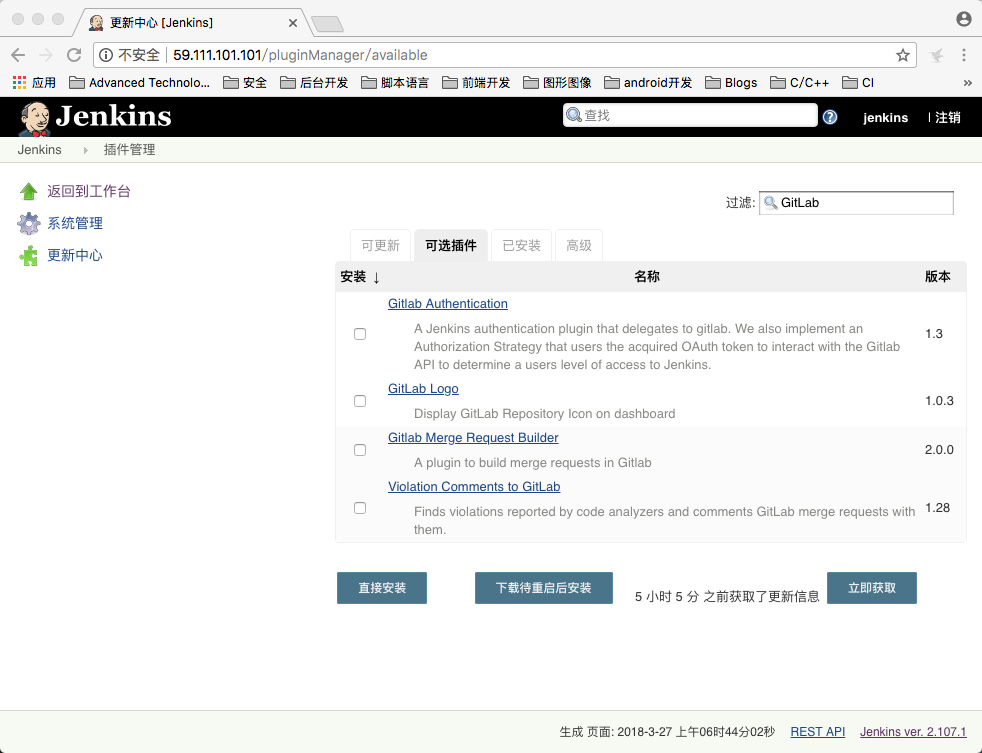

# 创建测试工程

为了便于测试，这里分别先在 Jenkins 和 GitLab 上创建测试工程。在 Jenkins Dashboard 主页点击 ***新建任务***，进入新建任务页面：

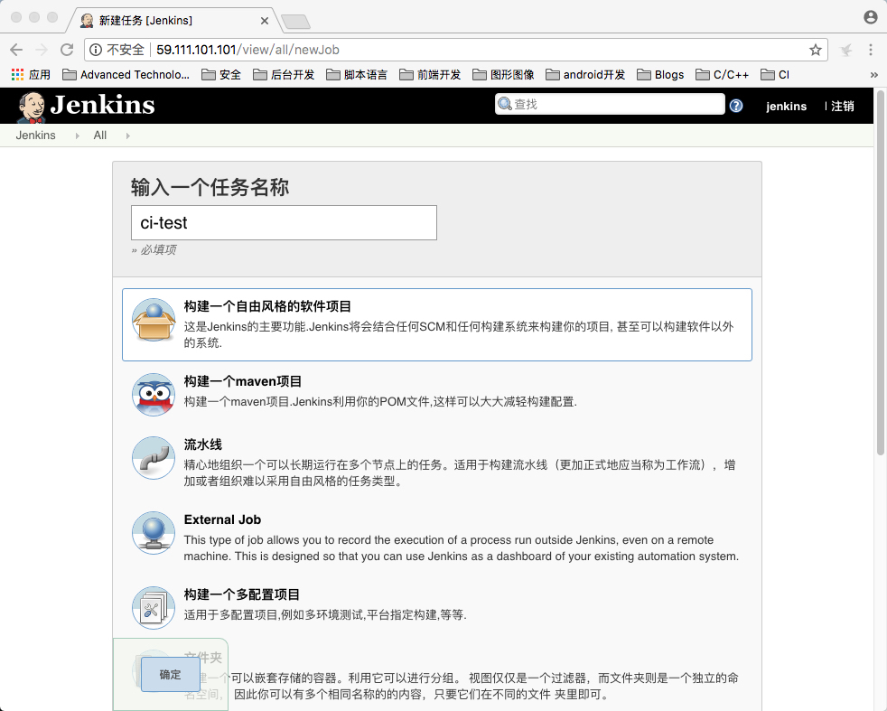

在输入框中输入工程名，选择 ***构建一个自由风格的软件项目***，然后点击左下角的 ***确定按钮***，进入工程配置页面。

在工程配置页面的 ***源码管理部分***，输入 GitLab repo 的 URL，如下图：

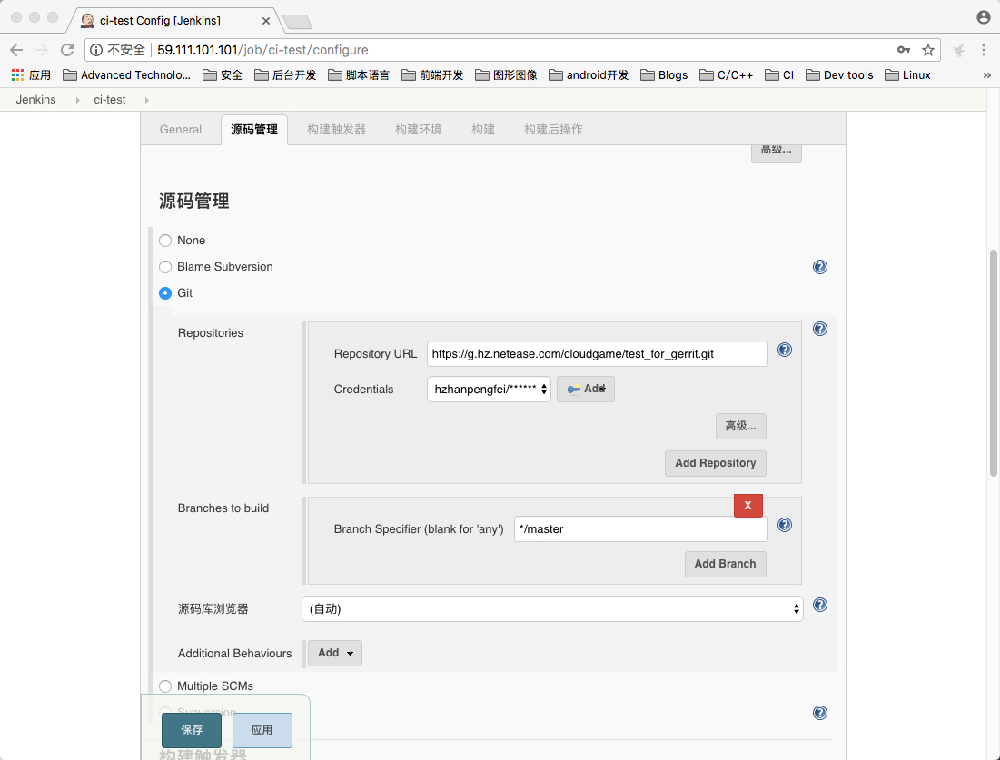

如果是 https 形式的 URL，记得配置登录 GitLab 的用户名和密码，通过点击 ***Credentials*** 行最后面的 ***Add*** -> ***Jenkins*** 按钮，在弹出的如下对话框中输入用户名和密码：

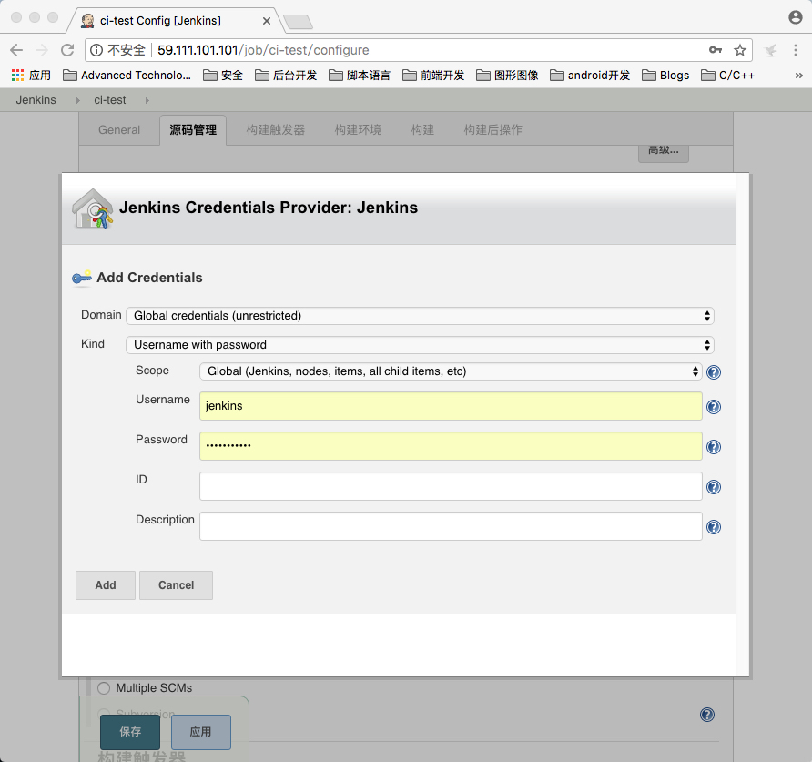

Add 之后，在 ***Credentials*** 的下拉框中选择这组用户名和密码。没有添加 GitLab 的用户密码的话，Jenkins 报错 —— 无法访问 repo，如下图：

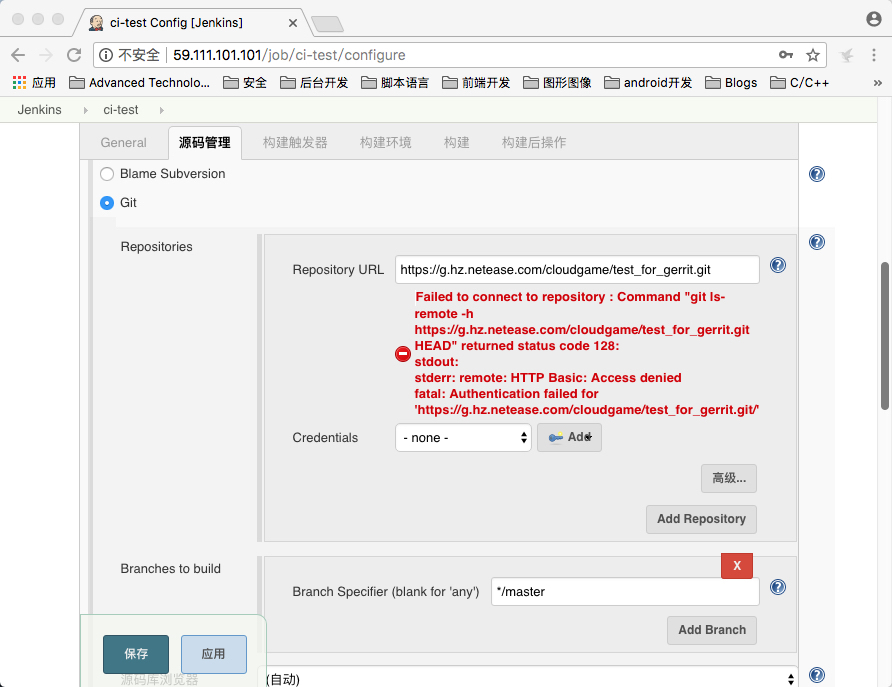

随后点击左下角的 ***保存*** 按钮，完成 Jenkins 工程的创建，并将它与 GitLab 的工程关联起来。

# 配置 GitLab 用户

创建一个用户或选择一个已有用户，用来让 Jenkins 和 GitLab  API 交互。这个用户将需要是全局的管理员或添加进每个组／工程，并作为成员。需要开发者权限来报告构建状态。这是由于，当使用了 'Merge when pipeline succeeds' 功能时，成功的构建状态可以触发合并。GitLab Plugin 的一些功能可能需要其它的一些权限。比如，有一个选项用于在构建成功时，接受 merge request。使用这一功能需要 developer，master 或 owner 级的权限。

选择 ***Settings*** -> ***Account***：

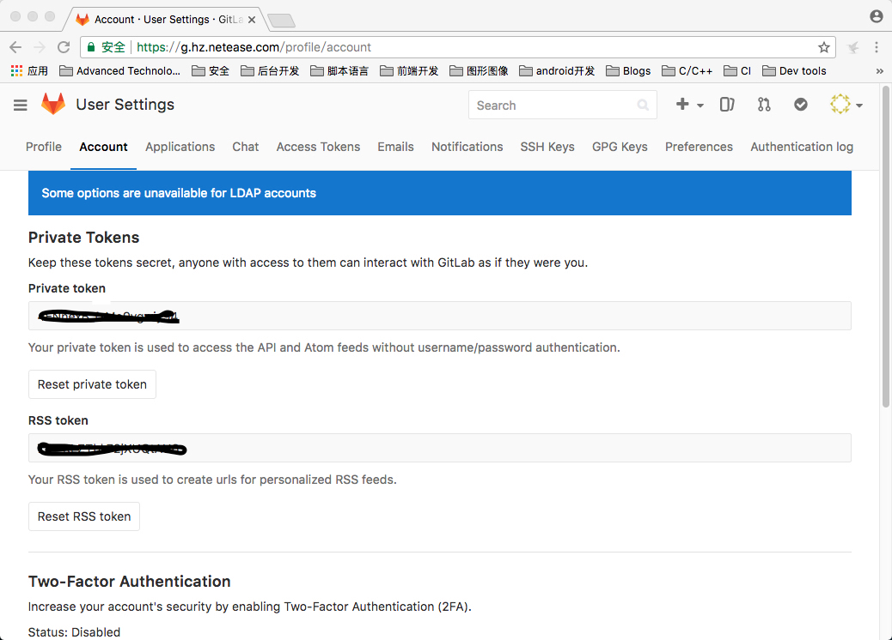

拷贝其中的 ***Private token***，稍后在配置 Jenkins 服务器时会用到。

# 配置 Jenkins 服务器

需要配置 Jenkins 服务器来与 GitLab 服务器通信。

在  Jenkins 中，选择 ***系统管理*** -> ***系统设置***，在系统设置中找到 ***GitLab*** 的部分：


在 ***Connection name*** 后的输入框中输入连接名称，在 ***Gitlab host URL*** 后的输入框中输入 GitLab 服务器的 URL 地址。点击 ***Credentials*** 行最后面的 ***Add*** -> ***Jenkins*** 按钮，弹出如下对话框，在 *** Kind*** 后的下拉列表中选择 ***GitLab API token***，并把上一步拷贝的 ***Private token*** 粘贴到 ***API token*** 后面的输入框中。随后在 ***Credentials*** 的下拉框中选择 ***GitLab API token***。

# 配置 Jenkins 工程

打开 Jenkins 工程的配置页面，找到 ***构建触发器*** 的部分，勾选 ***Build when a change is pushed to GitLab*** 那一行：

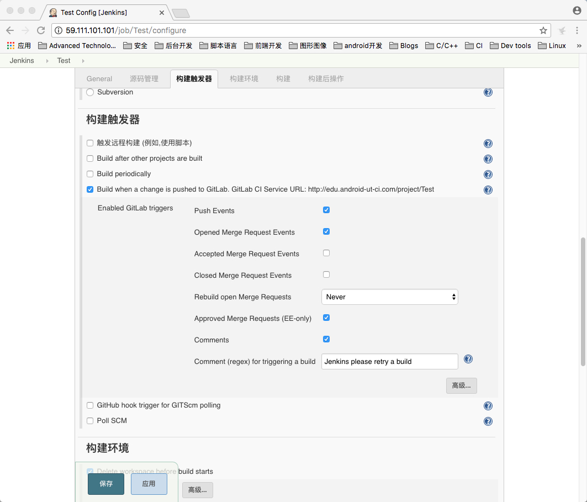

需要记下 ***Build when a change is pushed to GitLab*** 那一行中，***GitLab CI Service URL:*** 后面的 URL，后面在配置 GitLab 工程时需要用到。

还要点开右下角的 ***高级***：

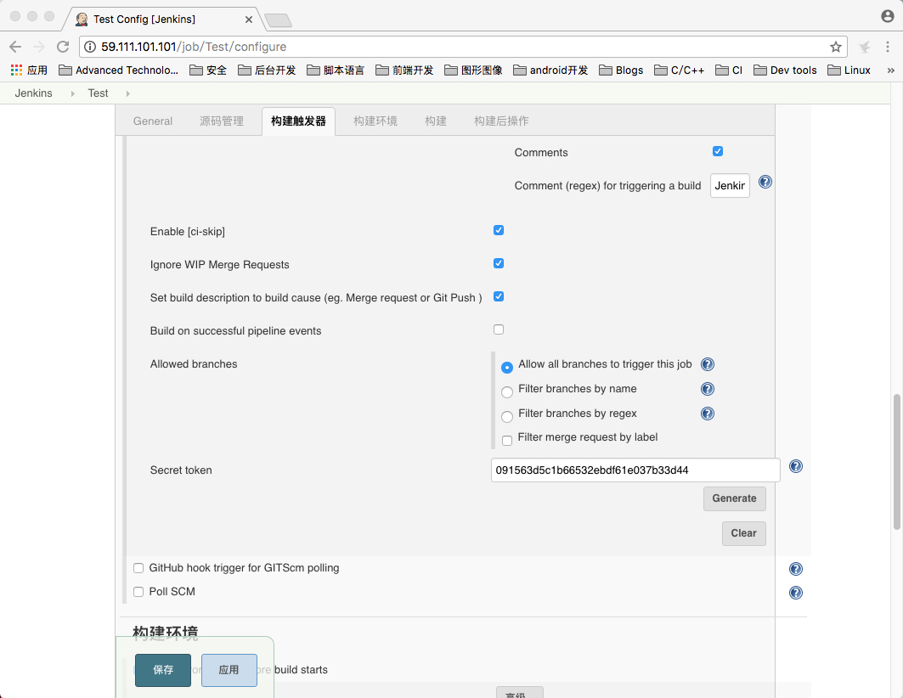

随后点击右下角的 ***Generate*** 按钮，生成 ***Secret token***，保存这里生成的 Secret token，它同样将用于后面 GitLab 的配置。随后点击左下角的 ***保存*** 按钮，保存前面所做的配置。

# 配置 GitLab 工程

创建一个新的或选择一个已有的 GitLab 工程。然后选择 ***Settings*** -> *** Integrations***，在 **URL** 一栏中输入前面保存的 **GitLab CI Service URL**，在 **Secret Token** 一栏中输入前面保存的 ***Secret token***，然后选择需要 trigger Jenkins 工程执行构建的事件：

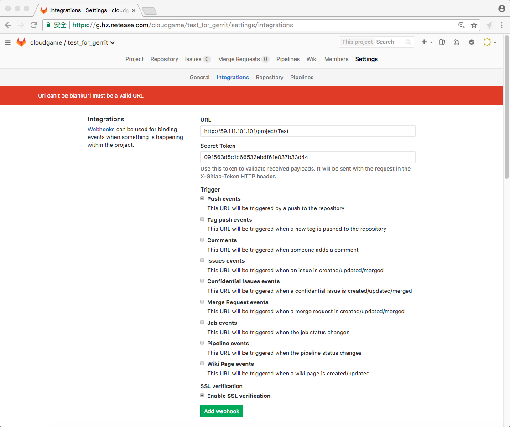

点击绿色的 ***Add webhook*** 按钮，完成 webhook 的创建。

创建好了 webhook 之后，点击 **Test** 下拉框中的 **Push events**，如下图：

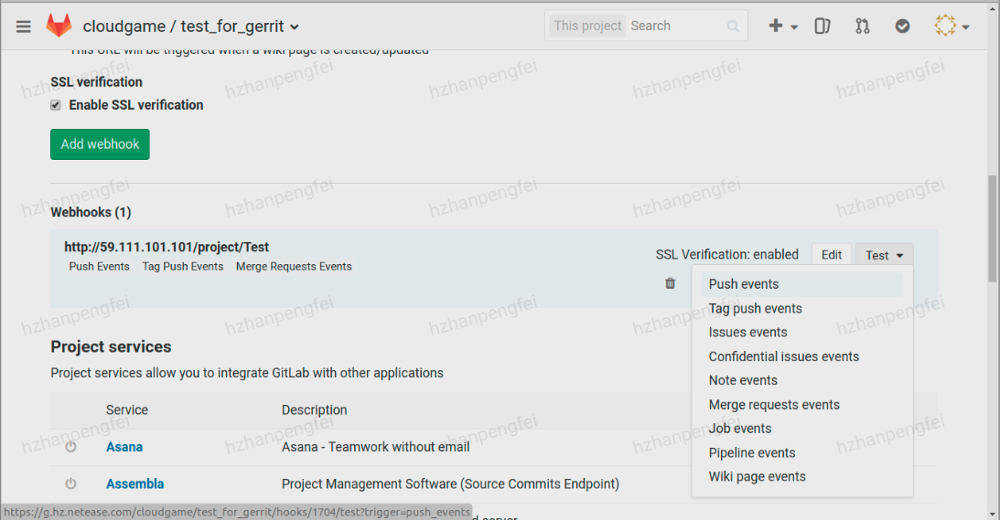

可以手动产生事件，触发 Jenkins 工程。点击 **Edit**，在 webhook 的编辑页面，拉到页面底部，还可以看到，该 webhook 最近的调用情况，如下图：


点开特定调用的 **View details**，还可以看到这次调用的详细情况，如下图：

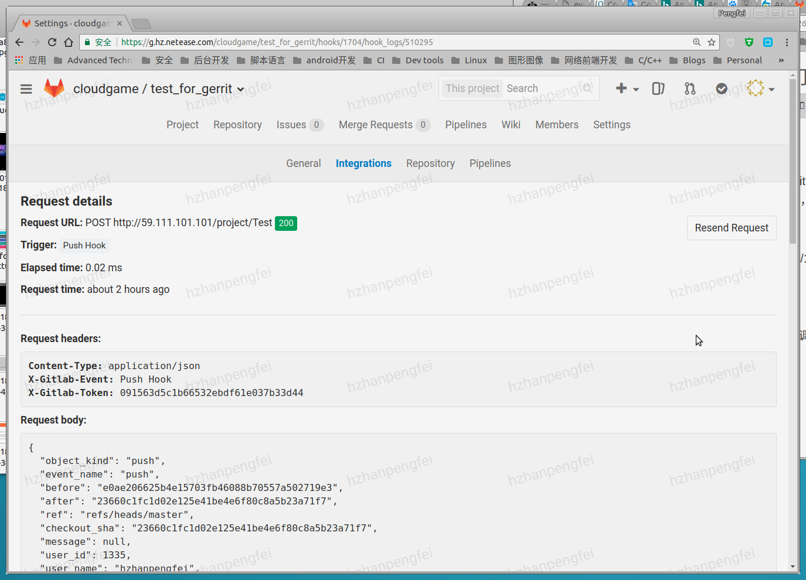

由此不难理解，GitLab trigger Jenkins 工程，主要是通过向 Jenkins 服务器发送一个 POST 请求实现的。

# 验证测试

修改我们的 GitLab 测试工程中的文件，并 push 到 GitLab 服务器上：

```
➜  test_for_gerrit git:(master) echo "Hello, world" >> read2.md

➜  test_for_gerrit git:(master) ✗ git status
On branch master
Your branch is up-to-date with 'origin/master'.
Changes not staged for commit:
  (use "git add <file>..." to update what will be committed)
  (use "git checkout -- <file>..." to discard changes in working directory)

	modified:   read2.md

no changes added to commit (use "git add" and/or "git commit -a")
➜  test_for_gerrit git:(master) ✗ git add .
➜  test_for_gerrit git:(master) ✗ git commit -m "Add test data."
➜  test_for_gerrit git:(master) git push
warning: push.default is unset; its implicit value has changed in
Git 2.0 from 'matching' to 'simple'. To squelch this message
and maintain the traditional behavior, use:

  git config --global push.default matching

To squelch this message and adopt the new behavior now, use:

  git config --global push.default simple

When push.default is set to 'matching', git will push local branches
to the remote branches that already exist with the same name.

Since Git 2.0, Git defaults to the more conservative 'simple'
behavior, which only pushes the current branch to the corresponding
remote branch that 'git pull' uses to update the current branch.

See 'git help config' and search for 'push.default' for further information.
(the 'simple' mode was introduced in Git 1.7.11. Use the similar mode
'current' instead of 'simple' if you sometimes use older versions of Git)

Counting objects: 3, done.
Delta compression using up to 4 threads.
Compressing objects: 100% (3/3), done.
Writing objects: 100% (3/3), 312 bytes | 0 bytes/s, done.
Total 3 (delta 1), reused 0 (delta 0)
To ssh://git@g.hz.netease.com:22222/cloudgame/test_for_gerrit.git
   23660c1..e86152a  master -> master
➜  test_for_gerrit git:(master) 
```

随后迅速地就能在 Jenkins 中，测试工程主页面的左下方，看到由 GitLab push 所 trigger 起来的构建任务：

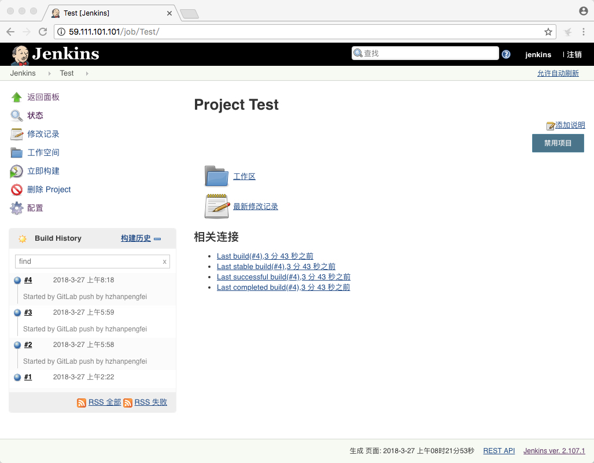

在由 GitLab push 所 trigger 起来的构建任务的下方，会显示构建任务是由谁 push 的代码所 trigger 起来的。打开特定构建任务的 **控制台输出** 可以看到构建的详细过程：


参考文档：

[Jenkins CI service](https://docs.gitlab.com/ee/integration/jenkins.html)
[Gitlab自动触发Jenkins构建打包](http://www.cnblogs.com/bugsbunny/p/7919993.html)

**除非文章内特别说明，你可以转载这个博客的文章，但请加入文章作者和出处。谢谢。**

Done.

