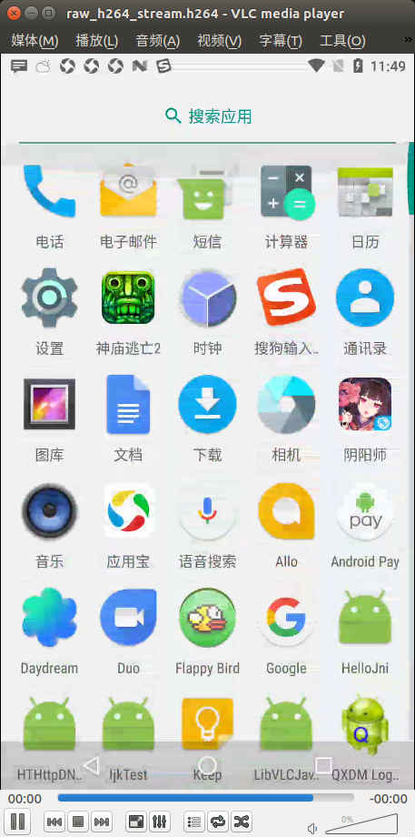
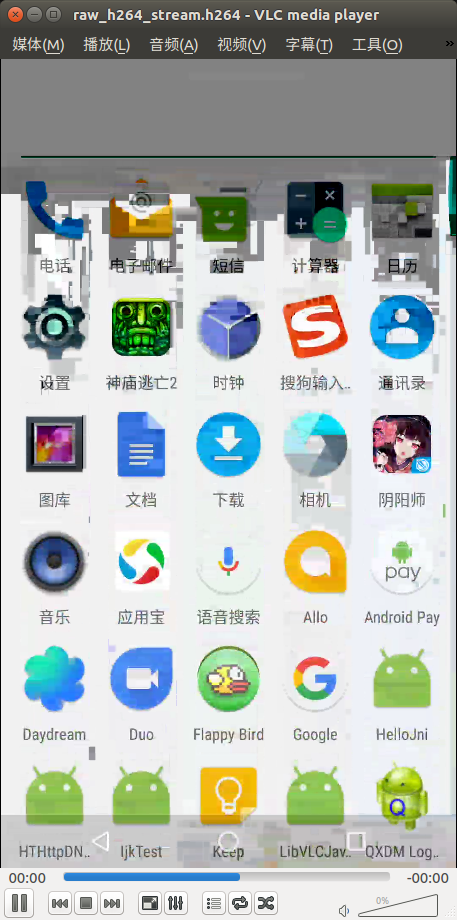

我们平时遇到的视频文件各式各样，五花八门。通常它们会根据格式的不同，而有着不同的扩展名，比如 avi，rmvb，mkv，mp4 等等等。这些格式代表的都是 **封装格式**。
<!--more-->
这些文件通常产生的过程是这样的：
1. 通过录制工具录制一帧一帧的图像，可能是 Camera，屏幕截取工具等。
2. 将录制的图像送给编码器进行编码，得到原始的视频码流，也称为裸流。比如视频中常用的 H.264 格式的编码。
3. 将原始的视频码流封装进封装格式文件中，产生我们最终看到的视频文件。

封装格式的文件，由于其通常可以包含更丰富的信息，存储传输方便，而得到广泛的应用，因此可以播放各种各样封装格式文件的播放器也非常多。

而原始的视频码流通常可以为我们学习视频编解码的知识提供极大的方便。由上面封装格式文件产生的过程，可以看出，H.264 原始视频码流的播放，显然要比封装格式文件的播放简单许多，但由于原始码流的实用价值有限，而难以找到相应的播放工具。

实际上，ffmpeg 项目又在原始 H.264 码流播放这个问题上，拯救了广大的视频编解码开发者。

ffmpeg 工具集提供的 `ffplay` 可以播放 H.264 裸流。如下面这样一个保存为文件的 H.264 裸流：

```
00000000   00 00 00 01  67 42 80 2A  DA 01 10 0F  1E 5E 52 0A  ....gB.*.....^R.
00000010   0C 0A 0D A1  42 6A 00 00  00 01 68 CE  06 E2 00 00  ....Bj....h.....
00000020   00 01 65 B8  40 F7 0F 84  3F 0F 42 E0  00 42 93 45  ..e.@...?.B..B.E
00000030   1E BF FF E0  C5 4B 1E A0  3D AE 5B FF  8D 3D 34 DA  .....K..=.[..=4.
00000040   C2 1A FF E0  89 5E CF DA  AB 58 F5 00  08 3E BB EE  .....^...X...>..
00000050   FF FC 13 68  3B F6 B6 BF  FF 7D C5 05  78 4D D4 69  ...h;....}..xM.i
00000060   8E 8E 2F FF  1E B8 20 E0  3F 6C 66 2D  74 35 B5 FF  ../... .?lf-t5..
00000070   F1 7D C5 05  78 17 28 D6  2D 26 BF F8  9E B8 20 E0  .}..x.(.-&.... .
00000080   7E FE E8 B5  B5 FF F7 7D  DD 05 78 17  0E 75 F2 60  ~......}..x..u.`
00000090   57 C1 0C 00  20 FA EF BB  00 BF F2 0F  7B 1D BE D6  W... .......{...
000000A0   D6 D6 D6 D6  D7 FF E3 BB  A0 AF 35 82  30 C7 46 47  ..........5.0.FG
000000B0   EA 85 1E FF  EE 7F 04 1D  96 13 B1 11  AD AD AD AD  ................
000000C0   AD AD AD AD  AD AD AD AD  AD AD AD AD  AD AD AD AD  ................
000000D0   AD AF FF FD  D0 21 E0 8F  78 15 51 AF  FF 8F D0 57  .....!..x.Q....W
000000E0   85 F3 80 90  B2 DC 06 34  5C FF FA E1  82 0E 0B 0D  .......4\.......
000000F0   95 C4 4D 63  D7 FF FC 73  87 AF FF A9  AD A2 D5 A8  ..Mc...s........
00000100   77 2D FF FE  28 10 F0 47  BC 30 8F FF  71 EA 82 BC  w-..(..G.0..q...
00000110   18 81 D5 16  1D A6 0C 18  A5 04 31 7F  FC D7 F3 F6  ..........1.....
00000120   B6 B6 B6 B6  B6 B6 BF 0F  FF 41 2C 76  98 2B E9 D7  .........A,v.+..
00000130   EC E0 1F 48  30 A4 0C 56  98 7B A3 7E  DC 7F FF B0  ...H0..V.{.~....
00000140   9F 03 A1 8D  EC 64 26 96  C9 C0 00 97  BF F5 F9 55  .....d&........U
00000150   05 3C 0B B4  9A 6D FC D0  77 22 5B C3  0F FF 13 DB  .<...m..w"[.....
00000160   53 EA 37 FD  3F FF FE C2  40 43 87 1E  82 D2 C6 DD  S.7.?...@C......
00000170   3C 0D 9C 86  59 CE F0 F3  59 5B E4 2D  2A 73 F6 08  <...Y...Y[.-*s..
00000180   BD 3F 6B 0B  94 37 D4 21  73 47 FD 04  CA F1 57 CC  .?k..7.!sG....W.
00000190   CA 10 40 71  BB 3F CE BD  B3 4C 32 D2  0E B8 B9 95  ..@q.?...L2.....
000001A0   64 0E C4 98  94 42 D7 6C  6B BB CF 0C  21 97 FF EA  d....B.lk...!...
000001B0   FE 7F FF 28  79 20 23 0A  66 8C 40 F1  AF AB C1 EA  ...(y #.f.@.....
000001C0   85 B9 48 4B  22 A9 2B C0  31 37 93 18  73 36 09 E1  ..HK".+.17..s6..
000001D0   FE DA 12 AB  34 E4 E1 98  21 9D 4F 48  A8 BD 2D 9E  ....4...!.OH..-.
000001E0   3D 4F 9C F0  D7 1A 7D 21  F6 15 99 88  1F 69 99 D5  =O....}!.....i..
000001F0   7F 28 79 25  10 CC D1 83  13 A6 AA 03  7F 1C C5 90  .(y%............
00000200   7A D0 37 64  39 11 40 AF  00 C4 FB F4  42 4C 35 3E  z.7d9.@.....BL5>
00000210   F5 93 86 66  86 60 74 E2  61 E4 6B 7C  DF 3A 5E 34  ...f.`t.a.k|.:^4
00000220   A3 9C 04 2D  7C 7B FC 77  4C AA 77 3F  FC 81 BD 90  ...-|{.wL.w?....
00000230   0D 85 37 1D  A6 33 07 5E  A2 57 11 00  E9 38 9B 31  ..7..3.^.W...8.1
00000240   09 39 00 15  E6 12 3F 84  2A 48 37 E7  61 C7 3D 3D  .9....?.*H7.a.==
00000250   94 EA B0 0C  D0 D0 CD 74  A5 E3 48 83  B4 ED F6 EC  .......t..H.....
00000260   5B E1 CF F8  8C 3B 69 FF  07 20 86 27  36 FD 30 21  [....;i.. .'6.0!
---  raw_h264_stream.raw       --0x0/0x7B68BE----------------------------------
```

第 0 ~ 21 字节为第一个 NALU，第 22 ~ 29 个字节为第二个 NALU，等等。

可以将文件路径直接作为 `ffplay` 的参数，来启动播放：
```
$ ffplay raw_h264_stream.h264 
ffplay version 2.8.11-0ubuntu0.16.04.1 Copyright (c) 2003-2017 the FFmpeg developers
  built with gcc 5.4.0 (Ubuntu 5.4.0-6ubuntu1~16.04.4) 20160609
  configuration: --prefix=/usr --extra-version=0ubuntu0.16.04.1 --build-suffix=-ffmpeg --toolchain=hardened --libdir=/usr/lib/x86_64-linux-gnu --incdir=/usr/include/x86_64-linux-gnu --cc=cc --cxx=g++ --enable-gpl --enable-shared --disable-stripping --disable-decoder=libopenjpeg --disable-decoder=libschroedinger --enable-avresample --enable-avisynth --enable-gnutls --enable-ladspa --enable-libass --enable-libbluray --enable-libbs2b --enable-libcaca --enable-libcdio --enable-libflite --enable-libfontconfig --enable-libfreetype --enable-libfribidi --enable-libgme --enable-libgsm --enable-libmodplug --enable-libmp3lame --enable-libopenjpeg --enable-libopus --enable-libpulse --enable-librtmp --enable-libschroedinger --enable-libshine --enable-libsnappy --enable-libsoxr --enable-libspeex --enable-libssh --enable-libtheora --enable-libtwolame --enable-libvorbis --enable-libvpx --enable-libwavpack --enable-libwebp --enable-libx265 --enable-libxvid --enable-libzvbi --enable-openal --enable-opengl --enable-x11grab --enable-libdc1394 --enable-libiec61883 --enable-libzmq --enable-frei0r --enable-libx264 --enable-libopencv
  libavutil      54. 31.100 / 54. 31.100
  libavcodec     56. 60.100 / 56. 60.100
  libavformat    56. 40.101 / 56. 40.101
  libavdevice    56.  4.100 / 56.  4.100
  libavfilter     5. 40.101 /  5. 40.101
  libavresample   2.  1.  0 /  2.  1.  0
  libswscale      3.  1.101 /  3.  1.101
  libswresample   1.  2.101 /  1.  2.101
  libpostproc    53.  3.100 / 53.  3.100
Input #0, h264, from 'raw_h264_stream.raw':   0KB sq=    0B f=0/0   
  Duration: N/A, bitrate: N/A
    Stream #0:0: Video: h264 (Baseline), yuv420p(tv, bt470bg/bt470bg/smpte170m), 1080x1920, 25 fps, 25 tbr, 1200k tbn, 50 tbc
```
`ffplay` 还会打印与视频相关的一些信息，如 H.264 的编码配置，图像格式，分辨率等等。此外，默认还会输出所用的 ffmpeg 库的配置信息。`ffplay` 界面如下图：


相对于许多其它面向普通用户的播放器而言，`ffplay` 在用户操作上是简陋了点，几乎没有为用户提供任何对视频播放的控制功能，但还是为音视频的开发提供了极大的方便。

除了 `ffplay` 之外，基于 ffmpeg 开发的 vlc 播放器，也支持播放 H.264 裸流，如：
```
$ vlc -vvv raw_h264_stream.h264 
VLC media player 2.2.2 Weatherwax (revision 2.2.2-0-g6259d80)
[0000000000aaa158] core libvlc debug: VLC media player - 2.2.2 Weatherwax
[0000000000aaa158] core libvlc debug: Copyright © 1996-2016 the VideoLAN team
[0000000000aaa158] core libvlc debug: revision 2.2.2-0-g6259d80
[0000000000aaa158] core libvlc debug: configured with ./configure  '--build=x86_64-linux-gnu' '--prefix=/usr' '--includedir=${prefix}/include' '--mandir=${prefix}/share/man' '--infodir=${prefix}/share/info' '--sysconfdir=/etc' '--localstatedir=/var' '--disable-silent-rules' '--libdir=${prefix}/lib/x86_64-linux-gnu' '--libexecdir=${prefix}/lib/x86_64-linux-gnu' '--disable-maintainer-mode' '--disable-dependency-tracking' '--config-cache' '--disable-update-check' '--enable-fast-install' '--docdir=/usr/share/doc/vlc-data' '--libdir=/usr/lib' '--with-binary-version=2.2.2-5ubuntu0.16.04.3' '--enable-a52' '--enable-aa' '--enable-bluray' '--enable-bonjour' '--enable-caca' '--enable-chromaprint' '--enable-dbus' '--enable-dca' '--enable-directfb' '--enable-dvbpsi' '--enable-dvdnav' '--enable-faad' '--enable-flac' '--enable-fluidsynth' '--enable-freerdp' '--enable-freetype' '--enable-fribidi' '--disable-gles1' '--enable-gles2' '--enable-gnutls' '--enable-jack' '--enable-kate' '--enable-libass' '--enable-libmpeg2' '--enable-libxml2' '--enable-lirc' '--enable-live555' '--enable-mad' '--enable-mkv' '--enable-mod' '--enable-mpc' '--enable-mtp' '--enable-mux_ogg' '--enable-ncurses' '--enable-notify' '--enable-ogg' '--enable-opus' '--enable-pulse' '--enable-qt' '--enable-realrtsp' '--enable-samplerate' '--enable-schroedinger' '--enable-sdl' '--enable-sdl-image' '--enable-sftp' '--enable-shine' '--enable-shout' '--enable-skins2' '--enable-speex' '--enable-svg' '--enable-svgdec' '--enable-taglib' '--enable-theora' '--enable-twolame' '--enable-upnp' '--enable-vcdx' '--enable-vdpau' '--enable-vnc' '--enable-vorbis' '--enable-x264' '--enable-x265' '--enable-zvbi' '--with-kde-solid=/usr/share/kde4/apps/solid/actions/' '--disable-decklink' '--disable-dxva2' '--disable-fdkaac' '--disable-gnomevfs' '--disable-goom' '--disable-libtar' '--disable-mfx' '--disable-opencv' '--disable-projectm' '--disable-sndio' '--disable-telx' '--disable-vpx' '--disable-vsxu' '--disable-wasapi' '--enable-alsa' '--enable-atmo' '--enable-dc1394' '--enable-dv1394' '--enable-linsys' '--enable-omxil' '--enable-udev' '--enable-v4l2' '--enable-libva' '--enable-vcd' '--enable-smbclient' '--disable-oss' '--enable-crystalhd' '--enable-mmx' '--enable-sse' '--disable-neon' '--disable-altivec' 'build_alias=x86_64-linux-gnu' 'CFLAGS=-g -O2 -fstack-protector-strong -Wformat -Werror=format-security ' 'LDFLAGS=-Wl,-Bsymbolic-functions -Wl,-z,relro -Wl,--as-needed' 'CPPFLAGS=-Wdate-time -D_FORTIFY_SOURCE=2' 'CXXFLAGS=-g -O2 -fstack-protector-strong -Wformat -Werror=format-security ' 'OBJCFLAGS=-g -O2 -fstack-protector-strong -Wformat -Werror=format-security'
[0000000000aaa158] core libvlc debug: searching plug-in modules
[0000000000aaa158] core libvlc debug: loading plugins cache file /usr/lib/vlc/plugins/plugins.dat
[0000000000aaa158] core libvlc debug: recursively browsing `/usr/lib/vlc/plugins'
[0000000000aaa158] core libvlc debug: saving plugins cache /usr/lib/vlc/plugins/plugins.dat
. . . . . .
```

即使是对于 H.264 裸流，vlc 也提供了进度控制等功能：



进度时间总是显示为 0。如果真的去拖动进度条的话，画面还可能会花掉：



### [打赏](https://www.wolfcstech.com/about/donate.html)

Done。
