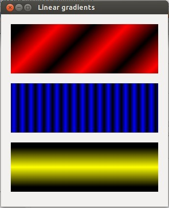

PyCairo 教程的这个部分，我们将讨论渐变。我们将提到线性的和径向的渐变。

在计算机图形学中，渐变是从浅色到深色或从一种颜色到另一种颜色的平滑混合。在 2D 绘图程序和绘画程序中，渐变被用于创建五彩缤纷的背景和特殊的效果，也用于模拟灯光和阴影。(answers.com)
<!--more-->
# 线性渐变

线性渐变是颜色或色调沿着线的混合。在 PyCairo 中，它们由一个 `cairo.LinearGradient` 类表示。
```
#!/usr/bin/python

'''
ZetCode PyCairo tutorial 

This program works with linear
gradients in PyCairo.

author: Jan Bodnar
website: zetcode.com 
last edited: August 2018
'''

import gi
gi.require_version('Gtk', '3.0')
from gi.repository import Gtk
import cairo


class Example(Gtk.Window):

    def __init__(self):
        super(Example, self).__init__()
        
        self.init_ui()
        
        
    def init_ui(self):    

        darea = Gtk.DrawingArea()
        darea.connect("draw", self.on_draw)
        self.add(darea)

        self.set_title("Linear gradients")
        self.resize(340, 390)
        self.set_position(Gtk.WindowPosition.CENTER)
        self.connect("delete-event", Gtk.main_quit)
        self.show_all()
        
    
    def on_draw(self, wid, cr):
        
        self.draw_gradient1(cr)
        self.draw_gradient2(cr)
        self.draw_gradient3(cr)
        
        
    def draw_gradient1(self, cr):

        lg1 = cairo.LinearGradient(0.0, 0.0, 350.0, 350.0)
       
        count = 1

        i = 0.1    
        while i < 1.0: 
            if count % 2:
                lg1.add_color_stop_rgba(i, 0, 0, 0, 1)
            else:
                lg1.add_color_stop_rgba(i, 1, 0, 0, 1)
            i = i + 0.1
            count = count + 1      


        cr.rectangle(20, 20, 300, 100)
        cr.set_source(lg1)
        cr.fill()
        
        
    def draw_gradient2(self, cr):        

        lg2 = cairo.LinearGradient(0.0, 0.0, 350.0, 0)
       
        count = 1
         
        i = 0.05    
        while i < 0.95: 
            if count % 2:
                lg2.add_color_stop_rgba(i, 0, 0, 0, 1)
            else:
                lg2.add_color_stop_rgba(i, 0, 0, 1, 1)
            i = i + 0.025
            count = count + 1        

        cr.rectangle(20, 140, 300, 100)
        cr.set_source(lg2)
        cr.fill()
        
        
    def draw_gradient3(self, cr):        

        lg3 = cairo.LinearGradient(20.0, 260.0,  20.0, 360.0)
        lg3.add_color_stop_rgba(0.1, 0, 0, 0, 1) 
        lg3.add_color_stop_rgba(0.5, 1, 1, 0, 1) 
        lg3.add_color_stop_rgba(0.9, 0, 0, 0, 1) 

        cr.rectangle(20, 260, 300, 100)
        cr.set_source(lg3)
        cr.fill()
        
    
def main():
    
    app = Example()
    Gtk.main()
        
        
if __name__ == "__main__":    
    main()
```
这个例子绘制了由线性渐变填充的三个矩形。

```
        lg3 = cairo.LinearGradient(20.0, 260.0, 20.0, 360.0)
```
此处我们创建了一个线性渐变。参数指定了一条直线，我们沿着这条直线绘制。这是一条竖直直线。

```
lg3.add_color_stop_rgba(0.1, 0, 0, 0, 1) 
lg3.add_color_stop_rgba(0.5, 1, 1, 0, 1) 
lg3.add_color_stop_rgba(0.9, 0, 0, 0, 1) 
```
我们定义颜色终止点来产生我们的渐变模式。在这个例子中，渐变是黑色和黄色的混合。通过添加两个黑色和一个黄色终止点，我们创建了一个横向的渐变模式。这些终止点实际意味着什么呢？在我们的例子中，我们以黑色开始，它会终止于 1/10 大小处。然后我们逐渐地用黄色来绘制，这将在形状的中心达到高潮。黄色终止于 9/10 大小处，我们在此处再次开始用黑色绘制，直到终点。



# 径向渐变

径向渐变是两个圆之间的颜色或色调的混合。在PyCairo中，用 `cairo.RadialGradient` 类创建径向渐变。
```
#!/usr/bin/python

'''
ZetCode PyCairo tutorial

This program works with radial
gradients in PyCairo.

author: Jan Bodnar
website: zetcode.com 
last edited: August 2012
'''

import gi
gi.require_version('Gtk', '3.0')
from gi.repository import Gtk
import cairo
import math


class Example(Gtk.Window):

    def __init__(self):
        super(Example, self).__init__()
        
        self.init_ui()
        
        
    def init_ui(self):    

        darea = Gtk.DrawingArea()
        darea.connect("draw", self.on_draw)
        self.add(darea)

        self.set_title("Radial gradients")
        self.resize(300, 200)
        self.set_position(Gtk.WindowPosition.CENTER)
        self.connect("delete-event", Gtk.main_quit)
        self.show_all()
        
    
    def on_draw(self, wid, cr):
        
        self.draw_gradient1(cr)
        self.draw_gradient2(cr)
        

    def draw_gradient1(self, cr):
        
        cr.set_source_rgba(0, 0, 0, 1)
        cr.set_line_width(12)

        cr.translate(60, 60)
        
        r1 = cairo.RadialGradient(30, 30, 10, 30, 30, 90)
        r1.add_color_stop_rgba(0, 1, 1, 1, 1)
        r1.add_color_stop_rgba(1, 0.6, 0.6, 0.6, 1)
        cr.set_source(r1)
        cr.arc(0, 0, 40, 0, math.pi * 2)
        cr.fill()
        
        cr.translate(120, 0)
        
        
    def draw_gradient2(self, cr):        

        r2 = cairo.RadialGradient(0, 0, 10, 0, 0, 40)
        r2.add_color_stop_rgb(0, 1, 1, 0)
        r2.add_color_stop_rgb(0.8, 0, 0, 0)
        cr.set_source(r2)
        cr.arc(0, 0, 40, 0, math.pi * 2)
        cr.fill()   
        
    
def main():
    
    app = Example()
    Gtk.main()
        
        
if __name__ == "__main__":    
    main()
```
在这个例子中，我们绘制了两个径向渐变。

```
        r1 = cairo.RadialGradient(30, 30, 10, 30, 30, 90)
        r1.add_color_stop_rgba(0, 1, 1, 1, 1)
        r1.add_color_stop_rgba(1, 0.6, 0.6, 0.6, 1)
        cr.set_source(r1)
        cr.arc(0, 0, 40, 0, math.pi * 2)
        cr.fill()
```
我们绘制了一个圆圈，并用径向渐变填充它的内部。径向渐变由两个圆定义。`add_color_stop_rgba()` 方法定义颜色。我们可以试验圆的位置或半径的长度。在第一个渐变的例子中，我们创建一个对象，它类似于一个 3D 形状。

```
        r2 = cairo.RadialGradient(0, 0, 10, 0, 0, 40)
        r2.add_color_stop_rgb(0, 1, 1, 0)
        r2.add_color_stop_rgb(0.8, 0, 0, 0)
        cr.set_source(r2)
        cr.arc(0, 0, 40, 0, math.pi * 2)
        cr.fill()
```
在这个例子中，定义径向渐变的圆和将要绘制的圆，具有相同的中心位置。


在这一章中，我们讨论了 PyCairo 的渐变。

[原文](http://zetcode.com/gfx/pycairo/gradients/)

Done.
