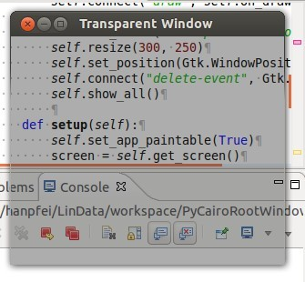

PyCairo 教程的这个部分，我们将与根窗口打交道。根窗口就是桌面窗口，通常也是我们放置图标的地方。

控制根窗口是可能的。从程序员的角度来看，它仅仅是一种特殊的窗口。
<!--more-->
# 透明窗口

我们的第一个例子将创建一个透明窗口。我们将看到窗口对象下面是什么东西。

```
#!/usr/bin/python

'''
ZetCode PyCairo tutorial

This code example shows how to
create a transparent window.

author: Jan Bodnar
website: zetcode.com
last edited: August 2012
'''

import gi
gi.require_version('Gtk', '3.0')
from gi.repository import Gtk
import cairo


class Example(Gtk.Window):
    def __init__(self):
        super(Example, self).__init__()

        self.tran_setup()
        self.init_ui()

    def init_ui(self):
        self.connect("draw", self.on_draw)

        self.set_title("Transparent window")
        self.resize(300, 250)
        self.set_position(Gtk.WindowPosition.CENTER)
        self.connect("delete-event", Gtk.main_quit)
        self.show_all()

    def tran_setup(self):
        self.set_app_paintable(True)
        screen = self.get_screen()

        visual = screen.get_rgba_visual()
        if visual != None and screen.is_composited():
            self.set_visual(visual)

    def on_draw(self, wid, cr):
        cr.set_source_rgba(0.2, 0.2, 0.2, 0.4)
        cr.set_operator(cairo.OPERATOR_SOURCE)
        cr.paint()


def main():
    app = Example()
    Gtk.main()


if __name__ == "__main__":
    main()
```
为了创建透明窗口，我们获取 screen 对象的 visual 值，并为我们的窗口设置它。在 `on_draw()` 方法中，我们在 screen 的 visual 对象上绘制。这创造了部分透明的错觉。

```
        self.set_app_paintable(True)
```
我们必须将要绘制的应用设置为 on。

```
        screen = self.get_screen()
```
`get_screen()` 方法返回 screen 对象。

```
        visual = screen.get_rgba_visual()
```
从 screen 窗口，我们获取它的 visual。这个 visual 包含一些底层的显示信息。

```
        if visual != None and screen.is_composited():
            self.set_visual(visual)
```
不是所有的显示器都支持这种操作。然而，我们检查我们的屏幕是否支持组合，并且返回的 visual 不是 None。我们将屏幕的 visual 设置为我们的窗口的visual。

```
    def on_draw(self, wid, cr):
        cr.set_source_rgba(0.2, 0.2, 0.2, 0.4)
        cr.set_operator(cairo.OPERATOR_SOURCE)
        cr.paint()
```
我们使用部分透明的 source 在屏幕窗口上绘制。`cairo.OPERATOR_SOURCE` 创建一个组合操作，我们以此用 source 来绘制，其中 source 为屏幕窗口。为了获取完全的透明，我们把 alpha 值设置为 0，或者使用 `cairo.OPERATOR_CLEAR` 操作符。



# 截屏

根窗口在截屏时也是必须的。

```
#!/usr/bin/python

'''
ZetCode PyCairo tutorial

This code example takes a screenshot.

author: Jan Bodnar
website: zetcode.com
last edited: August 2012
'''

import gi
gi.require_version('Gdk', '3.0')
from gi.repository import Gdk
import cairo


def main():
    root_win = Gdk.get_default_root_window()

    width = root_win.get_width()
    height = root_win.get_height()

    ims = cairo.ImageSurface(cairo.FORMAT_ARGB32, width, height)
    pb = Gdk.pixbuf_get_from_window(root_win, 0, 0, width, height)

    cr = cairo.Context(ims)
    Gdk.cairo_set_source_pixbuf(cr, pb, 0, 0)
    cr.paint()

    ims.write_to_png("screenshot.png")


if __name__ == "__main__":
    main()
```
这个例子截取整个屏幕的快照。

```
    root_win = Gdk.get_default_root_window()
```
我们通过 `Gdk.get_default_root_window()` 方法调用获得根窗口。

```
    width = root_win.get_width()
    height = root_win.get_height()
```
我们确定根窗口的宽度和高度。

```
    ims = cairo.ImageSurface(cairo.FORMAT_ARGB32, width, height)
```
创建一个空的图像 surface。它的大小与根窗口一致。

```
    pb = Gdk.pixbuf_get_from_window(root_win, 0, 0, width, height)
```
我们使用 `Gdk.pixbuf_get_from_window()` 方法调用由根窗口获取一个 pixbuf。pixbuf是在内存中描述图片的对象。它由 GTK 库使用。

```
    cr = cairo.Context(ims)
    Gdk.cairo_set_source_pixbuf(cr, pb, 0, 0)
    cr.paint()
```
在上面的这几行代码中，我们基于前面创建的图片 surface 创建一个 Cairo 绘制上下文。我们把 pixbuf 放进绘制上下文，并且将它绘制到 surface 上。

```
    ims.write_to_png("screenshot.png")
```
使 `write_to_png()` 方法将图片 surface 写入一个 PNG 图片文件。

# 展示消息

在第三个例子中，我们将在桌面窗口中显示一条信息。

```
#!/usr/bin/python

'''
ZetCode PyCairo tutorial

This code example shows a message on the desktop
window.

author: Jan Bodnar
website: zetcode.com
last edited: August 2012
'''

import gi
gi.require_version('Gtk', '3.0')
from gi.repository import Gtk, Gdk, Pango
import cairo


class Example(Gtk.Window):
    def __init__(self):
        super(Example, self).__init__()

        self.setup()
        self.init_ui()

    def setup(self):
        self.set_app_paintable(True)
        self.set_type_hint(Gdk.WindowTypeHint.DOCK)
        self.set_keep_below(True)

        screen = self.get_screen()
        visual = screen.get_rgba_visual()
        if visual != None and screen.is_composited():
            self.set_visual(visual)

    def init_ui(self):
        self.connect("draw", self.on_draw)

        lbl = Gtk.Label()
        text = "ZetCode, tutorials for programmers."
        lbl.set_text(text)

        fd = Pango.FontDescription("Serif 20")
        lbl.modify_font(fd)
        lbl.modify_fg(Gtk.StateFlags.NORMAL, Gdk.color_parse("white"))

        self.add(lbl)

        self.resize(300, 250)
        self.set_position(Gtk.WindowPosition.CENTER)
        self.connect("delete-event", Gtk.main_quit)
        self.show_all()

    def on_draw(self, wid, cr):
        cr.set_operator(cairo.OPERATOR_CLEAR)
        cr.paint()
        cr.set_operator(cairo.OPERATOR_OVER)


def main():
    app = Example()
    Gtk.main()


if __name__ == "__main__":
    import signal

    signal.signal(signal.SIGINT, signal.SIG_DFL)
    main()
```
这段代码在根窗口上显示一条消息标签。

```
        self.set_app_paintable(True)
```
我们将管理应用窗口，所以使它为 paintable。

```
        self.set_type_hint(Gdk.WindowTypeHint.DOCK)
```
实现这个窗口 hint 移除窗口边界和装饰。

```
        self.set_keep_below(True)
```
我们使应用总是在底部，只在根窗口上方。

```
        screen = self.get_screen()
        visual = screen.get_rgba_visual()
        if visual != None and screen.is_composited():
            self.set_visual(visual)
```
我们将屏幕的 visual 设为我们的应用程序的 visual。

```
        lbl = Gtk.Label()
        text = "ZetCode, tutorials for programmers."
        lbl.set_text(text)
```
我们在应用程序窗口上放一条消息标签。

```
        fd = Pango.FontDescription("Serif 20")
        lbl.modify_font(fd)
        lbl.modify_fg(Gtk.StateFlags.NORMAL, Gdk.color_parse("white"))
```
借助于 Pango 模块，我们改变文字的外观。

```
    def on_draw(self, wid, cr):
        cr.set_operator(cairo.OPERATOR_CLEAR)
        cr.paint()
        cr.set_operator(cairo.OPERATOR_OVER)
```
我们使用 `cairo.OPERATOR_CLEAR` 操作符清除窗口的背景。然后我们设置`cairo.OPERATOR_CLEAR` 来绘制标签 widget。

```
if __name__ == "__main__":
    import signal

    signal.signal(signal.SIGINT, signal.SIG_DFL)
    main()
```
有一个老 [bug](https://bugzilla.gnome.org/show_bug.cgi?id=622084) 使得我们无法通过 Ctrk+C 快捷键终止由终端启动的应用程序。添加这两行代码是对这种情况的一种workaround 做法。


在这一章中，我们讨论了 PyCairo 中的桌面窗口。

[原文](http://zetcode.com/gfx/pycairo/root/)

Done.
