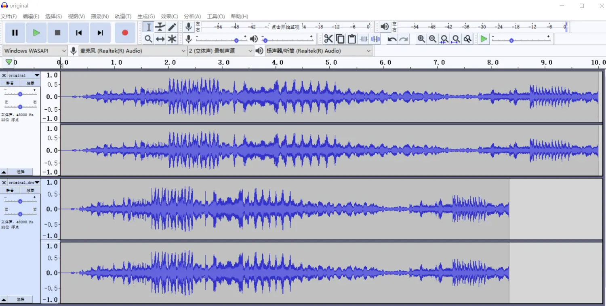
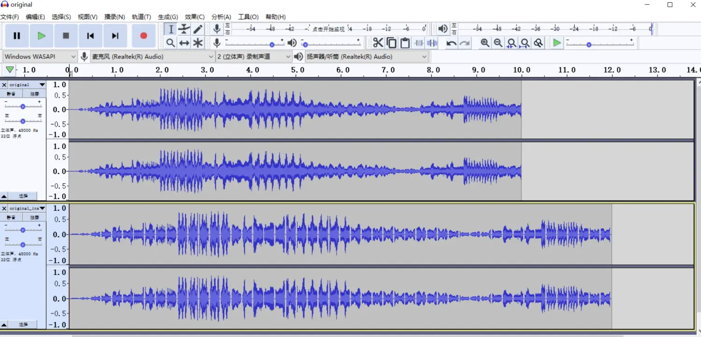
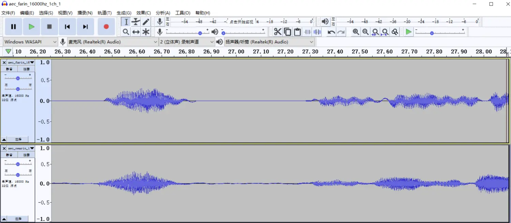
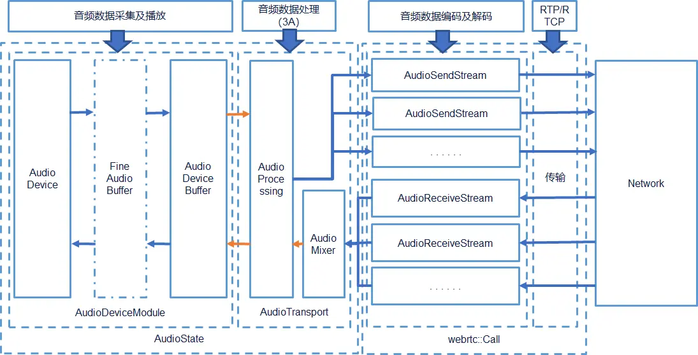
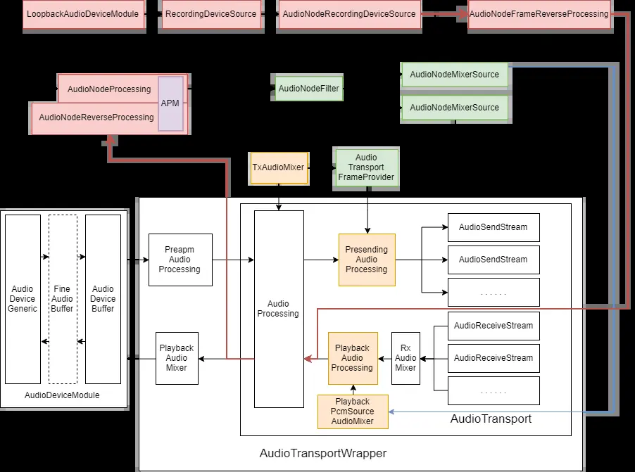

## RTC 中音频数据处理时序问题的主要来源

音频数据处理对时序及数据的连续性是格外敏感的。

<!--more-->

考虑人的耳朵，它无时无刻不从外界接收着音频信号并送进大脑进行处理，外界音频信号的一些甚至很微小的变化也将被人耳感知到。音频数据处理的一些常见的时序及数据连续性问题，如部分音频数据丢失，音频信号有明显的间断，这种情况的音频信号波形图如下（图中上部为正常的音频信号波形）：

再如音频数据不够，或到达的不及时（如果播放设备播放音频数据时卡顿，对于人耳和人脑来说，属于此种情况），而在正常的音频数据中间被插入了值全为 0 的空数据，这种情况的音频信号波形图如下（图中上部为正常的音频信号波形）：

在波形图上，插入空音频数据帧看上去更明显一点。

上面所述情况中的任何一种出现时，人耳在听到相应的声音信号时，都会有明显的不适感。

在 RTC 中，端点之间的连麦互动是最基本的能力之一了，在连麦互动中，回声消除必不可少。回声消除的基本原理是，在播放声音信号时，把播放的声音信号暂存下来，播放的声音信号也称为参考信号，随后麦克风录制获得录制信号，回声消除模块 AEC 把前面保存的参考信号从录制信号中剔除出去从而达到消除回声的目标。不难看出，要实现回声消除，必须保证 AEC 看到的音频信号视图中，参考信号是早于录制信号的，否则出现所谓的非因果现象，导致回声无法被消掉。

另外回声消除模块内的缓冲区大小有限，录制的需要被回声消除的音频数据信号被送进回声消除模块的时间，相对于其对应的播放的参考信号被送进回声消除模块的时间的延迟有一定的限制。

一般来说，回声总是由于音频数据被扬声器播放出去之后，又被麦克风录进来而产生，音频处理引擎总是可以在扬声器将音频数据播放出去之前拿到要播放的音频数据，回声消除中的非因果究竟是怎么产生的呢？

产生非因果的一种情况是，录制的节奏相对于播放快，参考信号缓冲区中的数据被拿空，为录制数据做回声消除时，读指针前移，导致参考信号在时间上相对后移，从而出现非因果。参考信号缓冲区是一个音频数据块的环形缓冲区。

考虑这样的一种情况。由于播放的节奏相对较慢，某一时刻参考信号缓冲区被拿空，此时读指针和写指针指向参考信号环形缓冲区相同的位置，假设这个位置为 6：

AEC 对于这种情况的处理是，前移读指针，假设将读指针向前移 3 个块，移到位置 3：

随后播放数据到达，被写入参考信号环形缓冲区，随后写指针被更新：

处理一帧录制数据，从参考信号环形缓冲区取走部分数据，随后，读指针更新，假设此时读指针指向位置 5：

随后播放数据很快被录制进来，保存在位置 6 处的播放数据，它被录制进来后做回声消除时，看到读指针位于位置 5，出现非因果：

录制设备启动较慢时也可能出现非因果。考虑这样一种情况，某个时刻参考信号缓冲区被塞了好多数据。状态如下图：

录制设备启动时，参考信号缓冲区中前面的一些数据早就被播放完了，因而，录制设备录到的数据，假设是包含了块 6 中的数据的，此时做回声消除出现非因果：

正常情况下，做回声消除时，参考信号和录制信号大体应该像下面这样（参考信号在上，录制信号在下）：

可以看到，参考信号基本上都是在录制信号前面的。

做回声消除出现非因果时，参考信号和录制信号则可能像下面这样（参考信号在上，录制信号在下）：

可以看到，录制信号跑到了参考信号的前面。

RTC SDK 音频处理引擎很核心的一部分职责即是处理这些时序问题。

对于这些时序问题，首先音频数据处理引擎会有两个高优先级的线程，即用于驱动麦克风录制数据处理的录制线程，和用于扬声器播放数据处理的播放线程。在任何一段时间内，播放线程为播放设备按照设备要求的采样率，提供足额的播放数据，录制线程则将足量的录制数据处理完成并推出去。

## RTC 中音频数据的接收处理

RTC 中，接收端接收远端主播通过网络发送过来编码音频数据。接收端可能在同时接收多个远端主播发送过来的数据。多个主播发送过来的数据需要先经过混音，混音之后被送进播放设备播放。在混音之前，接收端还需要对主播发送过来的数据进行解码。播放线程以拉模式，驱动整个音频数据解码播放的数据处理过程。

音频数据通过不可靠传输协议传输。音频数据包在传输过程中丢失是比较常见的事情。如果对于数据包的丢失不做任何处理，直接解码并拼在一起拿去播放，无可避免的会出现问题：一是音频信号不连续，造成不好的用户体验；二是收到的数据量不足，难以满足播放对数据的需求，则在正常的音频信号之间，将无可避免地被插入一些值全为 0 或随机值的空数据。

音频数据处理引擎，在接收端的处理，除了一般的丢包重传，FEC 等弱网对抗手段外，还引入了 NetEQ。NetEQ 采用一些音频数字信号处理的方法，通过算法对部分丢失的数据包进行补足和拉伸，在突然出现的接收过多数据的情况下对数据信号进行压缩，以此消除网络抖动及数据包丢失的影响，为播放设备以一种相对平稳的节奏提供足量的音频数据。

## 音频裸数据处理的时序问题

音频裸数据，有时也称为自采集数据，指由 RTC SDK 的用户以 PCM 的格式给 SDK 灌的数据。常见的应用场景，如 SDK 的用户期望可以给麦克风录制的声音中加进一些伴奏音，再如在服务端推流中通过 RTC 通道为观众端推送一些音频，再如播放器播放一段音频数据等等等。

在 RTC 中，对于音频裸数据的处理，SDK 需要支持用户向 SDK 灌多路数据，不同路音频数据可以做混音，SDK 需要支持音频裸数据的本地播放，SDK 需要支持音频裸数据的单独编码发送，SDK 需要支持音频裸数据和麦克风录制音频数据混音之后再发送等。

如果 SDK 用户将音频数据灌进 SDK，同步完成所有的处理，包括音效处理，编码等，直接在用户灌数据的线程中将数据送进音频播放设备进行播放，或通过网络发送出去，则一般不会出现前面我们提到的部分音频数据被丢弃，或者在正常的音频数据中被插入无效的空白音频帧的问题。

由于对音频裸数据的处理，需要支持多路音频数据做混音，使得很难选择合适的 SDK 外部灌数据的线程来驱动混音及之后的过程；由于 SDK 外部灌数据的线程灌数据的节奏千差万别， SDK 外部灌数据的线程也很难确定一个合适的执行混音及之后的处理过程的时间点；SDK 外部灌进来的音频数据在播放时可能要与远端发送过来的音频数据进行混音之后再播放，或在发送时可能要与麦克风录制的音频数据混音之后再发送，通过 SDK 外部灌数据的线程驱动混音及之后的处理过程，与 RTC 场景中常设的录制线程和播放线程相冲突。

对于音频裸数据的处理，在 SDK 用户将 PCM 数据灌进来之后，一般是要先暂存在一个缓冲区中，用于混音的 AudioMixer 的混音操作需要转为在一个 SDK 内部的线程上执行。

对于音频裸数据的处理的整体结构如下图：

SDK 用户通过 `AudioPcmDataSender` 将 PCM 音频数据灌进 SDK，这些数据随后在 `AudioNodePcmSource` 中被转为时长均匀的 10ms 数据帧，随后通过 `AudioNodeFilter` 做音效处理，之后数据被送进 `AudioNodeMixerSource`，等着被 AudioMixer 拿走做混音。`AudioNodeMixerSource` 即为我们前面提到的暂存数据的缓冲区，它还是发生线程转换的地方。对于播放，`AudioNodeMixerSource` 被接进 `PlaybackPcmSourceAudioMixer`，对于发送 `AudioNodeMixerSource` 被接进 `TxAudioMixer`。对于播放，播放线程驱动 `PlaybackPcmSourceAudioMixer` 完成混音，从 `PlaybackPcmSourceAudioMixer` 拿到混音之后的数据，并完成之后的处理播放过程。对于发送，`TxAudioMixer` 内部将启动一个线程，驱动混音过程，拿到混音之后的数据推出去。

音频裸数据处理的时序问题发生的一个热点地带是 `AudioNodeMixerSource`。这里可能发生的时序问题及其处理如下：

1. 从这个缓冲区里拿数据的线程存在抖动。如播放线程或 `TxAudioMixer` 内部的线程从这里拿数据的时间间隔不均匀。
对于这种问题，需要在允许 `AudioNodeMixerSource` 缓冲区中的数据首次被取走之前，缓存一定的音频数据帧。缓存的帧数为略多于播放/录制线程一次 burst 处理的数据量为好。增加缓冲带来的问题也很明显，接收端收到数据的延迟会变大。考虑到首次提供数据前缓冲数据量小于播放/录制线程一次 burst 处理的数据量时，在整个处理过程中，可能只发生一次正常帧之间被插入空白帧的情况，这个缓冲数据量被设置为更小的值也可以接受。

2. 考虑到这个缓冲区的内存占用，缓冲区的最大大小是必然要设置的。当 SDK 用户推数据推的太快时，冲爆了这里的缓冲区，则 SDK 将丢弃多余的数据，这将出现音频数据不连续的问题。
对于这种问题，需要要求 SDK 用户发送数据的节奏不能过快过多。

3. 当从这个缓冲区中取数据的过程被停掉了，但 SDK 用户还一直在发数据，在取数据的过程被重新启动时，推进来的数据的处理延迟将为缓冲区的最大大小所对应的时长，如果缓冲区的最大大小比较大，这个延迟也将比较大。如果在发送音频数据的同时，还在发送视频数据，则可能会造成比较严重的音画不同步。
对于这个问题，这个缓冲区的最大大小需要随着缓冲区的状态变化而变化。当从这个缓冲区中取数据的过程被停掉时，缓冲区的最大大小需要是一个比较小的值，而当从这个缓冲区中取数据的过程处于运行中时，这个缓冲区的最大大小可以设置为更大的值。

4. 当 SDK 的用户发送数据的时钟不准，长期无法保证向 SDK 发送时长所对应的足够的数据量，则在正常的音频数据帧之间插入空白音频帧将是无可避免的。
对于这种问题，需要要求 SDK 用户发送数据的节奏不能过慢过少。SDK 用户需要引入时钟校准机制来处理。

对于音频裸数据的发送，要支持与麦克风录制的声音数据混音之后发送，及单独发送，无论是哪种情况，都要求 `TxAudioMixer` 在长时间段内，能够及时足额的将数据发送出去。`TxAudioMixer` 发送数据的节奏不管是快了，还是满了，都会出问题，如我们前面的描述。因而这里需要做时钟校准，需要大体保证在长时间段内，发送出去的数据量是够的。

当需要将音频裸数据与麦克风录制的音频数据混音之后发送时，`TxAudioMixer` 扮演的角色类似于 SDK 用户发送数据的 `AudioPcmDataSender`，作为 `TxAudioMixer` 的数据发送线程和录制线程之间的数据中转缓冲区的 `AudioTransportFrameProvider` 的角色与 `AudioNodeMixerSource` 的角色类似，`AudioTransportFrameProvider` 的缓冲策略也需要与 `AudioNodeMixerSource` 类似。

音频裸数据处理的时序问题大体如此。

## 互动连麦回声消除的时序问题

互动连麦处理的整体结构如下图：

音频数据的发送和接收有一个耦合点，即用于完成 3A 处理的 AudioProcessing。互动连麦回声消除的时序问题，对于音频架构来说，主要是我们前面提到的几种非因果的情况。

首先，SDK 要保证播放过程总是早于录制过程启动。对于这一点，音频处理引擎有多个在录制过程启动之前的点来启动播放过程。

其次，对于参考信号缓冲区过满导致的非因果问题，一般是在启动录制过程，或者麦克风录制得到的第一帧音频数据到达 AudioProcessing 时，复位回声消除模块中的缓冲区。

此外，回声消除模块内的缓冲区大小有限，录制的需要被回声消除的音频数据信号被送进回声消除模块的时间，相对于其对应的播放的参考信号被送进回声消除模块的时间的延迟有一定的限制。

回声消除模块内部需要维护对于大多数场景来说容量足够的缓冲区大小。目前来说，如果播放 A 的时刻是 T0，录制 A 的时刻是 T1，（T1-T0）的范围保证在[-60，452]ms 之间即可。（T0是指 aec_farin.pcm 的位置，T1是指 aec_nearin.pcm 的位置。）

音频架构中对于互动连麦回声消除的时序问题的处理大体如此。

## 声卡采集回声消除的时序问题

声卡采集所应用的场景是，期望获取 SDK 外其它应用程序播放的声音，将这个声音与麦克风录制的声音混音并发送出去。在实现上，通过系统提供的声卡采集接口获取 SDK 外其它应用程序播放的声音，但声卡采集获得的音频数据将不仅仅包含 SDK 外其它应用程序播放的音频数据，它还包括 SDK 播放的从远端接收的音频数据。此外，麦克风录制获得的音频数据将包含本地环境产生的声音，SDK 外其它应用程序播放的声音，以及SDK 播放的从远端接收的音频数据。录制的声音中的 SDK 外其它应用程序播放的声音和 SDK 播放的从远端接收的音频数据是需要被回声消除去掉的，声卡采集中包含的 SDK 播放的从远端接收的音频数据也需要被回声消除去掉。

声卡采集处理双 APM 方案的整体结构如下图：

声卡采集回声消除的时序问题主要是两个回声消除模块的非因果问题。用于消除声卡采集中 SDK 播放的从远端接收的音频数据的 APM，逻辑上不太容易出现分因果的问题。消除麦克风录制的音频数据中的回声的 APM，在声卡采集被开启时，其参考信号源做过一次切换，相对比较容易出现非因果。

麦克风录制的声音的回声消除处理，可以通过给麦克风录制的音频数据额外增加一些延迟来处理。

Done.
