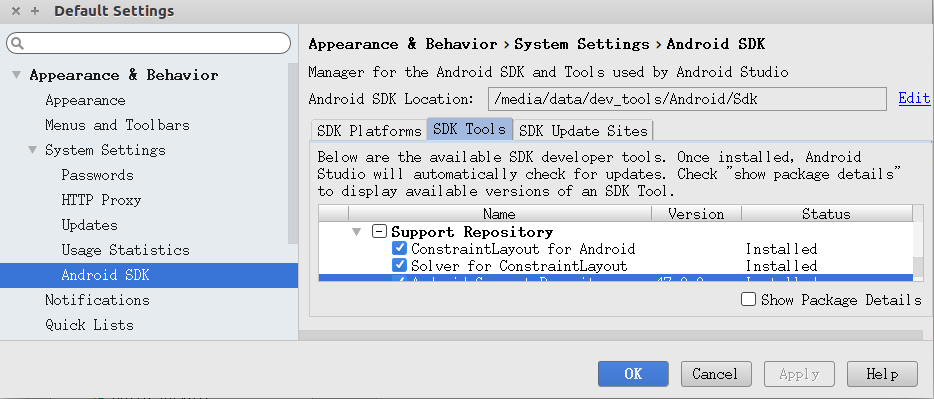
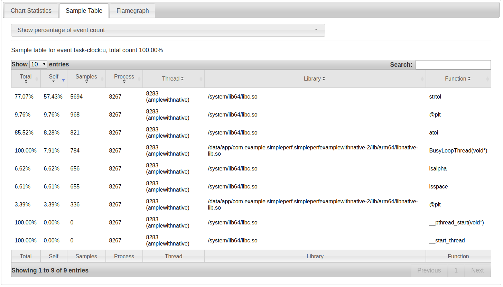

Simpleperf 是 Android 的一个本地代码性能剖析工具，它是 Android 开源项目（AOSP）的一部分。Simpleperf 可以用来剖析运行于 Android 平台的 Android 应用程序和本地进程，无论是 Java 代码还是 C++ 代码它都可以剖析。对于 Android 系统，需要是 Android L （Android 5.0）及以上版本。
<!--more-->
Simpleperf 包含两部分：`simpleperf` 可执行文件和 Python 脚本。`simpleperf` 可执行文件与 linux-tools-perf 类似，但它还包含一些专门针对 Android 剖析环境的特有功能：

 1. 它收集更多的剖析数据。性能剖析通常的工作流程是 “在设备上记录，在主机上分析并产生报告”，`simpleperf` 不只收集剖析数据的采样，它还收集需要的符号，设备信息，和记录时间等。
 2. 它提供了新的记录功能。a. 当记录基于 dwarf 的调用图时，`simpleperf` 在将样本写入文件前展开调用栈。这是为了节省设备上的存储空间。b. 通过 `--trace-offcpu` 选项同时支持追踪 on CPU 时间和 off CPU 时间。
 3. 它与 Android 平台密切相关。a. 了解 Android 环境，如使用系统属性启用剖析，使用 `run-as` 以应用程序上下文进行剖析。b. 由于自 Android O （Android 8.0）开始系统库使用 `.gnu_debugdata` 段构建，它支持从 `.gnu_debugdata` 段读取符号和调试信息。c. 支持剖析 apk 文件中嵌入的共享库。d. 它使用标准的 Android 调用栈展开工具，因而它的结果与其它 Android 工具一致。
 4. 它为不同的用途构建可执行文件和共享库。a. 在设备上构建静态可执行文件。由于静态可执行文件不依赖任何库，`simpleperf` 可执行文件可以被 push 进任何 Android 设备并用于记录剖析数据。b. 在不同的主机上构建可执行文件：Linux，Mac 和 Windows。这些可执行文件可用于在主机上生成报告。c. 在不同主机上构建报告共享库。报告库被不同的 Python 脚本用于解析剖析数据。

Python 脚本根据它们的功能被分为三个部分：

 1. 用于简化剖析数据记录的脚本，如 `app_profiler.py`。
 2. 用于生成剖析报告的脚本，如 `report.py`，`report_html.py`，`inferno`。
 3. 用于解析剖析数据的脚本，如 `simpleperf_report_lib.py`。

## 获得 Simpleperf

自版本 r13 开始，NDK 中包含了 Simpleperf 工具 。 `simpleperf` 可执行文件和 Python 脚本位于 ndk 发布版的 `simpleperf` 目录下。在 r13 版的 NDK 的 `simpleperf` 目录下仅在 `android` 目录中包含用于在设备上执行的 `simpleperf` 可执行文件，和 Python 脚本 `simpleperf_report.py`。随着 NDK 的迭代发展， Simpleperf 工具集逐渐完善，在 r16b 版的 NDK 中包含较为完善的 Simpleperf 工具集。可以下载 r16b 版或更新的 NDK 来获得 Simpleperf 。

同时也可以直接从 AOSP 下载获得 Simpleperf，它位于 `system/extras/simpleperf/scripts/` 目录下。通过如下命令下载 `system/extras` repo：
```
$ git clone https://android.googlesource.com/platform/system/extras
```

在 `extras/simpleperf/scripts` 中包含了 `simpleperf` 可执行文件和 Python 脚本，它们的功能如下：

 - bin/：包含可执行文件及共享库。
 - bin/android/${arch}/simpleperf：设备上运行的静态 `simpleperf` 可执行文件。其中 ${arch} 为目标设备的 CPU 架构，如 arm 和 arm64。
 - bin/${host}/${arch}/simpleperf：用于主机的 `simpleperf` 可执行文件，只支持生成报告。其中 ${host} 为主机的操作系统平台，如 linux，${arch} 为主机的 CPU 架构，如 x86_64。
 - bin/${host}/${arch}/libsimpleperf_report.${so/dylib/dll}：用于主机的报告生成库。其中 ${host} 指主机的操作系统平台，${arch} 为主机的 CPU 架构。
 - app_profiler.py：用于记录剖析数据的 Python 脚本。
 - binary_cache_builder.py：用于为剖析数据构建二进制缓存的 Python 脚本。
 - report.py：用于生成剖析报告并输出到标准输出的 Python 脚本。
 - report_html.py：用于生成剖析报告并输出为 html 文件的 Python 脚本。
 - inferno.sh （或 Windows 平台的 inferno.bat )：用于生成火焰图并输出为 html 文件的脚本工具。
 - inferno/：inferno 的实现。由 `inferno.sh` 使用。
 - pprof_proto_generator.py：将剖析数据的格式转换为 `pprof` 使用的格式的 Python 脚本。
 - report_sample.py：将剖析数据的格式转换为 `FlameGraph` 使用的格式的 Python 脚本。
 - simpleperf_report_lib.py：解析剖析数据的库。


## 使用 Simpleperf 分析本地代码性能

Simpleperf 只支持剖析 ELF 格式的二进制文件中的本地指令。如果 Java 代码由解释器执行，或通过 jit 缓存，则它无法用 Simpleperf 剖析。由于 Android 支持前期编译，因此可以将 Java 字节码编译为带有调试信息的本地指令。在 Android版本 <= M 的设备上，我们需要 root 特权才能编译带有调试信息的 Java 字节码。 但是，在 Android版本 > = N 的设备上，我们不需要 root 权限即可执行此操作。

通常剖析 Android 应用程序性能包含三个步骤：

 1. 准备应用程序。
 2. 记录剖析数据。
 3. 生成剖析数据的分析报告。

### 准备应用程序

在剖析之前，我们需要将应用程序安装到 Android 设备上。为了得到有效的剖析结果，需要先做如下这些检查：

 1. 应用程序应该是 `debuggable` 的。由于安全限制的原因，只有 `android::debuggable` 设置为 `true` 的应用程序才能剖析。（在一个已经 root 的设备上，所有应用程序都可以剖析。）在 Android Studio 中，这意味着我们需要使用 debug 构建类型，而不是 release 构建类型。
 2. 运行在 Android >= N 的设备上。
 3. 在 Android O 上，将 `wrap.sh` 添加进 apk 中。为了剖析 Java 代码，我们需要 ART 以 oat 模式运行。但是在 Android O 上，`debuggable` 的应用程序强制以 jit 模式运行。为了绕过这个问题，我们需要给 apk 添加一个 `wrap.sh`。如果要在 Android O 设备上运行，并且需要剖析 Java 代码，则添加 `wrap.sh`，像下面这样修改 app 的 build.gradle 文件：
```
// Set when building only part of the abis in the apk.
def abiFiltersForWrapScript = []
android {
    buildTypes {
        profiling {
            initWith debug
            externalNativeBuild {
                cmake {
                    // cmake Debug build type uses -O0, which makes the code slow.
                    arguments "-DCMAKE_BUILD_TYPE=Release"
                }
            }
            packagingOptions {
                // Contain debug info in the libraries.
                doNotStrip "**.so"
                // Exclude wrap.sh for architectures not built.
                if (abiFiltersForWrapScript) {
                    def exclude_abis = ["armeabi", "armeabi-v7a", "arm64-v8a",
                                        "x86", "x86_64", "mips", "mips64"]
                            .findAll{ !(it in abiFiltersForWrapScript) }
                            .collect{ "**/" + it + "/wrap.sh" }
                    excludes += exclude_abis
                }
            }
            // Add lib/xxx/wrap.sh in the apk. This is to enable java profiling on Android O
            // devices.
            sourceSets {
                profiling {
                    resources {
                        srcDir {
                            "profiling_apk_add_dir"
                        }
                    }
                }
            }
        }
    }
}
def writeWrapScriptToFullyCompileJavaApp(wrapFile) {
    wrapFile.withWriter { writer ->
        writer.write('#!/system/bin/sh\n')
        writer.write('\$@\n')
    }
}
task createProfilingApkAddDir {
    for (String abi : ["armeabi", "armeabi-v7a", "arm64-v8a", "x86", "x86_64", "mips", "mips64"]) {
        def dir = new File("app/profiling_apk_add_dir/lib/" + abi)
        dir.mkdirs()
        def wrapFile = new File(dir, "wrap.sh")
        writeWrapScriptToFullyCompileJavaApp(wrapFile)
        println "write file " + wrapFile.path
    }
}
```
 4. 确保使用优化标志编译 C ++ 代码。如果应用程序包含 C++ 代码，在 debug 构建类型中代码将以 `-O0` 标记编译，这使 C++ 代码变慢，为了避免这一问题，可以参考上面 Gradle 文件的写法，为 cmake 编译添加 `-DCMAKE_BUILD_TYPE=Release` 参数。
 5. 尽可能在 apk 中使用带有调试信息的本地层库。如果应用程序包含 C++ 代码或预编译的本地层代码，则尝试在 apk 中使用未 stripped 的库。这将帮助 `simpleperf` 产生更好的剖析结果。为了使用未 stripped 的库，请参考上面 Gradle 文件的写法，通过 `doNotStrip` 来使用未 stripped 的库。

这里我们使用 Google 提供的 Demo 应用程序 SimpleperfExampleWithNative 来演示使用 Simpleperf 分析本地代码性能的过程。构建 SimpleperfExampleWithNative 为性能剖析生成 app-profiling.apk。通过如下命令下载源码，并切换至源码目录：
```
$ git clone https://github.com/hanpfei/SimpleperfExampleWithNative.git
$ cd SimpleperfExampleWithNative/
```

添加 `local.properties` 文件，配置 SDK 和 NDK 的路径，如下面这样：
```
sdk.dir=${sdk.dir}
ndk.dir=${ndk.dir}
```
请将上面 `${sdk.dir}` 和 `${ndk.dir}` 分别替换为本地 Android SDK 和 NDK 的路径。

为 Demo 应用程序 SimpleperfExampleWithNative 安装 ConstraintLayout 支持库。


通过如下命令编译并安装 SimpleperfExampleWithNative。
```
$ ./gradlew clean assemble
$ adb install -r app/build/outputs/apk/profiling/app-profiling.apk
```

### 记录并生成剖析数据报告

我们可以使用 `app-profiler.py` 剖析 Android 应用程序。
```
$ mkdir profile
$ cd profile/
$ python /media/data/osprojects/extras/simpleperf/scripts/app_profiler.py -p com.example.simpleperf.simpleperfexamplewithnative
```
这个脚本将在当前目录的 `perf.data` 文件中收集剖析数据，并在 `binary_cache` 目录下收集相关的本地层二进制文件。

通常我们需要在剖析时使用应用程序，否则我们可能记录不到采样数据。但在这个例子中，`MainActivity` 启动了一个繁忙的线程。因而我们无需在剖析时使用应用程序。

```
$ python /media/data/osprojects/extras/simpleperf/scripts/report.py
Cmdline: /data/local/tmp/simpleperf record -e task-clock:u -g -f 1000 --duration 10 -o /data/local/tmp/perf.data --app com.example.simpleperf.simpleperfexamplewithnative
Arch: arm64
Event: task-clock:u (type 1, config 1)
Samples: 9914
Event count: 9914000000

Overhead  Command          Pid   Tid   Shared Object                                                                              Symbol
57.43%    amplewithnative  8267  8283  /system/lib64/libc.so                                                                      strtol
9.76%     amplewithnative  8267  8283  /system/lib64/libc.so                                                                      @plt
8.28%     amplewithnative  8267  8283  /system/lib64/libc.so                                                                      atoi
7.91%     amplewithnative  8267  8283  /data/app/com.example.simpleperf.simpleperfexamplewithnative-2/lib/arm64/libnative-lib.so  BusyLoopThread(void*)
6.62%     amplewithnative  8267  8283  /system/lib64/libc.so                                                                      isalpha
6.61%     amplewithnative  8267  8283  /system/lib64/libc.so                                                                      isspace
3.39%     amplewithnative  8267  8283  /data/app/com.example.simpleperf.simpleperfexamplewithnative-2/lib/arm64/libnative-lib.so  @plt
```
`report.py` 生成剖析数据的报告并输出到标准输出。

```
# 
$  python /media/data/osprojects/extras/simpleperf/scripts/report_html.py
$ python /media/data/osprojects/extras/simpleperf/scripts/report_html.py --add_source_code --source_dirs ../SimpleperfExampleWithNative/ --add_disassembly
```
不带参数时，`report_html.py` 用默认参数以 report.html 的形式生成报告，但也可以为它提供参数，以更好地控制它的行为。`report_html.py` 生成报告之后，会弹出一个浏览器标签来展示它，如下图这样：



### 记录并报告调用图

我们可以记录并报告调用图。

可以像下面这样，给 `-r` 选项添加 `-g` 参数，记录基于 dwarf 的调用图：
```
$ python app_profiler.py -p com.example.simpleperf.simpleperfexamplewithnative \
        -r "-e task-clock:u -f 1000 --duration 10 -g"
```

也可以给 `-r` 选项添加 `--call-graph fp` 参数，记录基于栈帧的调用图：
```
$ python app_profiler.py -p com.example.simpleperf.simpleperfexamplewithnative \
        -r "-e task-clock:u -f 1000 --duration 10 --call-graph fp"
```

产生剖析数据之后，可以通过 `report.py`、`report_html.py` 和 `inferno.sh` 生成报告。

产生调用图的报告，并输出至标准输出：
```
$ python report.py -g
Cmdline: /data/local/tmp/simpleperf record -e task-clock:u -f 1000 --duration 10 -g -o /data/local/tmp/perf.data --app com.example.simpleperf.simpleperfexamplewithnative
Arch: arm64
Event: task-clock:u (type 1, config 1)
Samples: 9933
Event count: 9933000000

Children  Self    Command          Pid    Tid    Shared Object                                                                              Symbol
100.00%   0.00%   amplewithnative  10861  10886  /system/lib64/libc.so                                                                      __start_thread
       |
       -- __start_thread
          |
           -- __pthread_start(void*)
              BusyLoopThread(void*)
               |--8.57%-- [hit in function]
               |
               |--85.23%-- atoi
               |    |--9.27%-- [hit in function]
               |    |
               |    |--86.79%-- strtol
               |    |    |--73.67%-- [hit in function]
               |    |    |
               |    |    |--9.13%-- @plt
               |    |    |
               |    |    |--8.95%-- isalpha
               |    |    |
               |    |     --8.25%-- isspace
. . . 
```

产生调用图的报告，并在 python Tk 的 GUI 程序中显示：
```
$ python report.py -g --gui
```

如下图：


以 html 文件的形式报告调用图：
```
$ python report_html.py
```

以 flame 图的形式报告调用图：
```
$ inferno.sh -sc
```

### 以 html 的形式生成报告

我们可以使用 `report_html.py` 在 Web 浏览器中展示剖析结果。`report_html.py` 集成了图表统计信息，样本表，火焰图，源代码注释和反汇编注释。它是展示报告的建议的方式。

```
$ python report_html.py
```

### 展示火焰图

为了展示火焰图，我们首先需要记录调用图。火焰图由 `report_html.py` 在 **Flamegraph** 标签中展示。我们也可以使用 `inferno` 直接展示火焰图。
```
$ inferno.sh -sc
```

我们也可以使用 https://github.com/brendangregg/FlameGraph 构建火焰图。请确保已经安装了 perl。
```
$ git clone https://github.com/brendangregg/FlameGraph.git
$ python report_sample.py --symfs binary_cache >out.perf
$ FlameGraph/stackcollapse-perf.pl out.perf >out.folded
$ FlameGraph/flamegraph.pl out.folded >a.svg
```

### 同时记录 on CPU 时间和 off CPU 时间

我们可以同时记录 on CPU 时间和 off CPU 时间

首先检查设备是否支持 `trace-offcpu` 功能。
```
$ python run_simpleperf_on_device.py list --show-features
dwarf-based-call-graph
trace-offcpu
```

如果 `trace-offcpu` 功能得到支持，它将显示在功能列表中。然后可以试下这个功能。
```
$ python app_profiler.py -p com.example.simpleperf.simpleperfexamplewithnative -a .SleepActivity \
    -r "-g -e task-clock:u -f 1000 --duration 10 --trace-offcpu"
$ python report_html.py --add_disassembly --add_source_code --source_dirs ../demo
```

### 剖析启动过程

我们可以在应用程序启动时就开始剖析它。
```
$ python app_profiler.py -p com.example.simpleperf.simpleperfexamplewithnative -a .MainActivity \
    --arch arm64 --profile_from_launch
```

### 手动解析剖析数据

我们也可以编写 python 脚本手动解析剖析数据，通过使用 `simpleperf_report_lib.py`。具体可以参考 `report_sample.py` 和 `report_html.py`。

## Simpleperf 的基本工作原理

现代 CPU 具有一个硬件组件，称为性能监控单元(PMU)。PMU 具有一些硬件计数器，计数一些诸如经历了多少次 CPU 周期，执行了多少条指令，或发生了多少次缓存未命中等事件。

Linux 内核将这些硬件计数器包装到硬件 perf 事件中。此外，Linux 内核还提供了独立于硬件的软件事件和跟踪点事件。Linux 内核通过 `perf_event_open` 系统调用将这些暴露给用户空间，这正是 simpleperf 所使用的机制。

Simpleperf 具有三个主要的功能：stat，record 和 report。

Stat 命令给出了在一段时间内被剖析的进程中发生了多少事件的摘要。以下是它的工作原理：

1. 给定用户选项，simpleperf 通过对 linux 内核执行系统调用来启用剖析。
2. Linux 内核在调度到被剖析进程时启用计数器。
3. 剖析之后，simpleperf 从内核读取计数器，并报告计数器摘要。

Record 命令记录一段时间内被剖析进程的采样。它的工作原理如下：

1. 给定用户选项，simpleperf 通过对 linux 内核执行系统调用来启用剖析。
2. Simpleperf 在 simpleperf 和 linux 内核之间创建映射缓冲区。
3. Linux 内核在调度到被剖析进程时启用计数器。
4. 每次给定数量的事件发生时，linux 内核将样本转储到映射缓冲区。
5. Simpleperf 从映射缓冲区读取样本并生成 perf.data。

Report 命令读取 “perf.data” 文件及所有被剖析进程用到的共享库，并输出一份报告，展示时间消耗在了哪里。

Done.
