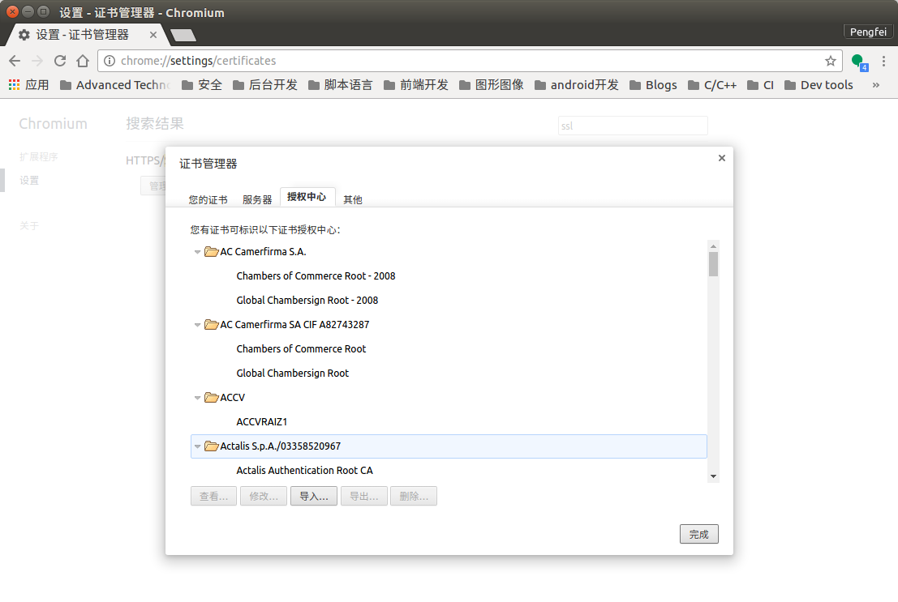
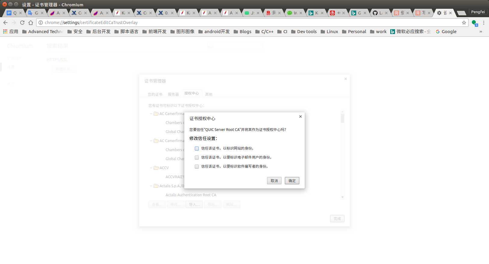

QUIC是Google新开发的一个基于UDP的协议，它提供了像TCP一样的传输可靠性保证，可以实现数据传输的0-RTT延迟，灵活的设计使我们可以对它的拥塞控制及流量控制做更多的定制，它还提供了传输的安全性保障，以及像HTTP/2一样的应用数据二进制分帧传输。
<!--more-->
而QUIC协议最最吸引人的特性有两点，一是对队首阻塞问题的解决更为彻底。基于TCP的HTTP/2，尽管从逻辑上来说，不同的流之间相互独立，不会相互影响，但在实际传输方面，数据还是要一帧一帧的发送和接收，一旦某一个流的数据有丢包，则同样会阻塞在它之后传输的其它与它毫不相干的流的数据的传输。而基于UDP的QUIC协议则可以更为彻底地解决这样的问题，让不同的流之间真正的实现相互独立传输，互不干扰。

另一个特性切换网络时的连接保持。当前移动端的应用环境，用户的网络可能会经常切换，比如从办公室或家里出门，WiFi断开，网络切换为3G或4G。基于TCP的协议，由于切换网络之后，IP会改变，因而之前的连接不可能继续保持。而基于UDP的QUIC协议，则可以内建与TCP中不同的连接标识方法，从而在网络完成切换之后，恢复之前与服务器的连接。

由于这些良好的特性，QUIC协议已经有在gmail中得到了大量的应用。打开Wireshark，随便对某个网卡抓包，都能看到大量的QUIC协议包：


这里我们来跑一下QUIC。

# 选择一份QUIC代码

下面的说明是用来基于chromium代码库编译QUIC代码。在Chrome支持的任何平台上，这里的说明都能保证是有效的，遇到问题时可以查看一些扩展的故障排查的文档。如果不想下载整个chromium代码库，则可以尝试github上快速而干净的[proto-quic](https://github.com/google/proto-quic)库。这是chromium中的代码的一份克隆，但剔除了大多数不必要的依赖，因而下载它要快得多，编译也更快，但不一定在所有的平台上都能用。事实上，github上的[proto-quic](https://github.com/google/proto-quic)库，当前只支持在Ubuntu linux上编译。

# 编译QUIC客户端和服务器

Chromium中提供了一个示例客户端和服务器实现。要使用这些东西，你首先应该已经[下载Chromium的源代码](http://www.chromium.org/developers/how-tos/get-the-code)，然后构建二进制文件：
```
ninja -C out/Debug quic_server quic_client
```
这就像编译chromium的任何模块一样。可以参考 [懒人chromium net android移植指南](http://www.jianshu.com/p/9d7a6e9ed777) 来对Chromium的构建系统做更多了解。

如果条件允许，github上的[proto-quic](https://github.com/google/proto-quic)库，编译起来也很简单快捷。首先需要下载代码及构建依赖的整个工具链：
```
git clone https://github.com/google/proto-quic.git
cd proto-quic
export PATH=$PATH:`pwd`/depot_tools
./proto_quic_tools/sync.sh
```
然后编译就是了，与普通的chromium模块编译一样：
```
cd src
gn gen out/Default && ninja -C out/Default quic_client quic_server net_unittests
```
# 从www.example.org准备测试数据
下载一份www.example.org的拷贝，它主要是给quic_server二进制可执行文件用来提供本地服务的：
```
mkdir ~/quic-data
cd ~/quic-data
wget -p --save-headers https://www.example.org
```
这里主要是要下载一个html文件，且保存文件的所有的HTTP header，当然也可以从其它的站点下载这个文件。

手动地编辑index.html，并调整如下的headers：

 * 移除(如果存在的话)："Transfer-Encoding: chunked"
 * 移除(如果存在的话)："Alternate-Protocol: ..."
 * 添加：X-Original-Url: https://www.example.org/

# 生成证书
为了运行服务器，需要一个有效的证书，及一个pkcs8格式的私有key。如果没有，则可以使用脚本来产生它们：
```
cd net/tools/quic/certs
./generate-certs.sh
cd -
```
除了服务器的证书及public key，这个脚本也会产生一个CA证书 (net/tools/quic/certs/out/2048-sha256-root.pem)，需要把它添加到操作系统的根证书商店以便于在证书验证期间它被信任。

一种比较简单的管理证书的方法是使用chrome浏览器。在地址栏中输入 `chrome://settings/search#ssl`，然后点击“管理证书”：


在弹出的窗口中选择 “授权中心”，如下图：



然后点击 “导入...” 按钮，此时将弹出一个文件选择对话框，我们选中所需要导入的根证书文件，也就是 `net/tools/quic/certs/out/2048-sha256-root.pem`，此时将有如下提示：



勾选其中的第一项，“信任该证书，以标识网站的身份。”，然后点击 “确定” 按钮结束导入。

在linux上管理证书相关的更多信息，请参考 [这些说明](https://chromium.googlesource.com/chromium/src/+/master/docs/linux_cert_management.md) 。

如果遗漏了这里的添加CA证书的步骤的话，后面在执行quic_client的时候会报出如下的证书验证错误：
```
$ ./out/Default/quic_client --host=127.0.0.1 --port=80 https://www.example.org/
[1008/164047:ERROR:cert_verify_proc_nss.cc(942)] CERT_PKIXVerifyCert for www.example.org failed err=-8179
[1008/164047:WARNING:proof_verifier_chromium.cc(466)] Failed to verify certificate chain: net::ERR_CERT_AUTHORITY_INVALID
Failed to connect to 127.0.0.1:80. Error: QUIC_PROOF_INVALID
```

# 运行QUIC服务器和客户端
运行quic_server：
```
./out/Default/quic_server \
  --quic_in_memory_cache_dir=~/quic-data/www.example.org \
  --certificate_file=net/tools/quic/certs/out/leaf_cert.pem \
  --key_file=net/tools/quic/certs/out/leaf_cert.pkcs8
```
还可以通过--port参数指定quic_server监听的端口，及--v参数指定输出更多信息，如：
```
./out/Default/quic_server --certificate_file=~/proto-quic/src/net/tools/quic/certs/out/leaf_cert.pem --key_file=~/proto-quic/src/net/tools/quic/certs/out/leaf_cert.pkcs8 --quic_in_memory_cache_dir=~/quic-data/www.example.com --port=32457 --v=1
```
quic_in_memory_cache_dir参数指定存放资源文件的目录路径。如我们前面看到的，从www.example.org下载到页面之后，需要调整headers，其中为`X-Original-Url`设置的是相应资源的url。quic_server起来的时候，会加载该目录下的文件。要为quic_server添加其它的测试资源，也要注意正确的设置其headers。如json接口：
```
# cat testApi1 
HTTP/1.1 200 OK
Cache-Control: private
Content-Length: 3214
Content-Type: application/json; charset=utf-8
Server: Microsoft-IIS/7.5
X-AspNet-Version: 4.0.30319
X-Powered-By: ASP.NET
Date: Thu, 13 Oct 2016 02:12:28 GMT
X-Original-Url: https://www.wolfcstech.com:6121/testApi1

{"res":[{"ctime":"2016-10-11","title":"温州","des":"国内","url":"http://news.163.com/16/1011/11/C33GFLIP0001124J.html"},{"ime":"2016","tit":"b","des":"a"}, {"ime":"2016","tit":"b","des":"a"}],"rea":"Su"}
```

然后就可以使用quic_client以QUIC协议请求文件了：
```
./out/Default/quic_client --host=127.0.0.1 --port=32457 https://www.example.org/
```
注意，如果要让服务器运行于端口32457上，则必须为客户端指定端口，因为它默认是80。

此外，如果本地机器有多个loopback地址 (由于它同时使用IPv4 和 IPv6)，则不得不选定一个地址。

目前还不确定后面的缺点是不是一个bug。

注意：client和server都主要是为了做集成测试的：它们都不能大规模使用。

要使用chrome来测试相同的下载过程，可以执行：
```
chromium-browser \
  --user-data-dir=/tmp/chrome-profile \
  --no-proxy-server \
  --enable-quic \
  --origin-to-force-quic-on=www.example.org:443 \
  --host-resolver-rules='MAP www.example.org:443 127.0.0.1:32457' \
  https://www.example.org
```

# 使用Chromium net访问QUIC资源
我们不仅可以通过 Chrome 浏览器访问 QUIC 服务，还可以通过 Chromium net来访问。Chromium 有一个名为 cronet 的子项目，是一个 Chromium net 在移动端的封装，它提供了非常方便的接口，以便于将 Chromium net 用在移动平台，cronet 具体的移植过程，可以参考 [懒人chromium net android移植指南](https://www.wolfcstech.com/2016/11/11/lazy-chromium-net-android-porting-guide/) 一文。

在将 Chromium net 移植到 Android 之后，我们可以通过如下的方式在手机上访问QUIC 服务：
```
package com.netease.netlib;

import android.content.Context;

import org.chromium.net.CronetEngine;
import org.chromium.net.UploadDataProviders;
import org.chromium.net.UrlRequest;
import org.json.JSONException;
import org.json.JSONObject;

import java.util.concurrent.Executor;
import java.util.concurrent.Executors;

public class CronetUtils {
    private static final String TAG = "CronetUtils";

    private static CronetUtils sInstance;

    private CronetEngine mCronetEngine;
    private Executor mExecutor = Executors.newCachedThreadPool();

    private CronetUtilsBak() {
    }

    public static synchronized CronetUtilsBak getsInstance() {
        if (sInstance == null) {
            sInstance = new CronetUtilsBak();
        }
        return sInstance;
    }

    public synchronized void init(Context context) {
        if (mCronetEngine == null) {
            CronetEngine.Builder builder = new CronetEngine.Builder(context);
            builder.enableHttpCache(CronetEngine.Builder.HTTP_CACHE_IN_MEMORY,
                            100 * 1024)
                    .enableHttp2(true)
                    .enableQuic(true)
                    .enableSDCH(true)
                    .setLibraryName("cronet")
                    .addQuicHint("www.example.org", 32457, 32457)
                    .addQuicHint("www.wolfcstech.com", 443, 6121)
                    .addQuicHint("www.wolfcstech.cn", 443, 6121)
                    .addQuicHint("www.wolfcstech.com", 6121, 6121)
                    .addQuicHint("www.wolfcstech.cn", 6121, 6121);

            JSONObject experimentalOptions = null;
            try {
                JSONObject quicParams = new JSONObject()
                        .put("connection_options", "PACE,IW10,FOO,DEADBEEF")
                        .put("host_whitelist", "www.example.org")
                        .put("max_server_configs_stored_in_properties", 2)
                        .put("delay_tcp_race", true)
                        .put("max_number_of_lossy_connections", 10)
                        .put("packet_loss_threshold", 0.5)
                        .put("idle_connection_timeout_seconds", 300)
                        .put("close_sessions_on_ip_change", false)
                        .put("migrate_sessions_on_network_change", false)
                        .put("migrate_sessions_early", false)
                        .put("race_cert_verification", true);
                experimentalOptions = new JSONObject().put("QUIC", quicParams);
            } catch (JSONException e) {
                e.printStackTrace();
            }

            builder.setExperimentalOptions(experimentalOptions.toString());

            mCronetEngine = builder.build();
        }
    }

    public void getHtml(String url, UrlRequest.Callback callback) {
        startWithURL(url, callback);
    }


    private void startWithURL(String url, UrlRequest.Callback callback) {
        startWithURL(url, callback, null);
    }

    private void startWithURL(String url, UrlRequest.Callback callback, String postData) {
        UrlRequest.Builder builder = new UrlRequest.Builder(url, callback, mExecutor, mCronetEngine);
        applyPostDataToUrlRequestBuilder(builder, mExecutor, postData);
        builder.build().start();
    }

    private void applyPostDataToUrlRequestBuilder(
            UrlRequest.Builder builder, Executor executor, String postData) {
        if (postData != null && postData.length() > 0) {
            builder.setHttpMethod("POST");
            builder.addHeader("Content-Type", "application/x-www-form-urlencoded");
            builder.setUploadDataProvider(
                    UploadDataProviders.create(postData.getBytes()), executor);
        }
    }
}
```
基本的过程与常规的通过 Cronet 发起 ***HTTPS*** 请求类似：
1. 创建 `CronetEngine` 对象。
2. 实现 `UrlRequest.Callback` 回调，以接收请求结果。
3. 发起请求。

在访问 QUIC 服务时，仅有的差别在于，创建 `CronetEngine` 对象时，要注意启用 `QUIC` ，同时要调用 `addQuicHint()`，添加一些 `QuicHint`。`QuicHint` 作用于 Chromium net 的 Alternative-Service 实现，使得 Chromium net 在请求服务时，会尝试用QUIC 协议去做。

# 故障排查

如果你在运行时遇到了问题，则可以以--v=1参数运行服务器或客户端。它将提升日志的verbosity，更多的日志常常可以帮助暴露底层的问题。

### [打赏](https://www.wolfcstech.com/about/donate.html)


[原文](https://www.chromium.org/quic/playing-with-quic)