## 概述

这份指南描述 ARM 系统内存管理单元版本 3 (SMMUv3) 的基本操作和 SMMUv3 的使用场景。它包括：

 * SMMU 架构的概念、术语和操作
 * 与 SMMU 功能相关的系统级注意事项
 * 了解典型的 SMMU 使用场景

### 在开始之前

本指南补充了 [ARM 系统内存管理单元架构规范版本 3](https://developer.arm.com/documentation/ihi0070/latest/)。它不是替代品或候选品。请参考 [ARM 系统内存管理单元架构规范版本 3](https://developer.arm.com/documentation/ihi0070/latest/) 了解寄存器、数据结构和行为的详细描述。

这份指南假设你熟悉 AArch64 虚拟内存系统架构 (VMSA)。如果你想了解关于 AArch64 VMSA 的内容，请参考 [AArch64 内存管理指南](https://developer.arm.com/documentation/101811/latest) 和 [AArch64 内存属性和特性指南](https://developer.arm.com/documentation/102376/latest/)。

## SMMU 的作用

SMMU 执行的任务类似于 PE 中的 MMU。在将来自系统 I/O 设备的 DMA 请求传递到系统互连之前，它会转换请求的地址。SMMU 只为来自客户端设备的事务提供转换服务，而不为到客户端设备的事务提供转换服务。从系统或 PE 到客户端设备的事务由其它方式管理，例如 PE MMU。图 **SMMU 的角色** 展示了 SMMU 在系统中的角色。

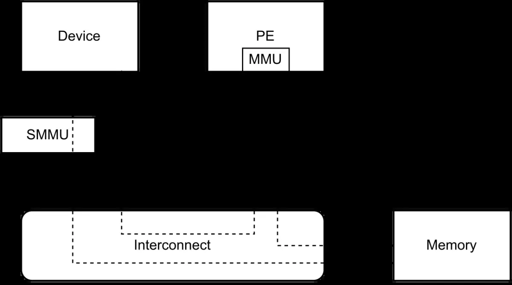

ARM SMMU 提供如下服务：

**转换**

将客户端设备提供的地址从虚拟地址空间转换到系统的物理地址空间。

**保护**

转换表中持有的权限信息可能会阻止来自客户端设备的操作。你可以禁止设备对特定的内存区域执行读取、写入、执行或任何访问操作。

**隔离**

来自一个设备的事务可以与另一个设备的事务区分开来，即使两个设备共享与 SMMU 的连接。这意味着可以对每个设备应用不同的转换和保护属性。每个设备可能有自己的私有转换表，或者可能与其它设备共享它们，具体取决于应用场景。

为了关联设备事务和转换，并标识连接到 SMMU 的不同设备，**客户端设备的 DMA 请求有一个额外的属性**。StreamID 唯一地标识一个事务流。SMMU 可以为每个流执行不同的转换或检查。

SMMU 为 I/O 设备的内存管理提供了一种灵活且可扩展的方法。它支持的系统范围从只有一台设备到具有许多设备的大型系统。图 **包含 SMMU 的系统拓扑简化示例** 显示了连接到两个设备的 SMMU：GPU 和 DMA 引擎。你可以为每个设备配置拥有自己的一组转换表。


SMMU 可以选择性地支持两阶段转换，以与 PE 支持虚拟化扩展类似的方式。你可以独立地开关每个转换阶段。在阶段 1 中，传入地址在逻辑上从虚拟地址 (VA) 转换为中间物理地址 (IPA)，然后将 IPA 输入到阶段 2，阶段 2 将 IPA 转换为输出物理地址 (PA)。第 1 阶段供软件实体使用，例如操作系统或用户空间应用程序。它提供对实体的物理地址空间内的缓冲区的隔离或转换，例如操作系统的物理地址空间内的 DMA 隔离。第 2 阶段适用于支持虚拟化扩展的系统，旨在将设备 DMA 虚拟化到客户端系统 VM 地址空间。

## SMMU 的操作

本章介绍 SMMU 的操作。它包含以下小节：

 * 转换过程概述
 * 流安全
 * 流标识
 * 故障模型
 * 旁路
 * 地址转换服务
 * 页请求接口

### 转换过程概述

图 **简化的 SMMU 转换流程** 显示了每个传入事务经历的简化的流程。本节描述顶层的转换过程。

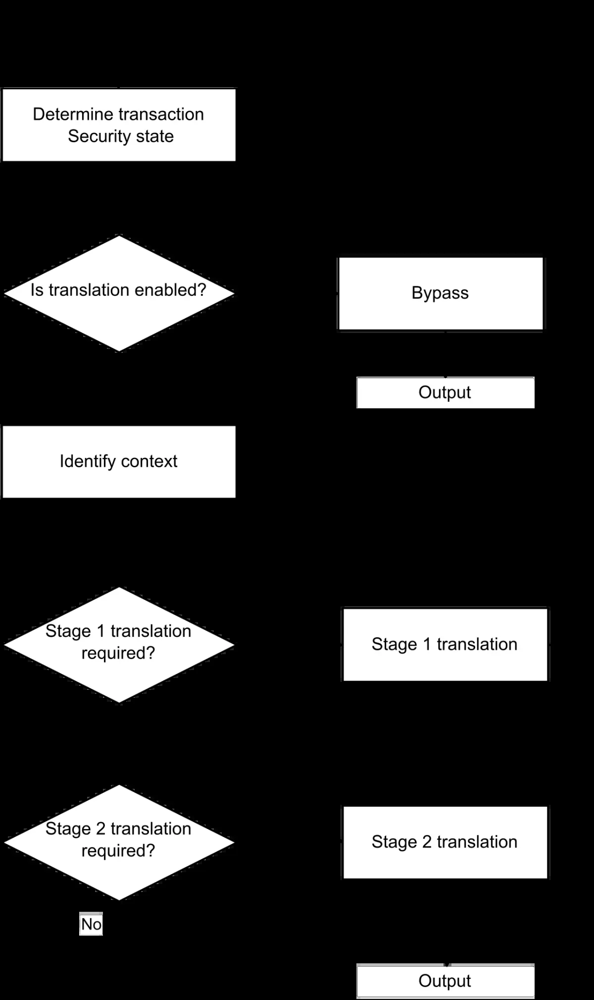

传入事务按照以下步骤执行转换：

1. 如果 SMMU 被全局禁用，则事务仅通过 SMMU 而不进行任何地址修改。全局属性（例如内存类型或可共享性）可以从 SMMU 的 SMMU_GBPA 寄存器应用。或者，SMMU_GBPA 寄存器可以被配置为中止所有事务。

2. 如果没有应用全局旁路，则配置通过以下过程确定：

   - a. 定位流表条目 (STE)。

   - b. 如果 STE 启用了第 2 阶段转换，则 STE 包含第 2 阶段转换表基地址。

   - c. 如果 STE 启用了第 1 阶段转换，则定位上下文描述符 (CD)。如果 STE 也启用了第 2 阶段转换，则从使用第 2 阶段转换的 IPA 空间获取 CD。否则，从 PA 空间获取 CD。

3. 如果配置有效，则执行转换。

   - a. 如果阶段 1 配置为执行转换，则 CD 包含第 1 阶段转换表基址，它指向所要遍历的表的基地址。如果 STE 启用了第 2 阶段转换，则这可能需要第 2 阶段转换。如果第 1 阶段配置为旁路，则输入地址将直接提供给第 2 阶段。

   - b. 如果阶段 2 配置为执行转换，则 STE 包含第 2 阶段转换表基地址，它用于执行第 2 阶段转换。阶段 2 转换阶段 1 的输出，或在阶段 1 被绕过时转换输入地址。如果阶段 2 配置为旁路，则阶段 2 的输入地址即为其输出地址。

4. 当事务通过所有转换阶段时，具有相关内存属性的转换后地址将被转发到系统中。

如果启用了 GPC，则实现了领域管理扩展 (RME) 的 SMMU 在访问所有物理地址时将受到粒度保护检查 (GPC) 的约束。但是，粒度保护表 (GPT) 信息的获取不受 GPC 的约束。所有客户端设备对物理地址的访问都必须根据 GPT 进行检查。SMMU 的这种行为与 A-profile 架构的 FEAT_RME 相对应。有关 RME 的更多详细信息，请参阅 [了解架构 - 领域管理扩展](https://developer.arm.com/documentation/den0126/latest/)。

 > **注意**
 > 
 > 此序列展示非安全流上事务的路径。如果支持 Secure 状态或 Realm 状态，Secure 流或 Realm 流上的事务路径类似，除了 **SMMU_S_CR0.SMMUEN** 和 **SMMU_S_GBPA** 控制旁路，或 **SMMU_R_CR0.SMMUEN** 和 **SMMU_R_GBPA** 控制旁路，而不是 **SMMU_CR0.SMMUEN** 和 **SMMU_GBPA** 控制旁路。

### 流安全

如果未实现 RME 设备分配（由 **SMMU_S_IDR1.SECURE_IMPL** 报告），SMMUv3 架构可选择性地支持两种安全状态。如果实现了 RME 设备分配（由 **SMMU_ROOT_IDR0.REALM_IMPL** 报告），则额外地支持 Realm 状态。对于每个安全状态，都有单独的寄存器和流表。流可以是 Secure、Non-secure 或 Realm 的，这由输入信号 **SEC_SID** (不是 SMMU 的寄存器的字段，它应该是设备的配置的一部分，设备请求 SMMU 做地址转换时，**SEC_SID** 作为事务的一部分被带给 SMMU，就像 StreamID 一样) 决定。表 **流安全状态确定** 展示了输入信号 **SEC_SID** 如何确定流的安全状态。

**流安全状态确定**

| SEC_SID 值 | 描述 |
|--|--|
| 0b00 | 该流是非安全流，并使用非安全寄存器和非安全流表 |
| 0b01 | 该流是安全流，并使用安全寄存器和安全流表 |
| 0b10 | 该流是 Realm 流，并使用 Realm 寄存器和 Realm 流表 |

发出 **SEC_SID** 信号的方式由 **实现定义**。这可以是，但不限于是边带信号或针对特定设备的捆绑信号。

非安全流只能生成非安全向下事务。传入的 **NS** 属性和页表中的 **NS** 属性将被忽略。安全流可以生成安全和非安全向下事务。Realm 流可以生成 Realm 和非安全向下事务。

 > **注意**
 > 
 > 安全流和安全事务是有区别的：
 > 
 >  * 安全事务意味着访问安全的物理地址空间。
 >  * 安全流是处于安全状态的设备的编程接口。

### 流标识

系统中可能有多个设备共享同单个 SMMU。通常不同的转换用于不同的设备。比如，在图 **包含 SMMU 的系统拓扑简化示例** 展示的系统中，虚拟机 A 可以使用 DMA 引擎，虚拟机 B 可以使用 GPU。SMMU 需要识别与它连接的不同设备，并将设备流量和事务关联起来。

#### StreamID 是什么？

StreamID 是 SMMU 区分不同客户端设备的方式。最简单的情况下，一台设备可以有一个 StreamID。但是，设备可能能够生成多个 StreamID，并基于 StreamID 应用不同的转换。例如，对于支持多个通道的 DMA 引擎，不同的 StreamID 可能应用于不同的通道。

StreamID 如何构成由 **实现定义**。通常它是边带信号的组合。

每个安全状态有一个单独的 StreamID 命名空间，即：

 * 安全 StreamID 0 是与非安全 StreamID 0 不同的 StreamID。
 * Realm StreamID 0 是与安全 StreamID 0 不同的 StreamID。

然而，Realm 和非安全 StreamID 共享同一个命名空间是。可以在非安全状态和 Realm 状态下操作的设备必须在两种状态下具有相同的 StreamID。

StreamID 在流表中选择一个 STE (STE 里面有什么？SMMU 又如何基于 STE 完成地址转换？)，其中包含每个设备的配置设置。请参考 **流表** 一节。

RME 扩展了 SMMU 架构以支持没有 StreamID 的事务。这些事务受 GPC 约束，但不受第 1 阶段或第 2 阶段转换的约束。ARM 预期此支持将用于 GIC 和调试访问端口等设备。也就是说，此支持用于传统上不会连接到 SMMU，但其访问需要粒度保护检查 (Granule Protection Checks，GPC) 的设备。

#### SubstreamID 的角色

SubstreamID 可以选择性地提供给实现第 1 阶段转换的 SMMU。子流使来自同一设备的事务能够共享相同的第 2 阶段转换，但具有不同的第 1 阶段转换。

考虑运行多个应用程序的虚拟机。你可能希望一个 DMA 通道由一个应用程序使用，而另一个 DMA 通道由另一个应用程序使用。这些应用程序位于同一虚拟机内，因此它们具有相同的第 2 阶段转换。然而它们有不同的第一阶段转换。SMMUv3 使每个流能够拥有多个子流。所有子流共享相同的第 2 阶段转换，但每个子流都有自己的第 1 阶段转换。例如，如果具有固定 StreamID 的 DMA 引擎具有多个通道，则不同的 SubstreamID 可能会应用于不同的通道。

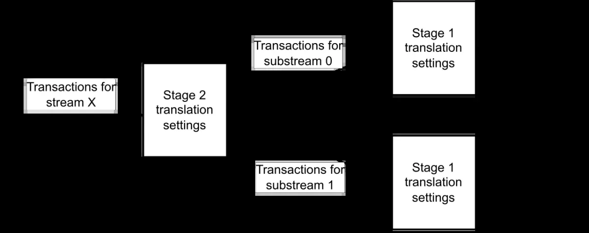

当 SubstreamID 与事务一起提供并且配置启用子流时，SubstreamID 索引 CD 表以选择阶段 1 转换上下文。请参考 **CD** 一节。

### 故障模型

图 **SMMU 故障记录和报告** 展示了 SMMU 记录和报告故障的流程。


传入的事务在继续进入系统之前会经历几个逻辑阶段。如果由于 **实现定义** 的原因，SMMU 不支持事务类型或属性，则会记录 **不支持的上游事务故障 (F_UUT)** 事件，并通过 **中止** 终止事务。请参考 **事件队列** 一节。

否则，StreamID 和 SubstreamID（如果提供）用于查找事务的配置。如果任何所需的 STE 和 CD 无法找到或无效，则会记录配置错误事件，并通过 **中止** 终止事务。

如果找到有效的配置以便可以访问转换表，则转换过程开始。在此阶段可能会发生其它故障。当事务进行到转换时，遇到故障时的行为变得可配置。以下故障类型在阶段 1 或阶段 2 产生时，构成转换相关故障：

 * **F_TRANSLATION**
 * **F_ADDR_SIZE**
 * **F_ACCESS**
 * **F_PERMISSION**

这些故障类型对应于 VMSA 中的故障类型：

 * 转换故障
 * 地址大小故障
 * 访问标记故障
 * 权限故障

你可以在终止和 Stall 模型之间切换转换相关的故障的行为，终止和 Stall 模型由 **CD** 决定。**{A,R,S}** 标记用于第 1 阶段和 **STE.{S2R,S2S}** 标记用于第 2 阶段。

#### 终止模型

当阶段 1 配置为终止故障时，在阶段 1 发生故障的事务将：

 * 当 **SMMU_IDR0.TERM_MODEL = 1** 或 **CD.A = 1** 时，通过向正在进行访问的客户端设备报告 **中止** 而终止。

 * 当 **SMMU_IDR0.TERM_MODEL = 0** 且 **CD.A = 0** 时 **RAZ/WI**。

当阶段 2 配置为终止故障时，在阶段 2 发生故障的事务将以 **中止** 而终止。

终止后客户端设备的行为特定于该设备。

如果配置为终止故障的阶段也配置了 **CD.A = 1** 或 **STE.S2R == 1**，根据故障的阶段，SMMU 将失败访问的详细信息记录到事件队列中的一个事件记录中。

#### Stall 模型

Stall 模型是允许请求调页类型的模型。如果启用了 Stall 模型，则 SMMU 会记录 Stall 事务的详细信息并引发中断，以便软件感知它。收到中断后，软件会在内存中进行分页并更新转换表，然后发送恢复命令以告知 SMMU 重试转换。上游设备似乎经历了较长的延迟。

或者，软件可以选择终止事务而不是重新启动它。例如，当设备访问出于安全原因不允许访问的地址范围时。

重试或终止命令通过 SMMU 的命令队列发出。请参考下文的 [命令队列](https://developer.arm.com/documentation/109242/0100/Programming-the-SMMU/Command-queue?lang=en) 一节。

### 旁路

在旁路模式下，SMMU 不必转换传入事务的地址。可以将流或整个安全状态设置为旁路。这意味着输出地址等于输入地址。然而，其它输入事务属性（例如可缓存性）仍然可以选择性地被覆盖。旁路有以下三种类型：

**全局旁路**

当一种安全状态的转换被绕过时，该安全状态的所有事务都被绕过转换。软件可以通过把 **SMMU_(*_)CR0.SMMUEN** 设置为 0 来启用全局旁路。软件也可以选择性地设置 **SMMU_(*_)GBPA** 来覆盖输入属性。

**流旁路**

当 **SMMU_(*_)CR0.SMMUEN = 1** 时，这种类型的 SMMU 旁路可用。这是当 StreamID 选择配置为旁路的 STE (**STE.Config == 0b100**) 时。对于基于流的旁路，属性是使用 STE 字段配置的。**STE.{MTCFG,MemAttr,ALLOCCFG,SHCFG,NSCFG,PRIVCFG,INSTCFG}** 可以在事务传递到内存系统之前覆盖任何属性。

**阶段旁路**

当启用转换时，为每个转换阶段单独配置旁路，这也是由 **STE.Config** 控制的：

 * 阶段 1 旁路：**STE.Config[0] == 0**
 * 阶段 2 旁路：**STE.Config[1] == 0**

这几乎与在 VMSA 架构中禁用某个转换阶段相同。

### 地址转换服务

地址转换服务 (ATS) 扩展了 PCIe 协议以支持提前转换 DMA 地址的 SMMU。转换后的地址随后缓存在 PCIe 设备的本地 TLB 中。本地 TLB 被称为地址转换缓存 (ATC)。在设备中定位转换后的地址旨在减少延迟并提供可扩展的分布式缓存系统，从而提高 I/O 性能。请参阅 [PCI Express 基本规范](https://pcisig.com/specifications) 了解更多关于 ATS 机制的信息。

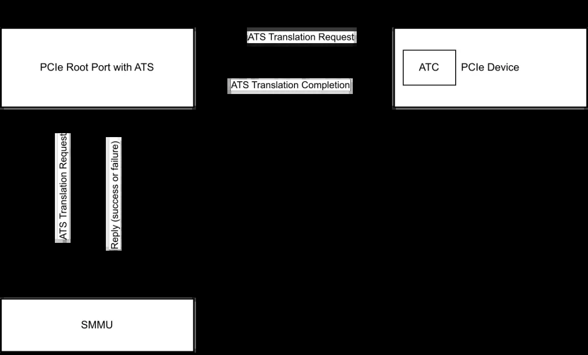

图 **ATS 机制** 展示了 ATS 如何工作。PCIe 功能块生成 ATS 转换请求，该请求通过 PCIe 层次结构发送到根端口，然后根端口将其转发到 SMMU。当收到 ATS 转换请求时，SMMU 执行以下基本步骤：

1. 验证该功能块是否已配置为启用 ATS 转换。
2. 确定该功能块是否可以访问 ATS 转换请求指示的内存，并具有关联的访问权限。
3. 确定是否可以为该功能块提供完整的转换或部分转换。如果是，则 SMMU 向该功能块发出转换。
4. SMMU 将请求的成功或失败传达给根端口，根端口生成 ATS 转换完成，并通过 **通过根端口的响应 TLP** 传输给功能块。

当功能块接收到 ATS 转换完成时，它会更新其 ATC 以反映转换或注意到转换不存在。该功能块在完成的结果之上，使用已转换的地址或未转换的地址，生成后续的请求。**SMMU_CR0.ATSCHK** 控制 SMMU 是否允许绕过已转换的事务而无需进一步检查。

**注意**

在具有 RME DA 的 SMMU 中，设备权限表 (DPT) 对已转换的事务执行检查。

支持 PCIe ATS 的 SMMU 实现可能会提供可选的额外硬件接口。例如，MMU-600/MMU-700 提供 DTI-ATS 接口，支持 ATS 转换请求和 ATS 转换响应。**SMMU_IDR0.ATS** 显示 SMMU 是否实现 ATS。

### 页请求接口

如果只有 ATS 接口，为了提高 DMA 的效率，软件需要钉住 DMA 使用的内存。也就是说，内存被锁定在适当的位置，这样它就不能被系统的动态分页机制换出。与固定内存相关的开销可能不大。然而将一大部分内存从可分页池中移除，对系统性能的负面影响可能会很大。相关的页面请求接口 (PRI) 为 PCIe 功能块增加了将 DMA 定位到未固定的动态分页内存的能力。请参阅 [PCI Express 基本规范](https://pcisig.com/specifications) 了解更多关于 PRI 机制的信息。

为了支持 PRI，SMMUv3 架构引入了一个可选的 PRI 队列来存储来自于 PCIe 根端口的 PRI 页请求 (PPR)。[PRI 队列](https://developer.arm.com/documentation/109242/0100/Operation-of-an-SMMU/Page-Request-Interface?lang=en#md271-page-request-interface__fig:pri_queue) 一节展示了 PRI 队列的数据结构。PPR 包含诸如 StreamID、SubstreamID 和页面地址之类的信息。软件可以使用这些信息来定位目标页。

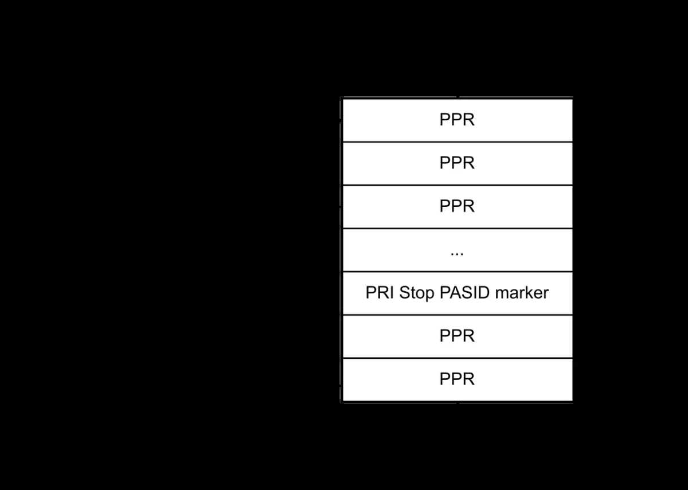

以下过程描述了 PRI 的工作原理：

1. 当 ATS 请求由于页面不存在而失败时，PCIe 功能块可以发出 PPR 来要求软件使所请求的页面可用。
2. SMMU 在 PRI 队列中保存 PPR 并增加 **SMMU_PRIQ_PROD**。
3. 软件在 PRI 队列上收到这些 PPR 并增加 **SMMU_PRIQ_CONS**。
4. 软件可以使用命令队列发出 **CMD_PRI_RESP**，以向端点发送 PRI 响应以表示 PPR 的成功或失败。请参考 **命令** 一节。
     * 在使页面呈现后，软件向 SMMU 发出肯定的 PRI 响应命令。如果请求的地址不可用，软件必须发出否定的 PRI 响应命令。例如，当编程错误导致设备请求非法地址时。

## 对 SMMU 进行编程

这个部分介绍 SMMUv3 的编程接口：

 * SMMU 寄存器
 * 流表
 * CD
 * 事件队列
 * 命令队列

大多数配置存储在内存结构中，因此软件必须为这些结构分配内存。然而，有些配置存储在 SMMU 寄存器中，如这些结构中的每个的位置和大小。

### SMMU 寄存器

图 **SMMU 寄存器映射页** 展示了 SMMU 寄存器映射页。

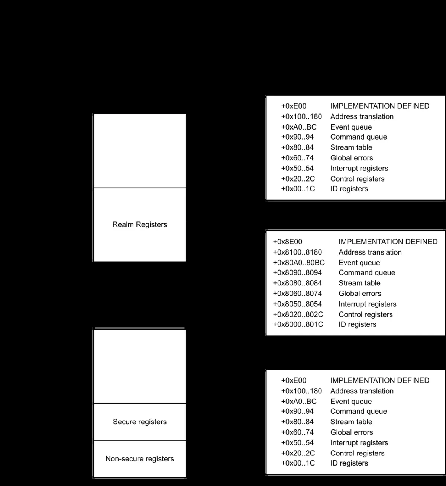

SMMU 寄存器占用了两个连续的 64K 页，SMMU 寄存器页 0 和 SMMU 寄存器页 1，这是架构上需要的。可能会出现用于可选的或 **实现定义** 的特性的附加页面：

 * 如果支持 VATOS 接口，则存在一个包含 VATOS 寄存器的 64KB 页。
 * 如果支持安全的 VATOS 接口，则存在一个包含 S_VATOS 寄存器的 64KB 页。
 * 如果支持增强型命令队列接口，则可能会出现一个或多个命令队列控制页。
 * 如果安全状态支持增强型命令队列接口，则可能会出现一个或多个安全命令队列控制页。
 * 可能存在任意数量的 **实现定义** 的页面。

具有 RME 的 SMMU 添加一个只能在根 PA 空间中访问的根控制页面。它的基地址与其它 PA 空间中可访问的寄存器地址不同。

具有 RME DA 的 SMMU 添加两个连续的 64K Realm 寄存器页，Realm 寄存器页 0 和 Realm 寄存器页 1，它们只能在 Realm 和根 PA 空间访问。Realm 寄存器页 0 的基地址 = SMMU 寄存器页 0 的基地址 + 0x20000 + (**SMMU_ROOT_IDR0.BA_REALM** * 0x10000)

SMMU 寄存器页 0 中的寄存器被分为：

 * 非安全寄存器，**SMMU_\***，从偏移量 0x0 开始。
 * 安全寄存器，**SMMU_S_\***，从偏移量 0x8000 开始。

等效的 Realm 寄存器，**SMMU_R_\***，位于 Realm 寄存器页 0 中。

大多数寄存器组是相同的，但不同安全状态下的相同寄存器可能具有不同的地址偏移量。例如：

**SMMU_CMDQ_BASE**

SMMU 寄存器页 0 中的偏移 0x90，设置为非安全命令队列的基地址。

**SMMU_S_CMDQ_BASE**

SMMU 寄存器页 0 中的偏移 0x8090，设置为安全命令队列的基地址。

**SMMU_R_CMDQ_BASE**

Realm 寄存器页 0 中的偏移 0x90，设置为 Realm 命令队列的基地址。

除了用于数据结构的寄存器之外，还有其它寄存器控制 SMMU 的其它功能：

 * 报告已实现特性的标识字段
 * 顶层控制，如启用 SMMU 和队列
 * 中断配置
 * 全局错误报告
 * 地址转换操作

### 流表

SMMU 使用内存中的一组数据结构来定位转换数据。请参考 **转换过程概述** 一节。**SMMU_(\*_)STRTAB_BASE** 保存初始结构，流表的基地址。流表条目 (STE) 包含第 2 阶段转换表基指针。它还定位第 1 阶段配置结构，其中包含转换表基指针。

传入事务的 StreamID（由 **SEC_SID** 限定）确定使用哪个流表进行查找，并定位 STE。


可以支持两种格式的流表：
 * 线性流表
 * 2 级流表

使用 **SMMU_IDR0.ST_LEVEL** 字段可以发现对 2 级流表格式的支持。软件配置 **SMMU_(\*_)STRTAB_BASE_CFG** 指定所使用的流表格式。

#### 线性流表

线性流表是连续的 STE 数组，按 StreamID 从 0 开始索引。数组的大小可配置为 STE 大小的 2 的 n 次方倍，最多可达 SMMU 硬件支持的最大 StreamID 位数。

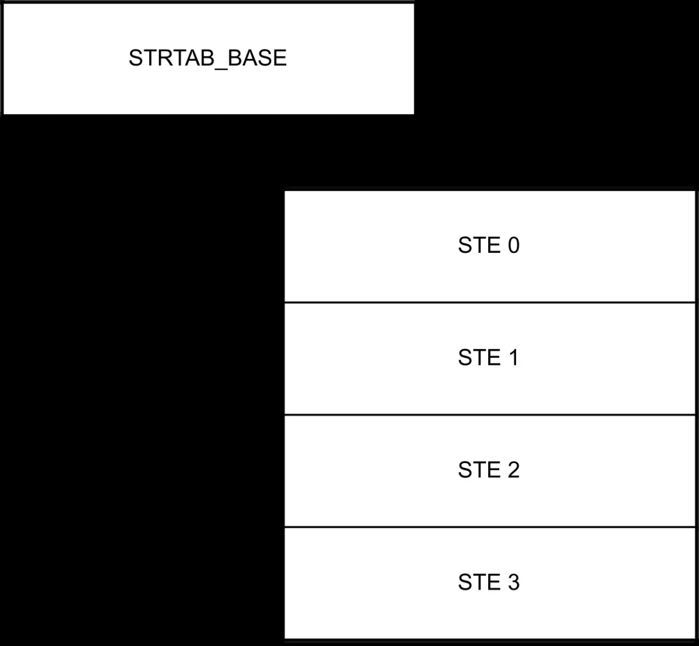

要定位事务的 STE，流表通过事务的 StreamID 进行索引：
```
STE_addr = STRTAB_BASE.ADDR + StreamID * sizeof(STE)
```

#### 2 级流表

2 级流表由一个顶级表组成，该顶级表包含指向多个二级表的描述符，这些 2 级表包含 STE 的线性数组。你可以将整个结构覆盖的 StreamID 范围配置为 SMMU 支持的最大 StreamID。但是，二级表不必完全填充，并且大小可能会有所不同。这可以节省内存并避免对非常大的 StreamID 空间进行大量物理连续的内存分配的要求。


2 级流表对于 StreamID 宽度较大，或者无法轻松分配那么多连续内存，或者 StreamID 的分布相对稀疏的软件很有用。例如，对于 PCIe 等用例，最多支持 256 条总线，并且 RequesterID 或 StreamID 空间至少为 16 位。请参考下文的 **PCIe 注意事项** 一节。然而，由于每个 PCIe 链路通常有一个 PCIe 总线，并且每个总线可能有一个设备，因此在最坏的情况下，可能在每 256 个可能的 StreamID 中只有一个有效的 StreamID。例如，如果 StreamID 的个数为 16 位的，则第一个有效的 StreamID 为 0，第二个有效的 StreamID 为256，第三个有效的 StreamID 为 512，以此类推。

顶级表由 StreamID[n:x] 索引，其中 n 是覆盖的最高 StreamID 位，x 是由 **SMMU_(\*_)STRTAB_BASE_CFG.SPLIT** 给出的可配置的分割点。第 2 级表的索引最多为 StreamID[(x - 1):0]，具体取决于每个表的跨度。

```
L1STD_addr = STRTAB_BASE.ADDR + StreamID[n:x] * sizeof(L1STD)
STE_addr = L1STD.L2Ptr + StreamID[(x - 1):0] * sizeof(STE)
```

图 **SPLIT == 8 时的 2 级流表示例** 展示了一个 SPLIT == 8 时的 2 级流表的示例。

软件最初分配 L1 流表，该表设置为 SMMU 配置的接受的最大 StreamID 宽度。L1 表中的每个条目代表一个 StreamID 块，其大小通过 **SMMU_(\*_)STRTAB_BASE_CFG.SPLIT** 设置。 **SMMU_(\*_)STRTAB_BASE_CFG.SPLIT** 设置 L2 流表的最大大小。

L1 流表描述符 (L1STD) 可以是无效的，或指向 L2 流表。软件可以根据需要分配这些 L2 流表。

L2 流表不必覆盖 L1STD 表示的整个 StreamID 范围。L1STD 包含一个 **Span** 字段，它设置了指向的表的大小。落在 L1 条目范围内，但超出 **Span** 的任何 StreamID 都被视为无效的。

### L1 流表描述符

图 **L1 流表描述符** 展示了 L1STD 的字段。


| 字段 | 描述 |
|--|--|
| L2Ptr | 指向 2 级数组的起始位置的指针 |
| Span | 2 级数组包含 2 的 (Span-1) 次方个 STE |

### STE

STE 存储该流的上下文信息。每个 STE 为 64 字节。

STE 字段遵循如下约定：

 * 与第 1 阶段事务有关的字段有一个 S1 前缀
 * 与第 2 阶段事务有关的字段有一个 S2 前缀
 * 不与特定转换阶段相关的字段没有前缀

下面的列表列出了一些常用的字段：

 * 公共配置
   * **Valid**：STE 是否有效
   * **Config**：阶段 1/阶段 2 转换启用或绕过
   * **CONT**：连续提示
   * **EATS**：启用 PCIe ATS 转换和流量
   * **STRW**：与 VMSA 中的转换机制相对应的 StreamWorld 控制

 * 阶段 1 转换设置
   * **S1Fmt**：CD 表的格式
   * **S1ContextPtr**：阶段 1 上下文描述符指针
   * **S1CDMax**：S1ContextPtr 指向的 CD 的个数，2 的 S1CDMax 次方个
   * **S1DSS**：默认的子流
   * **S1CIR**/**S1COR**/**S1CSH**：CD 表内存属性

 * 阶段 2 转换设置
   * **S2T0SZ**：阶段 2 转换表覆盖的 IPA 的大小
   * **S2SL0**：阶段 2 转换表遍历的起始层级
   * **S2IR0**/**S2OR0**/**S2SH0**：阶段 2 转换表遍历的内存属性
   * **S2TG**：阶段 2 转换粒度大小
   * **S2PS**：物理地址大小

### CD

CD 存储了与阶段 1 转换有关的所有设置。每个 CD 64 字节。指向 CD 的指针来自于 STE，而不是寄存器。只有在执行阶段 1 转换时才需要 CD。对于只有阶段 2 转换或绕过转换的流，只需要 STE。

CD 将 StreamID 与阶段 1 转换表基指针关联起来，以便针对每个第 2 阶段配置将 VA 转换为 IPA。如果使用了子流，则多个 CD 指示多个阶段 1 转换，每个子流一个。当未启用第 1 阶段转换时，具有 SubstreamID 的事务将终止。

当使用了第 1 阶段转换时，**STE.S1ContextPtr** 字段给出了由 **STE.S1Fmt** 和 **STE.S1CDMax** 配置的如下地址中的一个：

 * 单个 CD
 * 单层CD表的起始地址
 * 第一级 L1 L1CD 表的起始地址

预计，在存在虚拟机管理程序软件的情况下：

 * 流表和第 2 阶段转换表由虚拟机管理程序管理。
 * CD 表和与 *处于客户操作系统控制下的设备* 关联的第 1 阶段转换表由客户操作系统管理。

#### 单个 CD

图 **配置结构示例** 展示了一个示例配置，其中 StreamID 从线性流表中选择一个 STE。STE 指向了一个第 2 阶段的转换表，并指向了第 1 阶段配置的单个 CD。CD 指向第 1 阶段转换表。

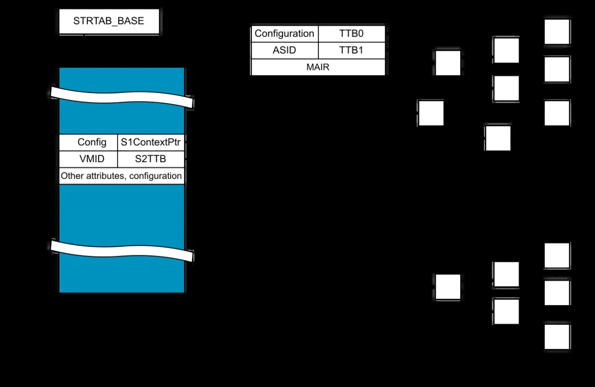

#### 单级 CD 表

图 **子流的多上下文描述符** 展示了一个配置，其中 STE 指向多个 CD 的数组。传入的 SubstreamID 选择其中一个 CD，因此 SubstreamID 确定事务使用哪个阶段 1 转换。


#### 2 级 CD 表

当使用子流时，CD 数组可以是 2 级的，与流表的方式非常相似。

图 **配置结构示例** 展示了一个复杂的布局，其中使用了 2 级流表。其中两个 STE 指向单个 CD 或 CD 的平面数组。第三个 STE 指向 2 级 CD 表。通过多个级别，可以在没有大型物理连续表的情况下支持许多流和许多子流。

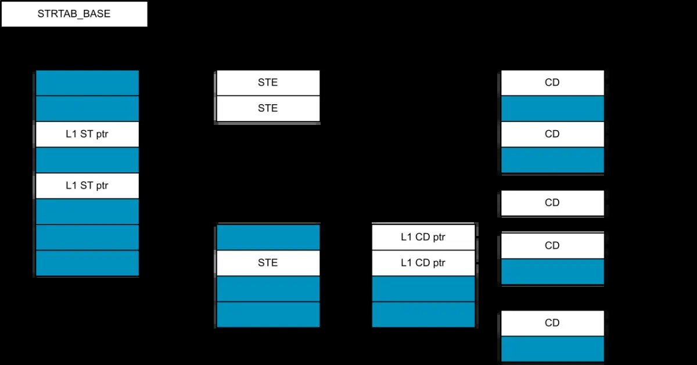

L1 表是由 SubstreamID 的高位索引的 L1CD 的连续数组。L1 表中的每个 **L1CD.L2Ptr** 配置有线性二级、L2、CD 表的地址。L2 表是由 SubstreamID 的低位索引的连续 CD 数组。用于 L1 和 L2 索引的 SubstreamID 位范围由 **STE.S1Fmt** 配置。

### 虚拟机结构

虚拟机结构 (VMS) 是一个 SMMU 概念，它是由指针字段 **STE.VMSPtr** 定位的结构体。VMS 保存每个 VM 的配置设置。一个安全状态内具有相同 VMID (virtual machine identifier，虚拟机标识符) 的多个 STE 必须指向相同的 VMS。目前 VMS 仅支持内存系统资源分区和监视 (MPAM) 特性。它将由客户操作系统配置的虚拟 **CD.PARTID** 值映射到物理 PARTID 值。有关 MPAM 特性的更多信息，请参阅 [了解架构 - 内存系统资源分区和监控 (MPAM) 概述](https://developer.arm.com/documentation/107768/latest)。

### 缓存

SMMU 实现不必须实现任何类型的缓存。然而，预计性能要求需要缓存至少一些配置或转换信息。

配置或转换的缓存可能表现为每种结构类型的单独缓存，或者将结构组合成较少数量的缓存。

当软件想要更改配置时，它需要使 SMMU 中的任何缓存失效。它通过向命令队列发出配置缓存失效命令来实现此目的。请参考 [命令队列](https://developer.arm.com/documentation/109242/0100/Programming-the-SMMU/Command-queue?lang=en) 一节。当软件想要更改转换时，它也需要使 SMMU 中的任何缓存失效。它通过向命令队列发出 TLB 失效命令，或通过广播发送 TLB 失效来实现此目的。

### 命令队列

SMMU 通过内存中的一个环形命令队列控制。例如，当软件更改 STE 或转换时，它需要使无效 SMMU 中的相关缓存。这可以通过向命令队列发出相应的无效命令来完成。请参考 [命令](https://developer.arm.com/documentation/109242/0100/Programming-the-SMMU/Command-queue/Commands?lang=en) 一节了解命令的分类。

在 SMMUv3.3 之前，每个安全状态有一个命令队列。实现 SMMUv3.3 的 SMMU 可以选择支持多个命令队列，以减少并发向 SMMU 提交命令的多个 PE 之间的争用。


**SMMU_CMDQ_BASE** 存储命令队列的基地址和大小。软件在向命令队列添加新命令之前，需要先检查命令队列中是否有空间。当软件向队列添加一个或多个命令时，它会更新 **SMMU_CMDQ_PROD** 指针以告诉 SMMU 有新命令可用。当 SMMU 处理命令时，它会更新 **SMMU_CMDQ_CONS** 指针。软件读取 **SMMU_CMDQ_CONS** 指针以确定命令已使用且空间已释放。

如果 **SMMU_CMDQ_PROD.WR == SMMU_CMDQ_CONS.RD** 且 **SMMU_CMDQ_PROD.WR_WRAP != SMMU_CMDQ_CONS.RD_WRAP**，则队列已满。

**SMMU_CMDQ_CONS** 更新仅表明命令已被消耗。这可能并不意味着该命令的效果是可见的。**CMD_SYNC** 命令可用于同步。仅当先前命令的效果可见时才会消耗它。比如：
```
CMD_TLBI_EL3_ALL
CMD_SYNC
```

当 **CMD_SYNC** 被消耗时，**CMD_TLBI_EL3_ALL** 的效果保证可见。

#### 命令

命令队列中的所有命令都是 16 字节长的。所有的命令队列项都是小尾端的。每个命令都以 8 位的命令操作码开始。下面的列表展示了命令的类别：

**预取命令**

预取转换或配置。

**TLB 无效命令**

使给定异常级别下与标记 (VMID，ASID (address space identifier，地址空间标识符)，VA 或全部) 匹配的所有 TLB 条目无效。

**配置缓存无效命令**

使给定 StreamID (在 STE 的情况下) 或 StreamID 和 SubstreamID (在 CD 的情况下) 的指定范围 <All，RANGE> 内的所有配置缓存条目无效。

**同步命令**

为与同步命令发出的相同的命令队列发出的先前的命令提供同步机制。

**PRI 响应命令**

当 **SSV == 1** 时，通知与 StreamID 和 SubstreamID 对应的设备，**PRGIndex** 指示的页面请求组已完成并具有给定响应。

**ATC 无效命令**

使所有与标记 (StreamID，SubstreamID，地址范围) 匹配的 ATC 条目无效。

**Stall 恢复/终止命令**

恢复或终止由给定的 StreamID 和 STAG 参数标识的已停止事务的处理。

**DPT 无效命令**

这些命令从 DPT TLB 中移除缓存的 DPT 信息。

关于命令的完整描述，请参考 [ARM 系统内存管理单元版本 3](https://developer.arm.com/documentation/ihi0070/latest/)。

### 事件队列

如果发生一组配置错误和故障，则会将其记录在事件队列中。其中包括由传入设备流量产生的事件，例如：

 * 收到设备流量后获取配置时发现的配置错误
 * 由设备流量地址引起的页错误

每个安全状态有一个事件队列。当事件队列从空转变为非空时，SMMU 生成中断。事件队列的结构与命令队列相同，只是生产者和消费者的角色颠倒了。对于命令队列，SMMU 是消费者，然而对于事件队列，SMMU 是生产者。


如果事件消耗得不够快，由传入事务引起的一系列故障或错误可能会填满事件队列并导致其溢出。如果事件队列已满，则由停滞的故障事务产生的事件永远不会被丢弃。当事件队列中的条目被消耗并且接下来的空间变得可用时，则记录它们。如果事件队列已满，其它类型的事件将被丢弃。系统软件应快速消耗事件队列中的条目，以避免正常操作期间溢出。

#### 事件记录

事件记录的大小为 32 字节，且所有的事件记录都是小尾端的。事件队列中可能记录三类事件：

 * 配置错误
 * 转换过程中的故障
 * 杂项

以下列表显示了一些示例：

 * **CERROR_ILL**：非法或无法识别的命令
 * **C_BAD_STREAMID**：事务 StreamID 超出范围
 * **C_BAD_STE**：使用的STE无效
 * **F_TRANSLATION**：转换错误

关于事件记录的完整描述，请参考 [ARM 系统内存管理单元版本 3](https://developer.arm.com/documentation/ihi0070/latest/)。

### 全局错误

与编程接口相关的全局错误将报告到相应的 **SMMU_(\*_)GERROR** 寄存器中，而不是报告到基于内存的事件队列中。这些错误往往很严重，例如阻止 SMMU 向前推进。例如，访问配置数据结构之一时发生外部中止。以下列表显示了所有全局错误：

 * 命令队列错误
 * 事件队列访问已中止，当标记为中止时，将停止向事件队列的传送
 * PRI 队列访问已中止，当标记为中止时，将停止向 PRI 队列的传送
 * CMD_SYNC 消息信号中断 (MSI) 写入中止
 * PRI 队列 MSI 写入中止 (仅限非安全 GERROR)
 * GERROR MSI 写入中止
 * SMMU 进入服务故障模式

**SMMU_(\*_)GERROR** 为每个全局错误提供了一个一位标记。当错误条件被触发时，通过切换 **GERROR** 中的相应标志来激活错误。某些情况下，当错误处于激活状态时，SMMU 行为会发生变化。例如，当命令队列错误处于激活状态时，SMMU 不会从命令队列中消耗命令。

当 **SMMU_(\*_)IRQ_CTRL.GERROR_IRQEN == 1** 时，当 SMMU 激活非 **GERROR** **MSI** 写入中止的错误时，会触发 **GERROR** 中断。

### 最小配置

如下序列展示了 SMMU 初始化的最小配置：

1. 分配流表

 * 为流表分配内存。
 * 通过写入 **SMMU_STRTAB_BASE_CFG** 配置流表的格式和大小。
 * 通过写入 **SMMU_STRTAB_BASE** 配置流表的基地址。
 * 通过为每个 STE 设置 **STE.V = 0** 将其标记为无效，防止未初始化的内存被解释为有效配置。
 * 通过执行 DSB 操作，确保 SMMU 可观察到写入的数据。
     * 如果 **SMMU_IDR0.COHACC = 0**，则系统不支持 SMMU 对内存的一致访问。在这些情况下，你可能需要额外的步骤，包括数据缓存维护，以确保 SMMU 可以观察到写入的数据。

2. 分配命令和事件队列

 * 为命令队列和事件队列分配内存。
 * 通过配置 **SMMU_CMDQ_BASE**、**SMMU_CMDQ_PROD**、**SMMU_CMDQ_CONS**、**SMMU_EVENTQ_BASE**、**SMMU_EVENTQ_PROD** 和 **SMMU_EVENTQ_CONS** 指定基地址，大小，生产者指针和消费者指针。

3. 为访问流表，命令队列和事件队列设置内存属性

 * 配置 **SMMU_CR1**。

4. 为事件队列和 GERROR 启用 IRQ

 * 配置 **SMMU_IRQ_CTRL**。

5. 启用命令和事件队列

 * 通过将 **SMMU_CR0.CMDQEN** 位设置为 1 启用命令队列。
 * 通过轮询 **SMMU_CR0ACK** 直到 **CMDQEN** 读取为 1 来检查启用操作是否完成。
 * 通过将 **SMMU_CR0.EVENTQEN** 位设置为 1 启用事件队列。
 * 通过轮询 **SMMU_CR0ACK** 直到 **EVENTQEN** 读取为 1 来检查启用操作是否完成。

6. 使 TLB 和配置缓存结构无效

 * 向命令队列发出命令
     * 要使 TLB 条目无效，请确保软件为转换上下文发出了适当的命令。例如，要使非安全 EL1 上下文的 TLB 条目无效，发出 **CMD_TLBI_NSNH_ALL** 命令，对于 EL2 上下文，发出 **CMD_TLBI_EL2_ALL** 命令。
     * 要使 SMMU 配置缓存无效，发出 **CMD_CFGI_ALL** 命令。
     * 要强制之前的命令完成，发出 **CMD_SYNC** 命令。
 * 或者，安全软件可以通过单次写入使所有 TLB 和缓存失效。
     * 将 **SMMU_S_INIT.INV_ALL** 设置为 1。
     * 在继续 SMMU 配置之前，轮询 **SMMU_S_INIT.INV_ALL** 以检查其是否设置为 0。

7. 启用转换

 * 将 **SMMU_CR0.SMMUEN** 位设置为 1。
 * 通过轮询 **SMMU_CR0ACK** 直到 **SMMUEN** 读取为 1 来检查启用操作是否完成。

**注意**

此序列展示了当 SMMU 未实现 RME 扩展或未启用 GPC 时的非安全 SMMU 编程。安全的或 Realm SMMU 编程与此类似。如果 SMMU 实现了 RME 扩展，并且启用了 GPC，则在 Root 世界中运行的软件需要首先初始化 GPT。

## 系统架构注意事项

本章介绍一些与 SMMU 相关的注意事项。

### I/O 一致性

如果设备的事务监听 PE 缓存以获取内存的可缓存区域，则设备的 I/O 与 PE 缓存一致。这将通过避免缓存维护操作 (CMO) 来提高性能。该设备不需要访问外部存储器。PE 不监听设备缓存。

如果设备的 I/O 与 PE 缓存一致，则与设备共享的内存不需要 CMO。该内存在 CPU 上映射为内部写回 (iWB)、外部写回 (oWB) 和内部共享 (ISH)。如果设备的 I/O 与 PE 缓存不一致，则与设备共享的内存需要 CMO，该内存在 CPU 上映射为 iWB-oWB-ISH。

这些类型的 SMMU 访问可以是 I/O 一致的：

 * SMMU 发起的事务
     * 转换表遍历
     * 获取 L1STD，STE，L1CD 和 CD
     * 访问命令队列，事件队列，和 PRI 队列
     * MSI 中断写入

 * 设备发起的事务
     * 如果 SMMU 的系统接口支持 I/O 一致性，则简单的非一致性设备可以实现 I/O 一致性。来自客户端设备的事务的可缓存性和可共享性属性可以被 SMMU 覆盖，因此输出到互连的事务可以监听 PE 缓存。

SMMU 是否支持发出一致性访问由 **SMMU_IDR0.COHACC** 指示。

**注意**

[Arm 基础系统架构](https://developer.arm.com/documentation/den0094/latest/) 需要 I/O 一致转换表和配置结构访问。

为了支持 I/O 一致性访问，SMMU 需要一个提供正确一致性保证的互连端口。例如，AMBA 互连中的 ACE-Lite 端口可以支持 I/O 一致访问。

### 客户端设备

本节介绍客户端设备的一些要求，例如：

 * 地址大小
 * 缓存
 * PCIe 设备或根端口的要求
 * StreamID 分配
 * 消息信号中断

#### 地址大小

SMMU 的架构输入地址大小为 64 位。 如果出现以下任何一种情况：

 * 客户端设备输出小于 64 位的地址。
 * 客户端设备和 SMMU 输入之间的互连支持少于 64 位的地址。

较小的地址以系统特定的方式转换为 64 位 SMMU 输入地址。SMMU 对扩展的 64 位地址执行输入范围检查：

 * **N** 被定义为 VA 区域大小，它由 **CD.T0SZ** 或 **CD.T1SZ** 控制，例如 40 位。
 * 如果使用顶部字节忽略，分别 **CD.TBI0** 或 **CD.TBI1**，则 **VA[55:N-1]** 全部相同。
 * 如果不使用顶部字节忽略，则 **VA[63:N-1]** 全部相同。

#### 缓存

连接在 SMMU 后面的设备无法包含与系统其余部分完全一致的缓存，因为监听与物理缓存线相关，但 SMMU 无法进行从 PA 到 VA 的反向转换。设备可能包含不支持硬件一致性的缓存，此类缓存必须由软件维护。

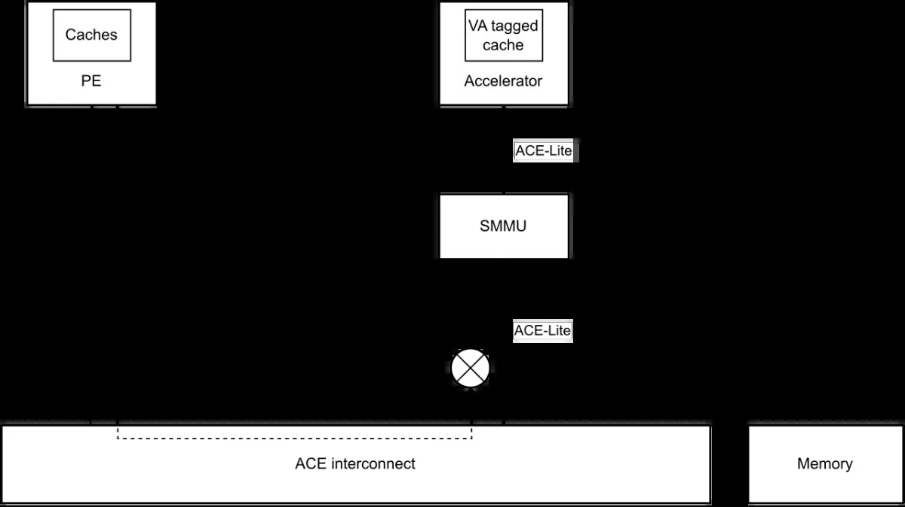

然而，包含使用 ATS 从 SMMU 填充的 TLB 的客户端设备可能会维护完全一致的物理地址缓存，在执行缓存访问之前使用 TLB 将内部地址转换为物理地址。SMMU 上游的任何物理地址缓存必须是一致的。例如，使用 ATS 转换虚拟地址和一致的物理地址缓存的 **CXL.cache** 或 **CCIX** 客户端设备。

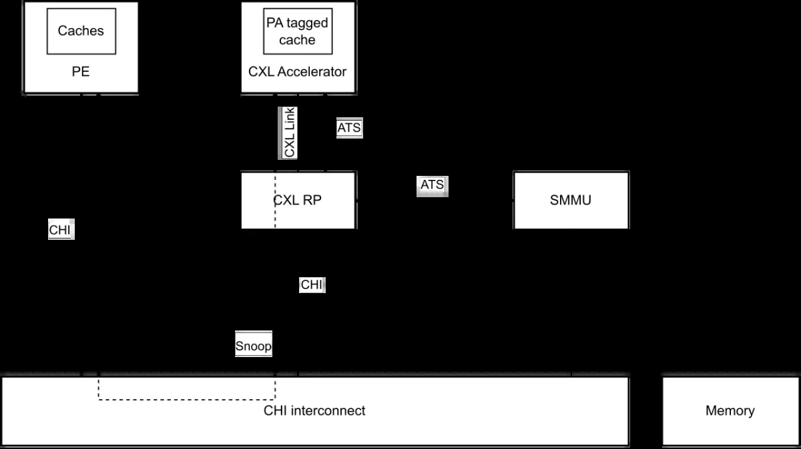

### PCIe 注意事项

当与 PCIe 子系统一起使用时，SMMU 实现必须至少支持完整的 16 位范围的 PCIe RequesterID。系统必须确保根端口以一对一或线性方式从 PCI RequesterID 生成 StreamID，以便 **StreamID[15:0] == RequesterID[15:0]**。可以通过连接来自多个 PCI 域（或“段”）的 RequesterID 来构建更大的 StreamID，例如：
 * `StreamID[17:0] == { pci_rp_id[1:0], pci_bus[7:0], pci_dev[4:0], pci_fn[2:0] };` 即，`StreamID[17:0] == { pci_domain[1:0], RequesterID[15:0] };`

当与支持 **PASID** 的 PCIe 系统一起使用时，系统必须确保根端口以一对一的方式从 PCI PASID 生成 SubstreamID。我们建议 SMMU 支持与客户端根端口支持的相同数量或更少的 PASID 位，以便软件能够通过 SMMU 检测端到端 SubstreamID 能力。其动机是软件可以查看 **SMMU_IDR1.SSIDSIZE** 寄存器字段并了解有多少位 PASID 可用。如果根端口支持的位少于 **SMMU_IDR1.SSIDSIZE**，则需要在其它地方 (例如固件表) 告知软件这一点。


[ARM 基础系统架构](https://developer.arm.com/documentation/den0094/latest/) 要求，如果系统支持 PCIe PASID，则必须至少支持 16 位PASID。这种支持必须是完整的系统支持，从根端口到需要 PASID 支持的 SMMU。

属于 PCIe 端点的流不得停止。[终止模型](https://developer.arm.com/documentation/109242/0100/Operation-of-an-SMMU/Fault-model/Terminate-model?lang=en) 是唯一可行的选择。停止 PCIe 事务可能会带来 PCIe 端点超时（可能难以恢复）或在某些情况下出现死锁的风险。出于安全原因，允许系统强制执行终止模型。例如，LTI 协议包括 **LAFLOW** 信号，AXI/ACE-Lite Issue H 包括 **AxMMUFLOW** 信号，DTI 协议包括 **DTI_TBU_TRANS_REQ.FLOW**。这些信号和消息都支持 NoStall 模式，可以强制执行终止模型。如果发生转换故障，则即使 SMMU 已为此转换上下文启用停顿故障，也会返回故障响应，而不依赖于 SMMU 软件配置。

具体来说，PCIe 流量不得等待任何 PE 操作，包括清空事件队列或重新启动停滞的事务。PCIe 流量必须始终向前推进，且不会出现依赖于软件的无限延迟。

#### 点对点

PCIe 点对点通信 (P2P) 使两个 PCIe 设备能够直接在彼此之间传输数据，而无需使用主机内存作为临时存储。是否支持通过系统的 P2P 流量是系统特定的。在 PCIe 层次结构无需通过 SMMU 即可实现 P2P 通信的系统中，SMMU 无法隔离 PCIe 设备。

为了解决这个问题，PCIe 规范包含了对 PCIe 访问控制服务 (ACS) 的支持：

 * 通过 ACS，当交换机端口发现对对等交换机端口的请求时，它会将 P2P 请求向上转发到根端口以进行请求验证。它检查是否允许事务以对等设备作为完成者。
 * 根端口决定是否可以将该请求转发到其预期的目标设备。
 * PCIe 规范指示该决定是在重定向请求验证逻辑的帮助下做出的。
 * SMMU 是唯一可以强制实施这种隔离的代理，因此它起着重定向请求验证逻辑的作用。
 * 如果 P2P 请求的 SMMU 查找导致错误响应，则该请求存在 ACS 违规错误。这可能是由以下一种或多种原因引起的：
     * 该请求没有访问目标位置所需的权限。
     * 请求的 VA 在与请求者设备上下文相对应的转换表结构中不存在有效的 VA 到 IPA 或 VA 到 PA 转换。
     * 存在配置错误或某些暂时性错误。

#### No_snoop

PCIe 事务包含 No_snoop 属性。如果在 PCIe 事务中设置了 No_snoop 属性，则表示允许该事务 “选择退出” 硬件缓存一致性。软件缓存一致性确保访问不会命中缓存，因此允许 I/O 访问以避免窥探缓存。与事务关联的内存属性必须替换为 Normal-iNC-oNC-OSH。

对 No_snoop 的支持取决于系统。如果实现的话，No_snoop 将 Normal 可缓存类型的最终访问属性转换为 SMMU 下游的 Normal-iNC-oNC-OSH。

#### ATS

PCIe 功能块可能会确定在其地址转换缓存中缓存转换是有益的。功能块或软件可以考虑以下因素，例如：

 * 长时间频繁访问的内存地址范围或其关联的缓冲区内容受到显著更新率的影响的内存地址范围
 * 内存地址范围例如：
     * 工作和完成队列结构
     * 用于低延迟通信的数据缓冲区
     * 图形帧缓冲区
     * 用于缓存功能块特定内容的主机内存

### StreamID 分配

系统设计者为请求者分配唯一的 StreamID 以输入到 SMMU。 StreamID 命名空间是每个 SMMU 的，因此 StreamID 在每个 SMMU 中必须是唯一的。

在具有 RME DA 的 SMMU 扩展的机密计算架构 (CCA) 系统中，设备接口可能在可信或不可信模式下运行：

 * 当在不可信模式下运行时，**SEC_SID = 非安全**
 * 当在可信模式下运行时，**SEC_SID = Realm**

两种模式中提供给 SMMU 的 StreamID 是相同的。例如，RequesterID 
 为 0x100 的 PCIe 设备以 StreamID 0x100 输入 SMMU，但 **SEC_SID** 可能会因设备配置的更改而更改。

> **注意**
> 
> 在 Linux 中，SMMUv3 驱动程序不支持同一 SMMU 后面的多个设备使用相同的 StreamID。

对于 PCIe 设备的 StreamID 生成，请参考 [PCIe 注意事项](https://developer.arm.com/documentation/109242/0100/System-architecture-considerations/PCIe-considerations?lang=en)。

由于与物理设备关联的 StreamID 是特定于系统的，因此系统软件将 StreamID 作为每个设备的固件描述的一部分提供给操作系统。ACPI 表和设备树都可以向操作系统提供每个设备的 StreamID。

### MSI

在 ARM GICv3 架构中，GIC 中断转换服务 (ITS) 隔离 MSI。请参阅 [局部特定外设中断 ARM 通用中断控制器 v3 和 v4](https://developer.arm.com/documentation/102923/latest)。

ITS 接收包含事件 ID 和设备 ID 输入的 MSI 写入。它使用这些信息选择正确的 PE，或虚拟 PE，及 IRQ 号来触发中断。

ITS 需要 DeviceID 输入来隔离中断源。ARM 基础系统架构提供了如何从通过 SMMU 传递的 StreamID 生成 DeviceID 的规则。实现相同粒度的中断源区分和 SMMU DMA 区分的最简单方法是从设备的 SMMU StreamID 生成设备的 DeviceID。确保这种关系尽可能简单，有利于高层软件和固件系统描述。DeviceID 是一对一地或通过简单的线性偏移从 StreamID 派生的。

ITS 寄存器映射提供包含一个 MSI 目标寄存器的寄存器页。该寄存器页可以安全地暴露给使用 SMMU 的设备，例如：

 * 当设备被分配给用户空间驱动程序时，可以通过第 1 阶段转换将寄存器页映射到设备，以便用户空间驱动程序使用 VA 目标来编程 MSI。
 * 当设备被分配给 VM 时，寄存器页可以通过第 2 阶段转换映射到设备，以便客户操作系统使用 IPA 目标对 MSI 进行编程。

在非 CCA 系统中，设备始终通过 **SEC_SID = Non-secure** 向 SMMU 发出 MSI 的存在。

在具有 RME DA 的 SMMU 的 CCA 系统中，与 TEE 设备接口安全协议 (TDISP) 兼容的设备可能会通过两种方式发出 MSI：

 * 如果通过配置空间中的 MSI 功能配置 MSI，则会通过 **T = 0** 将其发送到主机 SoC，并通过 **SEC_SID = Non-secure** 呈现给 SMMU。

 * 如果通过设备接口的受保护 MMIO 区域中的 MSI-X 功能配置 MSI，则会通过 **T = 1** 将其发送到主机 SoC，并通过 **SEC_SID = Realm** 呈现给 SMMU。

无论使用哪种 MSI 机制，来自单个设备接口的 MSI 都会以相同的 DeviceID 呈现给 GIC ITS 接口。MSI 的目标 PA 空间是根据转换表中的配置确定的。

## 相关信息

下面是一些与本指南中的材料有关的资源：

*   [ARM 系统内存管理单元架构规范版本 3](https://developer.arm.com/documentation/ihi0070/latest/) 提供了 SMMUv3 架构的完整规范

*   [A-profile 架构的 ARM 架构参考手册](https://developer.arm.com/documentation/ddi0487/latest/) 提供了完整的 VMSA 规范。

*   [AArch64 内存管理](https://developer.arm.com/documentation/101811/latest) 提供了关于 AArch64 内存管理的信息。

*   [AArch64 内存属性和特性](https://developer.arm.com/documentation/102376/latest/) 提供了关于 AArch64 内存属性和特性的信息。

*   [了解架构 - Realm 管理扩展](https://developer.arm.com/documentation/den0126/latest/) 提供了关于 RME 的信息。

*   [PCI Express 基本规范](https://pcisig.com/specifications) 提供完整的 PCIe 协议规范。

*   [了解架构 - 内存系统资源分区和监控 (MPAM) 概述](https://developer.arm.com/documentation/107768/latest) 提供了关于 MPAM 的信息。

*   [ARM 基础系统架构](https://developer.arm.com/documentation/den0094/latest/) 描述了 BSA 兼容系统中 SMMU 和客户端设备的硬件要求。

*   [局部特定外设中断 ARM 通用中断控制器 v3 和 v4](https://developer.arm.com/documentation/102923/latest) 提供了关于 ITS 的信息。

[原文](https://developer.arm.com/documentation/109242/0100)

Done.
