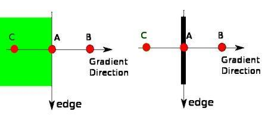
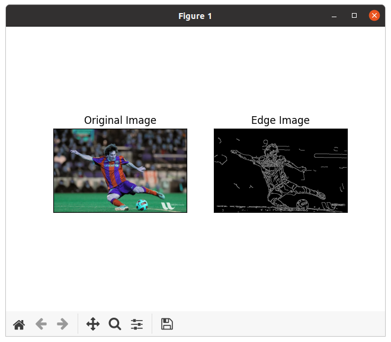

本文主要内容来自于 [OpenCV-Python 教程](https://docs.opencv.org/4.5.5/d6/d00/tutorial_py_root.html) 的 [OpenCV 中的图像处理](https://docs.opencv.org/4.5.5/d2/d96/tutorial_py_table_of_contents_imgproc.html) 部分，这部分的全部主要内容如下：
<!--more-->
-   [改变色彩空间](https://docs.opencv.org/4.5.5/df/d9d/tutorial_py_colorspaces.html)

    学习在不同色彩空间之间改变图像。另外学习跟踪视频中的彩色对象。

-   [图像的几何变换](https://docs.opencv.org/4.5.5/da/d6e/tutorial_py_geometric_transformations.html)

    学习对图像应用不同的几何变换，比如旋转、平移等。

-   [图像阈值](https://docs.opencv.org/4.5.5/d7/d4d/tutorial_py_thresholding.html)

    学习使用全局阈值、自适应阈值、Otsu 的二值化等将图像转换为二值图像。

-   [平滑图像](https://docs.opencv.org/4.5.5/d4/d13/tutorial_py_filtering.html)

    学习模糊图像，使用自定义内核过滤图像等。

-   [形态变换](https://docs.opencv.org/4.5.5/d9/d61/tutorial_py_morphological_ops.html)

    了解形态学变换，如侵蚀、膨胀、开放、闭合等。

-   [图像渐变](https://docs.opencv.org/4.5.5/d5/d0f/tutorial_py_gradients.html)

    学习寻找图像渐变、边缘等。

-   [Canny 边缘检测](https://docs.opencv.org/4.5.5/da/d22/tutorial_py_canny.html)

    学习通过 Canny 边缘检测寻找边缘。

-   [图像金字塔](https://docs.opencv.org/4.5.5/dc/dff/tutorial_py_pyramids.html)

    学习关于图像金字塔的内容，以及如何使用它们进行图像混合。

-   [OpenCV 中的轮廓](https://docs.opencv.org/4.5.5/d3/d05/tutorial_py_table_of_contents_contours.html)

    所有关于 OpenCV 中的轮廓的内容。

-   [OpenCV 中的直方图](https://docs.opencv.org/4.5.5/de/db2/tutorial_py_table_of_contents_histograms.html)

    所有关于 OpenCV 中的直方图的内容。

-   [OpenCV 中的图像变换](https://docs.opencv.org/4.5.5/dd/dc4/tutorial_py_table_of_contents_transforms.html)

    在 OpenCV 中遇到不同的图像变换，如傅里叶变换、余弦变换等。

-   [模板匹配](https://docs.opencv.org/4.5.5/d4/dc6/tutorial_py_template_matching.html)

    学习使用模板匹配在图像中搜索对象。

-   [霍夫线变换](https://docs.opencv.org/4.5.5/d6/d10/tutorial_py_houghlines.html)

    学习在一幅图像中探测线。

-   [霍夫圆变换](https://docs.opencv.org/4.5.5/da/d53/tutorial_py_houghcircles.html)

    学习在一幅图像中探测圆。

-   [使用分水岭算法的图像分割](https://docs.opencv.org/4.5.5/d3/db4/tutorial_py_watershed.html)

    学习使用分水岭分割算法分割图像。

-   [使用 GrabCut 算法的交互式前景提取](https://docs.opencv.org/4.5.5/d8/d83/tutorial_py_grabcut.html)

    学习使用 GrabCut 算法提取前景

## 目标

在本章中，我们将学习关于

 * Canny 边缘检测的概念
 * OpenCV 中为此提供的函数：**[cv.Canny()](https://docs.opencv.org/4.5.5/dd/d1a/group__imgproc__feature.html#ga04723e007ed888ddf11d9ba04e2232de "Finds edges in an image using the Canny algorithm  . ")**

## 理论

Canny 边缘检测是一个流行的边缘检测算法。它由 John F. Canny 开发

 1. 这是一个多阶段算法，我们将浏览每个阶段。
 2. **降噪**
 由于边缘检测容易受到图像中噪声的影响，因此第一步是使用 5x5 高斯滤波器去除图像中的噪声。我们在前面的章节中已经看到了这一点。
 3. 寻找图像的强度梯度
 然后在水平和垂直方向上使用 Sobel 核对平滑后的图像进行滤波，以获得水平方向 ($G_x$) 和垂直方向 ($G_y$) 的一阶导数。从这两张图像中，我们可以找到每个像素的边缘梯度和方向，如下所示：
$$
Edge\_Gradient \; (G) = \sqrt{G_x^2 + G_y^2} \\ Angle \; (\theta) = \tan^{-1} \bigg(\frac{G_y}{G_x}\bigg)
$$
梯度方向始终垂直于边缘。它被舍入到代表垂直、水平和两个对角线方向的四个角度之一。
 4. **非最大抑制**
 在获得梯度幅度和方向后，对图像进行全面扫描以去除可能不构成边缘的任何不需要的像素。为此，在每个像素处，检查像素是否是其邻域中沿梯度方向的局部最大值。检查下图：



 A点在边缘上（垂直方向）。梯度方向垂直于边缘。点 B 和 C 在梯度方向上。因此点 A 与点 B 和 C 一起检查来看下它是否是局部最大值。如果是，则将考虑让它进入下一阶段，否则，将其抑制（置零）。
简而言之，我们得到的结果是具有 “薄边” 的二值图像。
 5. **迟滞阈值**
 这个阶段决定哪些所有的边都是真正的边，哪些不是。为此我们需要两个阈值，`minVal` 和 `maxVal`。任何强度梯度大于 `maxVal` 的边缘肯定是边缘，低于 `minVal` 的边缘肯定是非边缘，因此丢弃。位于这两个阈值之间的那些根据它们的连通性被分类为边缘或非边缘。如果它们连接到 “确定边缘” 像素，则它们被认为是边缘的一部分。 否则，它们也会被丢弃。 见下图：


边缘 A 在 `maxVal` 之上，因此被认为是 “确定边缘”。尽管边缘 C 在 `maxVal` 之下，它连接到了边缘 A，因而也被认为是有效的边缘，且我们得到了完整的曲线。但边缘 B，尽管它在 `minVal` 之上，且与边缘 C 位于同一片区域，它没有连接到任何 “确定边缘”，因而它被丢弃。因此，我们必须相应地选择 `minVal` 和 `maxVal` 以获得正确的结果，这一点非常重要。
 在假设边缘是长线的情况下，这个阶段还去除了小像素噪声。

所以我们最终得到的是图像中的强边缘。

## OpenCV 中的 Canny 边缘检测

OpenCV 把上面所有的东西都放进一个函数里，**[cv.Canny()](https://docs.opencv.org/4.5.5/dd/d1a/group__imgproc__feature.html#ga04723e007ed888ddf11d9ba04e2232de "Finds edges in an image using the Canny algorithm  . ")**。我们将看到如何使用它。第一个参数是我们的输入图像。第二个和第三个参数分别是我们的 `minVal` 和 `maxVal`。第四个参数是 `aperture_size`。它是用于寻找图像梯度的 Sobel 内核的大小。其默认为 3。最后一个参数是 L2gradient，它指定了寻找梯度幅度的方程。如果它为 `True`，它使用上面提到的更精确的方程，否则它使用这个函数：$Edge\_Gradient \; (G) = |G_x| + |G_y|$。它的默认值为 `False`。
```
import numpy as np
import cv2 as cv
from matplotlib import pyplot as plt


def canary_edge_detection():
    cv.samples.addSamplesDataSearchPath("/media/data/my_multimedia/opencv-4.x/samples/data")
    img = cv.imread(cv.samples.findFile('messi5.jpg'))
    edges = cv.Canny(img, 100, 200)
    plt.subplot(121), plt.imshow(img, cmap='gray')
    plt.title('Original Image'), plt.xticks([]), plt.yticks([])
    plt.subplot(122), plt.imshow(edges, cmap='gray')
    plt.title('Edge Image'), plt.xticks([]), plt.yticks([])
    plt.show()


if __name__ == "__main__":
    canary_edge_detection()
```

来看如下的结果：



## 其它资源

1. [Wikipedia](https://en.wikipedia.org/wiki/Canny_edge_detector) 中的 Canny 边缘探测

2. [Canny 边缘探测教程](http://dasl.unlv.edu/daslDrexel/alumni/bGreen/www.pages.drexel.edu/_weg22/can_tut.html) by Bill Green, 2002.

## 练习

编写一个小应用来寻找 Canny 边缘探测，其阈值可以使用两个轨迹栏来改变。这样，你可以了解阈值的影响。

**参考文档**

[Canny Edge Detection](https://docs.opencv.org/4.5.5/da/d22/tutorial_py_canny.html)

Done.
